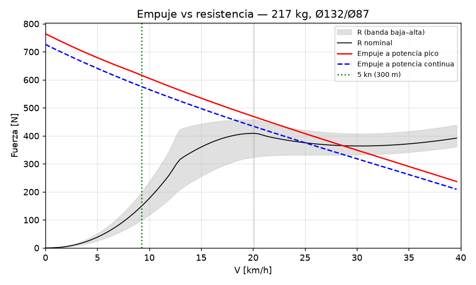

# 02 — Memoria de cálculo del waterjet (sizing.py)

Todo sale de [`sizing.py`](sizing.py) y de los modelos de [`p1calc/`](p1calc/) (`hull`, `planing`,
`waterjet`, `motor`, `power`), leyendo [`inputs.yaml`](inputs.yaml). Los casos estructurales están en
`04_diseno/structural_*.py`. Ningún número calculado está escrito a mano: las tablas entre marcadores
`AUTO` y los valores entre marcadores `<!--V:…-->` los rellena `python docgen.py` desde `resultados/*.json`.
Las entradas de `inputs.yaml` se citan con su etiqueta.

Etiquetas: [VERIFICADO: fuente] · [CALCULADO] · [ESTIMADO: base] · [SUPUESTO].

**Lectura honesta.** Con <!--V:sizing.masses.total_kg:.0f-->217<!--/V--> kg, el casco leído del plano y la
batería que cumple ≤ 50 V, **el modelo ya no puede asegurar que el bote planee con el margen pedido**: con la
banda alta de resistencia el margen mínimo en la joroba es <!--V:sizing.performance.hump_margin_min:.0%-->3%<!--/V-->
(a <!--V:sizing.performance.V_hump_margin_min_kmh:.1f-->19.8<!--/V--> km/h; se piden ≥ 10 %) y con la nominal
<!--V:sizing.vmax_band.nominal.hump_margin:.0%-->15%<!--/V--> (estado del optimizador:
`<!--V:sizing.status:-->sin_solucion_dura<!--/V-->`). El motivo es el casco: es corto para su peso y Savitsky da una
eslora mojada mayor que el fondo en todo el rango de planeo (§3), así que la resistencia entre 20 y 35 km/h es
[ESTIMADO] con un método propio. La V máx. sostenida da <!--V:sizing.performance.vmax_cont_kmh:.1f-->25.0<!--/V--> km/h
(banda nominal) y la "por ratos" <!--V:sizing.performance.vmax_peak_kmh:.1f-->28.6<!--/V--> km/h, contra el objetivo de
30 km/h, **sin base validada hasta la prueba T4** (06): con la banda de resistencia va de
<!--V:sizing.vmax_band.high.vmax_cont_kmh:.1f-->18.2<!--/V--> a <!--V:sizing.vmax_band.low.vmax_cont_kmh:.1f-->28.8<!--/V--> km/h.
El cambio más chico que devuelve el margen al 10 % es bajar la masa total
(<!--V:sizing.hump_recovery.mass_text:-->10 kg menos<!--/V-->) o un fondo más largo que el leído
(<!--V:sizing.hump_recovery.lwl_text:-->L_wl ≥ 1,90 m<!--/V-->): ninguno de los dos es un cambio de la propulsión, son
mediciones pendientes (PENDIENTES P0.1) o peso (§3.2). Y antes que la velocidad está la estabilidad:
GM = <!--V:sizing.hydrostatics.GM_m:.3f-->0.008<!--/V--> m (§2). Eso bloquea la navegación (D-04).

## 0. Resumen

<!-- AUTO:sizing_main -->
| Magnitud | Valor | Etiqueta |
|---|---|---|
| Estado del optimizador | sin_solucion_dura | [CALCULADO] |
| Motor / controlador / batería | Maytech MTI120116 150 KV (inrunner refrigerado por agua, 10–16S) / Flipsky FSESC 75350 con caja de agua (VESC, filtro de fase, IP65) / 2 × LiTime 36 V 60 Ah Golf Cart en paralelo (12S2P, BMS 2 × 120 A) | [CALCULADO: optimizador] |
| Masa total / LCG desde el espejo | 217 kg / 1.12 m | [CALCULADO] |
| Calado / GM / escora con el piloto 0,1 m a un lado | 285 mm / 8 mm / 79° | [CALCULADO] |
| Eje del impulsor bajo la flotación (cebado) | 170 mm (ceba) | [CALCULADO] |
| Impulsor / cubo / tobera | Ø132 / Ø66 / Ø87 mm | [CALCULADO] |
| Punto de diseño de la bomba | 39.6 km/h, 5073 rpm, φ 0.260, ψ 0.073, Ω_s 5.59 | [CALCULADO] |
| ¿Planea? / margen mínimo en la joroba (a qué V) | sí / 3 % (19.8 km/h) — NO cumple el mínimo de 10% | [CALCULADO] |
| Puntos de planeo con Savitsky válido (L_K ≤ L_wl, λ ≤ 4, τ 2–15°) | 0 de 14 (el resto: limitado por eslora) | [CALCULADO; método ESTIMADO] |
| Tiempo de 0 a planeo | 13.5 s | [CALCULADO] |
| V máx. sostenida (potencia continua, banda nominal) | 25.0 km/h (objetivo 30) | [CALCULADO] |
| V máx. sostenida, banda baja – alta de R (sin validar hasta T4) | 18.2 – 28.8 km/h | [CALCULADO; R ESTIMADO] |
| P de batería a V máx. / a 5 kn | 6723 W / 1680 W | [CALCULADO] |
| Empuje a punto fijo / en reversa | 764 N / 217 N | [CALCULADO] |
| Autonomía a V máx. / a 5 kn | 37 min (15.4 km) / 2.5 h | [CALCULADO] |
| Energía de la misión requerida / nominal | 3361 / 4608 Wh | [CALCULADO] |
| Cavitación S a V máx. (límite) | 3.20 (3.5) | [CALCULADO] |
| Velocidad periférica máx. | 29.0 m/s | [CALCULADO] |
| Corriente pico de batería / límite de fase | 192 A / 292 A | [CALCULADO] |
| I_q pico (FOC) / l_current_max / margen | 285 A / 292 A / 2 % | [CALCULADO; convención bus_foc SUPUESTO] |
| Motor a V máx. sostenida (estacionario) | 49 °C (máx. 120) | [CALCULADO] |
| Eje Ø / FS estático / FS fatiga | 20 mm / 4.0 / 9.3 | [CALCULADO] |
| Rodamientos L10 a V máx. / vel. crítica / sello | 783783 h / 3.8× n máx. / 4.4 m/s | [CALCULADO] |
<!-- /AUTO:sizing_main -->

Cadena de cálculo: masas (§1) → hidrostática y cebado (§2) → R(V) (§3) → bomba diseñada para el
motor y equilibrio motor–bomba–sistema a cada V (§4) → energía, térmico (§5) → eléctrico (§6) →
mecánico (§7) → cargas (§8) → estructural (§9). El optimizador (§4.3) recorre motor × controlador ×
batería × Ø de impulsor × relación de tobera × potencia de diseño, y elige la combinación más barata
que cumple las restricciones duras.

---

## 1. Masas y centro de gravedad

**Modelo** (`p1calc/hull.py`, `mass_items`, `mass_summary`): x hacia proa desde la cara exterior del
espejo, z hacia arriba desde la quilla.

  m = Σ mᵢ · LCG = Σ mᵢ·xᵢ / m · VCG = Σ mᵢ·zᵢ / m

| Ítem | kg | x [m] | z [m] | Etiqueta de la entrada |
|---|---|---|---|---|
| Casco con cubierta, consola y asiento | <!--V:sizing.masses.items.0.kg:.1f-->38.0<!--/V--> | <!--V:sizing.masses.items.0.x_m:.2f-->0.95<!--/V--> | <!--V:sizing.masses.items.0.z_m:.2f-->0.22<!--/V--> | [ESTIMADO: research/R10b §4.2: 30–45 kg] |
| Piloto | <!--V:sizing.masses.items.1.kg:.1f-->90.0<!--/V--> | <!--V:sizing.masses.items.1.x_m:.2f-->1.38<!--/V--> | <!--V:sizing.masses.items.1.z_m:.2f-->0.55<!--/V--> | [SUPUESTO: 80–100 kg; asiento del plano, R10b §4.4] |
| Batería (selección) | <!--V:sizing.masses.items.2.kg:.1f-->39.6<!--/V--> | <!--V:sizing.masses.items.2.x_m:.2f-->1.28<!--/V--> | <!--V:sizing.masses.items.2.z_m:.2f-->0.18<!--/V--> | masa [ESTIMADO: R11 §3.2]; posición [SUPUESTO: más a popa que en el plano] |
| Motor (selección) | <!--V:sizing.masses.items.3.kg:.1f-->4.4<!--/V--> | <!--V:sizing.masses.items.3.x_m:.2f-->0.74<!--/V--> | <!--V:sizing.masses.items.3.z_m:.2f-->0.16<!--/V--> | masa [VERIFICADO: R11 §1.2]; posición [CALCULADO: CAD] |
| Unidad de jet (toma, bomba, tobera, dirección, bucket, tren) | <!--V:sizing.masses.items.4.kg:.1f-->24.2<!--/V--> | <!--V:sizing.masses.items.4.x_m:.2f-->0.25<!--/V--> | <!--V:sizing.masses.items.4.z_m:.2f-->0.12<!--/V--> | [CALCULADO: masa del CAD, `manifest.json`] |
| Controlador, contactor, fusible, cables | <!--V:sizing.masses.items.5.kg:.1f-->6.0<!--/V--> | <!--V:sizing.masses.items.5.x_m:.2f-->0.90<!--/V--> | <!--V:sizing.masses.items.5.z_m:.2f-->0.30<!--/V--> | [ESTIMADO: R10b §4.2] |
| Agua retenida en toma y bomba | <!--V:sizing.masses.items.6.kg:.1f-->4.0<!--/V--> | <!--V:sizing.masses.items.6.x_m:.2f-->0.30<!--/V--> | <!--V:sizing.masses.items.6.z_m:.2f-->0.10<!--/V--> | [ESTIMADO: R10b §4.2] |
| Equipo de seguridad | <!--V:sizing.masses.items.7.kg:.1f-->6.0<!--/V--> | <!--V:sizing.masses.items.7.x_m:.2f-->1.60<!--/V--> | <!--V:sizing.masses.items.7.z_m:.2f-->0.25<!--/V--> | [ESTIMADO: R10b §4.2] |
| Flotación fija + achique | <!--V:sizing.masses.items.8.kg:.1f-->5.0<!--/V--> | <!--V:sizing.masses.items.8.x_m:.2f-->1.20<!--/V--> | <!--V:sizing.masses.items.8.z_m:.2f-->0.30<!--/V--> | [ESTIMADO: ~100 L de espuma, R10b H5] |

**Resultado** [CALCULADO]: m = <!--V:sizing.masses.total_kg:.1f-->217.2<!--/V--> kg; LCG = <!--V:sizing.masses.lcg_m:.3f-->1.117<!--/V--> m
desde el espejo; VCG = <!--V:sizing.masses.vcg_m:.3f-->0.340<!--/V--> m sobre la quilla; máquinas (motor + batería +
jet + controlador, para la capacidad de §2.3) = <!--V:sizing.masses.machinery_kg:.1f-->74.2<!--/V--> kg.

- La masa del jet la toma `sizing.py` del CAD vigente (`manifest.json → totals.jet_unit_mass_kg`,
  hoy <!--V:manifest.totals.jet_unit_mass_kg:.2f-->24.16<!--/V--> kg). Si el CAD cambia, hay que volver a correr
  `run_all.py`: la fila "Unidad de jet" de arriba es la que usó la última corrida de `sizing.py`.
- Los 150 kg del plano de Jorge no cierran (R10b §4.2: 165–242 kg con 3 kWh LFP). El piloto pesa
  <!--V:sizing.masses.items.1.kg:.0f-->90<!--/V--> kg de los <!--V:sizing.masses.total_kg:.0f-->217<!--/V--> y es la entrada
  más incierta después de la potencia del motor (§10).

## 2. Hidrostática, estabilidad, capacidad y cebado

### 2.1 Calado

**Sección** (`hull._half_width`, vista trasera del plano, R10b §4.3): fondo con astilla muerta β hasta un
ancho de fondo b_f, abre hasta la manga en el pantoque B_ch a la altura z_ch y sigue hasta la manga B en
la borda (z_g). Longitudinalmente, un coeficiente de bloque C_b:

  ∇ = m/ρ = C_b · L_wl · A_sec(T)   → T por bisección
  KB = centroide numérico de A_sec(T) · BM = C_I · L_wl · B_wl³ / ∇ · GM = KB + BM − KG

| Entrada | Valor | Etiqueta |
|---|---|---|
| L_wl | 1,75 m | [ESTIMADO: R10b §4.3, largo de fondo a escala] |
| b_f / B_ch / z_ch | 0,42 m / 0,69 m / 0,25 m | [ESTIMADO: R10b §4.3] |
| B / z_g / espejo | 0,80 m / 0,52 m / 0,42 m | [VERIFICADO: cotas del plano de Jorge] |
| β | 8° | [ESTIMADO: R10b §4.4 usó 5–10°] |
| C_b / C_I | 0,80 / 0,065 | [ESTIMADO] / [ESTIMADO: R10b §4.3, forma de flotación supuesta] |
| ρ | 1013 kg/m³ | [CALCULADO: R07 §2.5, 18 PSU] |

**Resultado** [CALCULADO]: ∇ = <!--V:sizing.hydrostatics.volume_m3:.3f-->0.214<!--/V--> m³; T = <!--V:sizing.hydrostatics.draft_m:.3f-->0.285<!--/V--> m;
B_wl = <!--V:sizing.hydrostatics.bwl_m:.3f-->0.704<!--/V--> m; francobordo en el espejo = <!--V:sizing.hydrostatics.freeboard_transom_m:.3f-->0.135<!--/V--> m;
desplazamiento con el agua al borde del espejo = <!--V:sizing.hydrostatics.disp_max_kg:.0f-->357<!--/V--> kg.

### 2.2 Estabilidad inicial

KB = <!--V:sizing.hydrostatics.KB_m:.3f-->0.163<!--/V--> m, BM = <!--V:sizing.hydrostatics.BM_m:.3f-->0.185<!--/V--> m,
KG = <!--V:sizing.hydrostatics.KG_m:.3f-->0.340<!--/V--> m → **GM = <!--V:sizing.hydrostatics.GM_m:.3f-->0.008<!--/V--> m** [CALCULADO].

Escora por correr al piloto una distancia d (lineal, ángulo chico; `hull.heel_for_offset`):

  φ = atan( m_piloto · d / (Δ · GM) )

Con d = 0,1 m: φ = <!--V:sizing.heel_pilot_0p1m_deg:.0f-->79<!--/V-->° [CALCULADO]. El modelo lineal no vale a ese ángulo;
lo que dice es que **el bote no tiene estabilidad inicial útil**: vuelca al subir, al reabordar desde el
agua o con un movimiento brusco del piloto. Con R10b H1 (GM de −113 a +90 mm según dónde va sentado el
piloto) la conclusión es la misma. La propulsión no lo arregla; hace falta más manga en la flotación
(caja: GM ≈ +144 mm con B_wl 0,9 m [CALCULADO: R10b §4.3]), flotadores laterales o un asiento más bajo.
Es el riesgo n.º 1 (03 §5, D-04) y se cierra con el ensayo de escora E1 de R13 §5 **antes** de la primera
prueba con motor.

### 2.3 Capacidad (33 CFR 183.33, referencia)

Fórmula para botes con motor interior [VERIFICADO: R10b §4.3, law.cornell.edu], no obligatoria en DK:

  W = máx[ Δ_max/5 − m_casco/5 − 4·m_máquinas/5 ; (Δ_max − m_casco)/7 ]

W₁ = <!--V:sizing.capacity.W1_kg:.0f-->4<!--/V--> kg, W₂ = <!--V:sizing.capacity.W2_kg:.0f-->46<!--/V--> kg → **personas + equipo ≤
<!--V:sizing.capacity.persons_gear_kg:.0f-->46<!--/V--> kg** [CALCULADO], menos que un piloto de
<!--V:sizing.masses.items.1.kg:.0f-->90<!--/V--> kg. Por esta regla el casco, tal como se leyó del plano, no tiene capacidad
para su propio piloto. Confirma H1/H6 de R10b: el casco es chico para la carga.

### 2.4 Cebado de la bomba

Regla: el eje del impulsor tiene que quedar bajo la flotación en reposo [VERIFICADO: R10a §3.2, HamiltonJet];
el proyecto pide ≥ 20 mm de margen (R10a §8). Eje del impulsor a <!--V:sizing.priming.axis_height_m:.3f-->0.115<!--/V--> m de la
quilla [CALCULADO: R10a §5.2, CAD], calado <!--V:sizing.priming.draft_m:.3f-->0.285<!--/V--> m → eje
<!--V:sizing.priming.axis_below_wl_m:.3f-->0.170<!--/V--> m bajo la flotación: **ceba** [CALCULADO]. El margen es grande porque
el casco es chico para la masa; con el casco medido (PENDIENTES P0.1) puede cambiar.

## 3. Resistencia al avance

**Modelo** (`p1calc/planing.py`), con Fn∇ = V/√(g·∇^⅓):

| Tramo | Rango | Ecuación | Etiqueta |
|---|---|---|---|
| Desplazamiento y joroba | Fn∇ ≤ 1,5 | R/Δ = r_joroba · (Fn∇/1,5)^2,2, r_joroba = 0,10 / 0,15 / 0,20 (bandas baja / nominal / alta) | [ESTIMADO: R10b §4.4, Savitsky 2003 × 1–2 para cascos rechonchos; R12 §6.3 da 0,12–0,17 con Mercier–Savitsky] |
| Planeo | Fn∇ ≥ 2,3, punto válido | Savitsky 1964 con `openplaning` (trimado de equilibrio, fricción ITTC-57 con rugosidad, aire), × 0,92 / 1,00 / 1,12 | Ecuaciones [VERIFICADO: R12 §6.1, R10b §4.4]; banda [ESTIMADO: dispersión de 6 cascos, R10b] |
| Planeo con casco corto | Fn∇ ≥ 2,3, Savitsky con L_K > L_wl | "Savitsky limitado por eslora": equilibrio vertical con L_K = L_wl (τ el que sostiene el peso); banda baja = Savitsky libre × 0,92, nominal = limitado, alta = limitado × 1,12 | [ESTIMADO: método propio, sin validar; el momento de cabeceo no cierra] |
| Transición | 1,5 < Fn∇ < 2,3 | Interpolación monótona (PCHIP) entre la joroba y el primer punto de planeo | [ESTIMADO] |

Entradas de Savitsky: b = 0,60 m [ESTIMADO: R10b §4.4], β = 8°, LCG y VCG de §1, r_g = 0,50 m, empuje
horizontal a 0,11 m [CALCULADO: eje del jet], aire 1,1 × 0,5 m con C_D 0,9 [ESTIMADO: R10b], rugosidad
150 µm, ν = 1,35·10⁻⁶ m²/s [ESTIMADO].

**Validez de Savitsky** [VERIFICADO: R12 §6, avisos de openplaning]: 2° ≤ τ ≤ 15°, λ ≤ 4, 0,60 ≤ C_V ≤ 13; y
además la eslora mojada en la quilla L_K no puede superar el largo del fondo L_wl
(<!--V:sizing.resistance.lwl_m:.2f-->1.75<!--/V--> m [ESTIMADO]): Savitsky supone un prisma más largo que la zona
mojada. Con este casco el equilibrio libre da L_K > L_wl en **todo** el rango de planeo
(<!--V:sizing.resistance.n_valid_free:d-->0<!--/V--> de <!--V:sizing.resistance.n_points:d-->14<!--/V--> puntos válidos):
L_K = <!--V:sizing.resistance.savitsky.0.L_K_free:.2f-->2.10<!--/V--> m a <!--V:sizing.resistance.savitsky.0.V_kmh:.1f-->20.1<!--/V--> km/h,
<!--V:sizing.resistance.savitsky.4.L_K_free:.2f-->1.87<!--/V--> m a <!--V:sizing.resistance.savitsky.4.V_kmh:.1f-->26.1<!--/V--> km/h y
<!--V:sizing.resistance.savitsky.10.L_K_free:.2f-->1.78<!--/V--> m a <!--V:sizing.resistance.savitsky.10.V_kmh:.1f-->35.1<!--/V--> km/h, con
C_Δ = <!--V:sizing.resistance.C_delta:.2f-->0.99<!--/V--> y el LCG al <!--V:sizing.resistance.lcg_over_lwl:.0%-->64%<!--/V--> del fondo [CALCULADO]. Es decir: para sostener 217 kg con ese trimado el bote
necesitaría un fondo más largo del que tiene; en la realidad se hunde más de proa o trima más, y eso Savitsky no
lo describe. No encontré un método abierto para ese régimen (Savitsky–Brown 1976 y Blount–Fox 1976 no están
abiertos, R12 §6.3; Mercier–Savitsky cubre solo Fn∇ 1–2, o sea hasta ~17 km/h). Por eso:

- **Nominal = Savitsky limitado por eslora** (`planing.savitsky_length_limited`) [ESTIMADO]: las mismas ecuaciones
  de Savitsky/openplaning, pero con L_K = L_wl fijo y el trimado τ que da equilibrio vertical. Sale más trimado y
  más resistencia que el libre a baja velocidad, y converge con el libre por encima de ~35 km/h (L_K libre → L_wl).
  El momento de cabeceo queda sin cerrar (proa abajo): lo tomaría la proa mojándose, que no está modelada.
- **Banda ensanchada** donde el punto no es válido: baja = Savitsky libre × 0,92 (optimista: como si el fondo fuera
  más largo), alta = limitado × 1,12.
- La validez de cada punto (L_K, L_K libre, λ, τ, método) queda en `sizing.json → resistance.savitsky`.

**Resultado** [CALCULADO]: joroba en <!--V:sizing.resistance.v_hump_kmh:.1f-->13.1<!--/V--> km/h (Fn∇ = 1,5); planeo
desde <!--V:sizing.resistance.v_planing_kmh:.1f-->20.1<!--/V--> km/h (Fn∇ = 2,3). Puntos de planeo (banda nominal):

| V [km/h] | R [N] | τ [°] | Presión [N] | Fricción [N] | Aire [N] | L_K [m] (libre) | λ | Método |
|---|---|---|---|---|---|---|---|---|
| <!--V:sizing.resistance.savitsky.0.V_kmh:.1f-->20.1<!--/V--> | <!--V:sizing.resistance.savitsky.0.R:.0f-->409<!--/V--> | <!--V:sizing.resistance.savitsky.0.tau_deg:.1f-->9.5<!--/V--> | <!--V:sizing.resistance.savitsky.0.R_pressure:.0f-->345<!--/V--> | <!--V:sizing.resistance.savitsky.0.R_friction:.0f-->56<!--/V--> | <!--V:sizing.resistance.savitsky.0.R_air:.0f-->8<!--/V-->  | <!--V:sizing.resistance.savitsky.0.L_K:.2f-->1.75<!--/V--> (<!--V:sizing.resistance.savitsky.0.L_K_free:.2f-->2.10<!--/V-->) | <!--V:sizing.resistance.savitsky.0.lambda:.2f-->2.78<!--/V--> | <!--V:sizing.resistance.savitsky.0.method:-->Savitsky limitado por eslora<!--/V--> |
| <!--V:sizing.resistance.savitsky.4.V_kmh:.1f-->26.1<!--/V--> | <!--V:sizing.resistance.savitsky.4.R:.0f-->371<!--/V--> | <!--V:sizing.resistance.savitsky.4.tau_deg:.1f-->7.2<!--/V--> | <!--V:sizing.resistance.savitsky.4.R_pressure:.0f-->265<!--/V--> | <!--V:sizing.resistance.savitsky.4.R_friction:.0f-->92<!--/V--> | <!--V:sizing.resistance.savitsky.4.R_air:.0f-->14<!--/V-->  | <!--V:sizing.resistance.savitsky.4.L_K:.2f-->1.75<!--/V--> (<!--V:sizing.resistance.savitsky.4.L_K_free:.2f-->1.87<!--/V-->) | <!--V:sizing.resistance.savitsky.4.lambda:.2f-->2.74<!--/V--> | <!--V:sizing.resistance.savitsky.4.method:-->Savitsky limitado por eslora<!--/V--> |
| <!--V:sizing.resistance.savitsky.7.V_kmh:.1f-->30.6<!--/V--> | <!--V:sizing.resistance.savitsky.7.R:.0f-->364<!--/V--> | <!--V:sizing.resistance.savitsky.7.tau_deg:.1f-->6.0<!--/V--> | <!--V:sizing.resistance.savitsky.7.R_pressure:.0f-->219<!--/V--> | <!--V:sizing.resistance.savitsky.7.R_friction:.0f-->125<!--/V--> | <!--V:sizing.resistance.savitsky.7.R_air:.0f-->20<!--/V-->  | <!--V:sizing.resistance.savitsky.7.L_K:.2f-->1.75<!--/V--> (<!--V:sizing.resistance.savitsky.7.L_K_free:.2f-->1.80<!--/V-->) | <!--V:sizing.resistance.savitsky.7.lambda:.2f-->2.70<!--/V--> | <!--V:sizing.resistance.savitsky.7.method:-->Savitsky limitado por eslora<!--/V--> |
| <!--V:sizing.resistance.savitsky.13.V_kmh:.1f-->39.6<!--/V--> | <!--V:sizing.resistance.savitsky.13.R:.0f-->392<!--/V--> | <!--V:sizing.resistance.savitsky.13.tau_deg:.1f-->4.2<!--/V--> | <!--V:sizing.resistance.savitsky.13.R_pressure:.0f-->157<!--/V--> | <!--V:sizing.resistance.savitsky.13.R_friction:.0f-->201<!--/V--> | <!--V:sizing.resistance.savitsky.13.R_air:.0f-->34<!--/V-->  | <!--V:sizing.resistance.savitsky.13.L_K:.2f-->1.75<!--/V--> (<!--V:sizing.resistance.savitsky.13.L_K_free:.2f-->1.77<!--/V-->) | <!--V:sizing.resistance.savitsky.13.lambda:.2f-->2.61<!--/V--> | <!--V:sizing.resistance.savitsky.13.method:-->Savitsky limitado por eslora<!--/V--> |

- La curva R(V) es casi plana entre 20 y 35 km/h: el fondo es angosto para el peso (∇/b³ alto, trimados
  de 6–8°, R10b §4.4). Por eso la V máx. depende tanto de la potencia: unos pocos newtons de empuje de
  más o de menos mueven el cruce T = R varios km/h (§10).
- **Banda de diseño.** El planeo se verifica con la banda **alta** (empuje a potencia pico ≥ 1,10 × R en
  toda la joroba, de 0 a Fn∇ = 2,3 [SUPUESTO: `operation.plane_margin_frac`]). La V máx. se informa con la banda
  nominal y, porque el tramo de planeo no está validado, también con las bandas baja y alta
  (`sizing.json → vmax_band`): sostenida <!--V:sizing.vmax_band.high.vmax_cont_kmh:.1f-->18.2<!--/V--> /
  <!--V:sizing.vmax_band.nominal.vmax_cont_kmh:.1f-->25.0<!--/V--> / <!--V:sizing.vmax_band.low.vmax_cont_kmh:.1f-->28.8<!--/V--> km/h
  y por ratos <!--V:sizing.vmax_band.high.vmax_peak_kmh:.1f-->23.0<!--/V--> / <!--V:sizing.vmax_band.nominal.vmax_peak_kmh:.1f-->28.6<!--/V-->
  / <!--V:sizing.vmax_band.low.vmax_peak_kmh:.1f-->31.3<!--/V--> km/h (bandas alta / nominal / baja) [CALCULADO; R ESTIMADO].
  **La V máx. no tiene base validada hasta la prueba T4 (06).**

Curva a fondo (potencia pico, banda alta, batería nominal) y figura
[`figuras/empuje_resistencia.png`](figuras/empuje_resistencia.png):

<!-- AUTO:sizing_curve -->
| V [km/h] | R diseño [N] | T pico [N] | rpm | P bat [W] | I bat [A] | S | Limita |
|---|---|---|---|---|---|---|---|
| 0 | 0 | 764 | 4048 | 7270 | 189 | 3.50 | cavitación (S) |
| 4 | 25 | 701 | 4053 | 7288 | 190 | 3.50 | cavitación (S) |
| 7 | 114 | 646 | 4068 | 7344 | 191 | 3.50 | cavitación (S) |
| 11 | 279 | 593 | 4080 | 7373 | 192 | 3.48 | corriente de batería |
| 14 | 438 | 543 | 4090 | 7373 | 192 | 3.46 | corriente de batería |
| 18 | 456 | 495 | 4102 | 7373 | 192 | 3.42 | corriente de batería |
| 22 | 444 | 450 | 4116 | 7373 | 192 | 3.38 | corriente de batería |
| 25 | 419 | 406 | 4131 | 7373 | 192 | 3.34 | corriente de batería |
| 29 | 409 | 363 | 4146 | 7373 | 192 | 3.29 | corriente de batería |
| 32 | 409 | 321 | 4163 | 7373 | 192 | 3.23 | corriente de batería |
| 36 | 420 | 279 | 4179 | 7373 | 192 | 3.16 | corriente de batería |
| 40 | 439 | 237 | 4195 | 7373 | 192 | 3.10 | corriente de batería |
<!-- /AUTO:sizing_curve -->

### 3.1 Velocidad legal y tope de ERPM

Dentro de 300 m de la costa el límite es 5 kn [VERIFICADO: R07, R13 §3]. Dos cálculos:

1. **Consumo a 5 kn** (`JetDrive.for_thrust`): rpm tal que T = R_alta(5 kn) con el piloto de diseño; de ahí P de
   batería y autonomía. Es la potencia de la energía de la misión (§5.2), del lado conservador. **Esas rpm
   están por encima del tope de COSTA** (el tope se calcula con el piloto liviano): con el perfil COSTA el piloto
   de diseño no llega a 5 kn; lo que da de verdad está en las filas "COSTA a fondo" de la tabla.
2. **Tope de rpm del perfil "costa"** (D-18): el caso que más rápido va con una rpm dada es el piloto
   liviano (<!--V:sizing.legal_speed.mass_light_kg:.0f-->197<!--/V--> kg en total con 70 kg [SUPUESTO]), banda baja y batería llena.
   Se busca la rpm que da T = R_baja(5 kn) y se pasa a ERPM con los pares de polos del motor. Comprobación
   [CALCULADO]: con esa rpm, T < R_liviano,baja(V) para toda V > 5 kn (exceso máximo
   <!--V:sizing.legal_speed.excess_above_limit_max_N:.1f-->-5.1<!--/V--> N).

<!-- AUTO:legal_speed -->
| Magnitud | Valor | Etiqueta |
|---|---|---|
| Límite legal a < 300 m de la costa | 9.26 km/h (5 kn) | [VERIFICADO: research/R07, R13] |
| Tope de rpm 'modo costa' (piloto liviano, 197 kg, banda baja, batería llena) | 1851 rpm / 9254 ERPM | [CALCULADO] → VESC `l_max_erpm` en el perfil de costa |
| COSTA a fondo, piloto liviano (banda baja, batería llena) | 9.3 km/h, 682 W | [CALCULADO] (el caso del tope) |
| COSTA a fondo, piloto de diseño (banda nominal / alta, batería nominal) | 7.8 / 7.0 km/h, 687 / 690 W (autonomía 6.0 h) | [CALCULADO] |
| P de batería para ir a 5 kn con el piloto de diseño (banda alta) | 1680 W a 2503 rpm — por encima del tope de COSTA: solo con el perfil ABIERTO | [CALCULADO] (energía de la misión, conservador) |
| Autonomía a esa potencia | 2.5 h | [CALCULADO] |
<!-- /AUTO:legal_speed -->

- **Pares de polos** (`inputs.yaml`, hoy <!--V:sizing.cavitation_cap.pole_pairs:d-->5<!--/V--> [VERIFICADO: página de
  Maytech, 12N10P]). El ERPM del VESC es rpm × pares de polos. Si el motor tiene otro número, el tope queda mal
  por el mismo factor: contarlo con VESC Tool (detección del motor) antes de cargar `l_max_erpm`.
- El tope es para 5 kn. En Sønderborg Havn (Als Sund) el límite es 4 kn y en las marinas 3 kn
  [VERIFICADO: R13 §3]; ahí se navega a mano por debajo del tope. Un perfil de 4 kn no está calculado.
- Prueba de cierre: GPS, ida y vuelta, piloto liviano, batería llena: media ≤ 9,0 km/h [SUPUESTO: margen];
  si no, `l_max_erpm` nuevo = actual × 9,0 / v medida.

### 3.2 Margen en la joroba: qué lo devuelve al 10 %

Con la combinación elegida, el margen mínimo (banda alta, batería nominal) es
<!--V:sizing.performance.hump_margin_min:.1%-->3.0%<!--/V--> a <!--V:sizing.performance.V_hump_margin_min_kmh:.1f-->19.8<!--/V--> km/h,
justo donde empieza el planeo limitado por eslora: no es el pico de la joroba (R/Δ) sino la transición. Por eso
ninguna combinación de impulsor, tobera ni punto de diseño llega al 10 % (tabla del optimizador, §4.3), y la
R/Δ crítica de la joroba es: <!--V:sizing.sensitivity.critical_r_hump.text:-->no hay: aun con R/Δ = 0,05 el margen queda < 10% (lo limita la transición joroba–planeo, no el pico de la joroba)<!--/V-->. Con la batería descargada el
margen es <!--V:sizing.performance.vmax_by_battery.v_min.hump_margin:.1%-->-2.4%<!--/V-->: con la banda alta **no planea**.

Qué lo devuelve al 10 % (`sizing.hump_recovery`, la bomba se rediseña en cada caso) [CALCULADO]:

| Cambio | Margen en la joroba | Comentario |
|---|---|---|
| Masa total | ≥ 10 % con <!--V:sizing.hump_recovery.mass_text:-->10 kg menos<!--/V--> | Casco, batería o piloto; pesar el casco (P0.1) |
| Largo del fondo | ≥ 10 % con <!--V:sizing.hump_recovery.lwl_text:-->L_wl ≥ 1,90 m<!--/V--> | El 1,75 m es [ESTIMADO] leído del plano; medir (P0.1) |
| Piloto de <!--V:sizing.hump_recovery.light_pilot.pilot_kg:.0f-->70<!--/V--> kg | <!--V:sizing.hump_recovery.light_pilot.hump_margin:.1%-->20.9%<!--/V--> | El piloto real decide |
| Corriente de batería al 100 % del BMS | <!--V:sizing.hump_recovery.bms_derate_1.hump_margin:.1%-->7.2%<!--/V--> | No alcanza: pasan a limitar la corriente de fase (I_q) y la cavitación; y deja el BMS sin margen |
| Banda nominal en vez de la alta | <!--V:sizing.hump_recovery.nominal_band.hump_margin:.1%-->15.4%<!--/V--> | Es aceptar menos margen, no un cambio |

La prueba que lo decide es T4.1 (06): tiempo de 0 a planeo con el piloto real y la batería al 20 %.

## 4. Waterjet

### 4.1 Cantidad de movimiento y curva del sistema

**Modelo** (`p1calc/waterjet.py`, `JetGeometry`), alturas en metros de columna:

  V_in = V·(1 − w) · V_j = Q / (C_c·A_n) · V_g = Q / A_g
  H_sys = (1 + K_n)·V_j²/2g − η_in·V_in²/2g + K_g·V_g²/2g + h_j
  T = ρ·Q·(V_j − V_in)·(1 − t) · η_chorro = T·V / P_eje

| Entrada | Valor | Etiqueta |
|---|---|---|
| C_c (tobera) | 0,98 | [ESTIMADO: tobera cónica pulida] |
| K_n (pérdida de tobera) | 0,02 | [VERIFICADO: R12 §1, Bulten ec. 2.56] |
| η_in (recuperación en la toma) | 0,70 | [ESTIMADO: R03 S9 "~70 %", valor general de tomas enrasadas, no de esta toma] |
| K_g (rejilla) / A_g | 0,40 / 3,15 × A_impulsor | [ESTIMADO: R10a §4, Kirschmer 0,2–0,6] / [CALCULADO: R10a §5.2] |
| w (estela) / t (deducción) / h_j | 0 / 0 / 0 m | [SUPUESTO: R10b §4.5]. w = 0 es conservador (no recupera estela); **t = 0 no lo es**: con t > 0 el empuje útil baja (1 − t). Sin fuente abierta con valores para jets chicos; sensibilidad 0–0,10 en §10 (D-22) |
| Garganta de la toma (IVR) | Ø = 1,11·D (círculo) | [CALCULADO: R10a §5.2; `waterjet.throat_d_ratio`, la misma que usa el CAD] |

### 4.2 Bomba fuera de diseño y motor

**Bomba** (`Pump`): impulsor axial de diámetro D y cubo ν·D; U = π·D·n; φ = Q/(A_anular·U); ψ = g·H/U².

  ψ(φ) = ψ_d · [1 + s·(1 − φ/φ_d)]  η(φ) = η_d · [1 − c·(φ/φ_d − 1)²] ≥ η_mín  P_eje = ρ·g·Q·H/η

con s = 1,5 (ψ de cierre ≈ 2,5·ψ_d), c = 2,5, η_d = 0,72, η_mín = 0,20 [ESTIMADO: R12 §2, §5.3; η_d de la
correlación de Bulten, 0,756, menos holgura y rugosidad]. El punto de funcionamiento a (n, V) es la
intersección ψ(φ)·U²/g = H_sys(Q, V) (bisección en φ).

**Motor y controlador** (`p1calc/motor.py`, modelo de CC equivalente):

  K_t = 60/(2π·KV) · I = Q_m/K_t + I₀ · V_m = ω/K_V,rad + I·R · P_bat = V_m·I/η_ESC · duty = V_m/V_bat ≤ 0,95

**Corriente del VESC (FOC).** El modelo de CC usa K_t = 1/KV_rad sobre la corriente de CC equivalente. El VESC
limita la amplitud de I_q (`l_current_max`) y el par es 1,5·pp·λ·I_q. Si el KV de catálogo está referido a la
tensión de bus (rpm en vacío = KV·V_bus), λ·pp = 1/(√3·KV_rad) y K_t,FOC = (√3/2)/KV_rad, así que
I_q = I_CC/0,866 [SUPUESTO: `motor.kt_convention` = <!--V:sizing.motor_current.kt_convention:-->bus_foc<!--/V-->; medir λ con
VESC Tool (K_t = 1,5·pp·λ) y cargarlo como `flux_linkage_wb`]. El límite de fase se aplica sobre I_q: a punto
fijo I_CC = <!--V:sizing.motor_current.I_m_bollard_A:.0f-->245<!--/V--> A → I_q = <!--V:sizing.motor_current.I_q_bollard_A:.0f-->283<!--/V--> A;
pico <!--V:sizing.motor_current.I_q_max_A:.0f-->285<!--/V--> A contra <!--V:sizing.motor_current.l_current_max_A:.0f-->292<!--/V--> A
(margen <!--V:sizing.motor_current.I_q_margin_frac:.1%-->2.4%<!--/V-->) [CALCULADO]. Con esa convención el par a
`l_current_max` es <!--V:sizing.motor_current.T_at_l_current_max_foc_Nm:.1f-->16.1<!--/V--> N·m; el eje y el pasador (§7) se
siguen calculando con K_t de CC (<!--V:sizing.mech.T_max_Nm:.1f-->18.6<!--/V--> N·m), la envolvente conservadora mientras la
convención sea un supuesto.

R en caliente = 1,24 × R fría [ESTIMADO]. A cada V, `JetDrive.full_throttle` busca la mayor rpm que
respeta duty, corriente de fase (sobre I_q), corriente de batería y límite de potencia; si S supera el límite de
cavitación, baja las rpm (§4.6). Límites [CALCULADO]: fase <!--V:sizing.electrical.I_phase_limit_A:.0f-->292<!--/V--> A (controlador / 1,2),
batería <!--V:sizing.electrical.I_bat_limit_A:.0f-->192<!--/V--> A (80 % del BMS), P_bat continua
<!--V:sizing.electrical.P_bat_cont_W:.0f-->6723<!--/V--> W (P_cont del motor / η_motor·η_ESC), P_bat pico
<!--V:sizing.electrical.P_bat_peak_W:.0f-->13447<!--/V--> W.

**Qué limita de verdad.** En la curva a fondo el limitante es la cavitación a muy baja velocidad y,
apenas el bote se mueve, la **corriente de batería** (columna "Limita" de §3 y tabla de §4.6). Los <!--V:sizing.electrical.P_bat_peak_W:.0f-->13447<!--/V--> W pico del
motor no se usan nunca: el BMS de 2 × 120 A corta antes. En crucero limita la potencia continua del
motor, que Maytech no publica [ESTIMADO: 6 kW] (D-12).

### 4.3 Optimizador y restricciones duras

Variables: motor × controlador × batería de la misma clase de tensión; Ø impulsor ∈ {100, 108, 120, 132} mm;
D_tobera/D ∈ {0,58 … 0,74}; f ∈ {0; 0,5; 1} [SUPUESTO: `waterjet.*_options`].

**Diseño de la bomba** (`design_pump`, D-07): el impulsor se diseña para absorber
P_d = [P_cont + f·(P_máx − P_cont)]·η_mec a plena tensión, en la V más alta en que el empuje con P_d
iguala a R nominal. n_d = rpm del motor a P_d con duty máximo y batería nominal. Así, con motor directo, la
bomba puede tomar más que la potencia continua en la joroba, y el controlador limita en crucero.

| Restricción dura | Criterio | Etiqueta |
|---|---|---|
| Tensión | V nominal ≤ 50 V; motor, controlador y batería de la misma clase; V_máx batería ≤ 0,95 × V_máx controlador; celdas ≤ máx. del motor | [VERIFICADO: R13 §4, R06] |
| Speedbåd | P_eje pico < 19 kW | [VERIFICADO: R13 §2, BEK 749/2020] |
| Planea | T_pico ≥ 1,10 × R_alta en toda la joroba y cruza a planeo | [SUPUESTO] |
| Energía | E_nominal ≥ E_misión (§5.2) | [SUPUESTO: misión] |
| Cavitación en V máx. | S ≤ 3,5 | [VERIFICADO: R12 §5, Bulten] |
| Velocidad periférica | U_punta ≤ 35 m/s | [VERIFICADO: R10a §4 (S9)] |
| φ_d / Ω_s | 0,15–0,40 / 2,5–6,0 | [ESTIMADO: R10b §4.6] |
| Corriente de batería | I_bat pico ≤ 80 % del BMS | [SUPUESTO] |
| Objetivo de V máx. (blanda) | V máx. sostenida ≥ 30 km/h | [VERIFICADO: plano de Jorge] |

Selección: entre las que cumplen las duras, las que además llegan a 30 km/h (si hay); de esas, las que
cuestan ≤ 1,10 × la más barata; desempata la mayor V máx. y el margen en la joroba. **Si ninguna cumple las
duras**, se descartan las que violan tensión o potencia (reglas del proyecto) y se elige la que cumple más
restricciones; entre esas, la de mayor margen en la joroba (al punto porcentual) y después la de mayor V máx.

**Resultado** [CALCULADO]: <!--V:sizing.optimization.n_evaluated:d-->780<!--/V--> combinaciones evaluadas,
<!--V:sizing.optimization.n_hard_ok:d-->0<!--/V--> cumplen las duras, estado `<!--V:sizing.optimization.status:-->sin_solucion_dura<!--/V-->`
(con la resistencia corregida de §3 ninguna combinación de 48 V llega al 10 % de margen en la joroba con la banda
alta, §3.2; y ninguna llega a 30 km/h sostenidos). Elegida: <!--V:sizing.selection.motor_desc:-->Maytech MTI120116 150 KV (inrunner refrigerado por agua, 10–16S)<!--/V--> ·
<!--V:sizing.selection.esc_desc:-->Flipsky FSESC 75350 con caja de agua (VESC, filtro de fase, IP65)<!--/V--> · <!--V:sizing.selection.battery_desc:-->2 × LiTime 36 V 60 Ah Golf Cart en paralelo (12S2P, BMS 2 × 120 A)<!--/V-->; impulsor
Ø<!--V:sizing.selection.D_imp_mm:.0f-->132<!--/V-->, tobera Ø<!--V:sizing.selection.D_noz_mm:.0f-->87<!--/V--> (D_t/D =
<!--V:sizing.selection.nozzle_ratio:.2f-->0.66<!--/V-->), f = <!--V:sizing.selection.f_pow:.1f-->1.0<!--/V-->; costo del núcleo
(motor + controlador + batería + cargador) <!--V:sizing.selection.cost_core_eur:.0f-->1952<!--/V--> €.

<!-- AUTO:optimization -->
| Motor | Batería | Ø imp | D_t/D | V máx [km/h] | Margen joroba | Costo [€] | Duras OK |
|---|---|---|---|---|---|---|---|
| HPM5000B_48 | LT36_60x1 | 132 | 0.74 | 14.1 | -39 % | 1322 | no |
| HPM5000B_48 | LT36_60x1 | 132 | 0.74 | 13.9 | -40 % | 1322 | no |
| HPM5000B_48 | LT36_60x1 | 132 | 0.70 | 13.9 | -39 % | 1322 | no |
| HPM5000B_48 | LT36_60x1 | 132 | 0.74 | 13.8 | -40 % | 1322 | no |
| HPM5000B_48 | LT36_60x1 | 132 | 0.70 | 13.8 | -40 % | 1322 | no |
| HPM5000B_48 | LT36_60x1 | 120 | 0.74 | 13.8 | -40 % | 1322 | no |
| HPM5000B_48 | LT36_60x1 | 132 | 0.66 | 13.7 | -40 % | 1322 | no |
| HPM5000B_48 | LT36_60x1 | 132 | 0.70 | 13.6 | -40 % | 1322 | no |
| HPM5000B_48 | LT36_60x1 | 120 | 0.74 | 13.6 | -40 % | 1322 | no |
| HPM5000B_48 | LT36_60x1 | 132 | 0.66 | 13.6 | -40 % | 1322 | no |
| HPM5000B_48 | LT36_60x1 | 120 | 0.70 | 13.6 | -40 % | 1322 | no |
| HPM5000B_48 | LT36_60x1 | 132 | 0.62 | 13.5 | -40 % | 1322 | no |
| HPM5000B_48 | LT36_60x1 | 120 | 0.74 | 13.5 | -41 % | 1322 | no |
| HPM5000B_48 | LT36_60x1 | 132 | 0.66 | 13.5 | -41 % | 1322 | no |
| HPM5000B_48 | LT36_60x1 | 120 | 0.70 | 13.4 | -41 % | 1322 | no |
<!-- /AUTO:optimization -->

La tabla incluye las combinaciones con el HPM5000B del plano: con su KV de catálogo (91,5 rpm/V) gira más
lento que el MTI120116 y la bomba absorbe menos potencia, así que da menos V máx. (R11 §1.3).

### 4.4 Punto de diseño y triángulos de velocidad

Punto de diseño [CALCULADO]: P_d = <!--V:sizing.selection.P_design_W:.0f-->11760<!--/V--> W a
<!--V:sizing.pump.V_design_kmh:.1f-->39.6<!--/V--> km/h y <!--V:sizing.pump.n_d_rpm:.0f-->5073<!--/V--> rpm; Q_d =
<!--V:sizing.pump.Q_d:.4f-->0.0935<!--/V--> m³/s, H_d = <!--V:sizing.pump.H_d:.2f-->9.11<!--/V--> m, φ_d =
<!--V:sizing.pump.phi_d:.3f-->0.260<!--/V-->, ψ_d = <!--V:sizing.pump.psi_d:.3f-->0.073<!--/V-->, Ω_s =
<!--V:sizing.pump.omega_s:.2f-->5.59<!--/V--> (axial de Ω_s alta, como anticipó R12 §0), U_punta =
<!--V:sizing.pump.U_tip_d:.1f-->35.1<!--/V--> m/s.

- **El punto de diseño es "virtual".** Es lo que la bomba absorbería a plena tensión sin límite de
  corriente. En servicio la batería limita (§4.2) y la bomba gira entre <!--V:sizing.performance.peak_curve.0.n_rpm:.0f-->4048<!--/V--> y <!--V:sizing.performance.peak_top.n_rpm:.0f-->4146<!--/V--> rpm a fondo (§4.6), con
  U_punta máx. <!--V:sizing.pump.U_tip_max:.1f-->29.0<!--/V--> m/s. Si la V de diseño queda en el borde del barrido
  (40 km/h), es porque con P_d el empuje supera a R en todo el rango.
- Geometría [CALCULADO / SUPUESTO en `inputs.yaml`]: <!--V:sizing.pump.blades:d-->5<!--/V--> álabes, cubo
  ν = <!--V:sizing.pump.hub_ratio:.2f-->0.50<!--/V--> (Ø<!--V:sizing.selection.hub_d_mm:.0f-->66<!--/V-->), <!--V:sizing.pump.stator_vanes:d-->7<!--/V--> álabes de
  estator (coprimo con 5), holgura de punta <!--V:sizing.pump.tip_clearance_mm:.2f-->0.40<!--/V--> mm (0,3 % de D, con anillo
  de desgaste torneado en sitio, R12 §2.7).

**Triángulos** (`Pump.design_report`; torbellino libre r·c_u = cte, entrada sin giro):

  ΔH_th = H_d/η_d · c_m = Q_d/A_anular · c_u2 = g·ΔH_th/u · β₁ = atan(c_m/u) · β₂ = atan(c_m/(u − c_u2))
  α₂ (entrada al estator) = atan(c_m/c_u2) · de Haller = w₂/w₁ ≥ 0,7 [ESTIMADO: R12 §9]

<!-- AUTO:sizing_pump -->
| Sección | r [mm] | u [m/s] | c_m [m/s] | β1 [°] | β2 [°] | desvío [°] | entrada estator [°] | de Haller |
|---|---|---|---|---|---|---|---|---|
| cubo | 33.0 | 17.5 | 9.1 | 27.5 | 41.1 | 13.6 | 52.2 | 0.70 |
| medio | 52.2 | 27.7 | 9.1 | 18.2 | 21.4 | 3.2 | 63.8 | 0.86 |
| punta | 66.0 | 35.1 | 9.1 | 14.6 | 16.1 | 1.6 | 68.8 | 0.91 |
<!-- /AUTO:sizing_pump -->

El cubo es la sección más cargada: de Haller <!--V:sizing.pump.sections.cubo.de_haller:.2f-->0.70<!--/V--> y desvío
<!--V:sizing.pump.sections.cubo.turning_deg:.1f-->13.6<!--/V-->°. Con cubo 0,40 no cerraba (D_f 0,60, R12 §0); por eso
0,50 (D-06). Los ángulos de pala del CAD agregan 3° de incidencia sobre β₁ (`params_bomba.py`).

### 4.5 Cavitación

  NPSH_a = (p_atm − p_v)/(ρ·g) + h_sum(V) + η_in·V_in²/2g − K_g·V_g²/2g
  S = ω·√Q / (g·NPSH_a)^¾ ≤ 3,5 · σ_punta = 2g·NPSH_a / (U² + c_m²)

p_v = 2984 Pa (agua a 24 °C, peor caso) [ESTIMADO: R07]; S_lím = 3,5 de diseño (comercial ≈ 4,0)
[VERIFICADO: R12 §5.1]. h_sum(V) = inmersión del eje bajo la superficie (`Resistance.h_sub`) [ESTIMADO]: la
estática (§2.4) hasta la joroba; en planeo, calado del espejo de Savitsky (L_K·sen τ) menos la subida de la quilla
hasta la cara del impulsor (x_if·tan τ) menos la altura del eje; lineal entre ambos. A V máx. sostenida
h_sum = <!--V:sizing.performance.top.h_sub:.3f-->0.080<!--/V--> m (en reposo <!--V:sizing.priming.axis_below_wl_m:.3f-->0.170<!--/V--> m):
pesa ~1 % en el NPSH, casi nada en S.

| Punto | V [m/s] | rpm | S | σ_punta | IVR (garganta) | Etiqueta |
|---|---|---|---|---|---|---|
| Punto fijo (a fondo) | <!--V:sizing.performance.peak_curve.0.V:.2f-->0.00<!--/V--> | <!--V:sizing.performance.peak_curve.0.n_rpm:.0f-->4048<!--/V--> | <!--V:sizing.performance.peak_curve.0.S:.2f-->3.50<!--/V--> | <!--V:sizing.performance.peak_curve.0.sigma_tip:.3f-->0.238<!--/V--> | — | [CALCULADO] |
| 5 kn (crucero legal) | <!--V:sizing.performance.legal.V:.2f-->2.57<!--/V--> | <!--V:sizing.performance.legal.n_rpm:.0f-->2503<!--/V--> | <!--V:sizing.performance.legal.S:.2f-->1.69<!--/V--> | <!--V:sizing.performance.legal.sigma_tip:.3f-->0.638<!--/V--> | <!--V:sizing.performance.legal.IVR:.2f-->0.97<!--/V--> | [CALCULADO] |
| V máx. sostenida | <!--V:sizing.performance.top.V:.2f-->6.95<!--/V--> | <!--V:sizing.performance.top.n_rpm:.0f-->4009<!--/V--> | <!--V:sizing.performance.top.S:.2f-->3.20<!--/V--> | <!--V:sizing.performance.top.sigma_tip:.3f-->0.280<!--/V--> | <!--V:sizing.performance.top.IVR:.2f-->0.61<!--/V--> | [CALCULADO] |
| V máx. por ratos (pico) | <!--V:sizing.performance.peak_top.V:.2f-->7.96<!--/V--> | <!--V:sizing.performance.peak_top.n_rpm:.0f-->4146<!--/V--> | <!--V:sizing.performance.peak_top.S:.2f-->3.29<!--/V--> | <!--V:sizing.performance.peak_top.sigma_tip:.3f-->0.273<!--/V--> | <!--V:sizing.performance.peak_top.IVR:.2f-->0.56<!--/V--> | [CALCULADO] |

- El margen es chico en todo el rango alto, como anticipaba R10b H20 (σ_punta 0,28–0,35).
- IVR (ITTC) = V media en la garganta de la toma (círculo Ø 1,11·D) / V del bote [VERIFICADO definición: R10a §4].
  A 5 kn queda > 1 → punto de estancamiento del lado casco del labio; por eso el labio es redondeado y generoso
  (R10a §4). En V máx. sostenida da <!--V:sizing.performance.top.IVR:.2f-->0.61<!--/V--> (en la entrada del impulsor,
  círculo Ø D: <!--V:sizing.performance.top.IVR_pump:.2f-->0.75<!--/V-->) y por ratos
  <!--V:sizing.performance.peak_top.IVR:.2f-->0.56<!--/V-->: **por debajo de ~0,65, en la zona de separación del techo de la
  rampa** [VERIFICADO el umbral: R10a §4, ITTC], como ya anticipaba R10a §6 (0,54–0,59 a 30 km/h). La versión
  anterior de este cálculo usaba el área anular del impulsor y daba ≈ 1 (sobrestimaba ×1,33). Mitigación: rampa
  de 27° con techo de curvatura continua (ya en el CAD); generadores de vórtices opcionales (R10a §6); verificar
  con hilos en el techo y el labio (R10a §8.9) en T4.

### 4.6 Ley de control anti-cavitación a baja velocidad

"Full power cannot be used at low vessel speeds" [VERIFICADO: R10a S4]. En el modelo (`cav_limited`), a
cada V la rpm se limita a la mayor que da S ≤ 3,5:

  n_máx(V) = máx{ n : S(n, V) ≤ S_lím }

| V [m/s] | rpm máx. | S | Empuje [N] | Limita |
|---|---|---|---|---|
| <!--V:sizing.performance.peak_curve.0.V:.2f-->0.00<!--/V--> | <!--V:sizing.performance.peak_curve.0.n_rpm:.0f-->4048<!--/V--> | <!--V:sizing.performance.peak_curve.0.S:.2f-->3.50<!--/V--> | <!--V:sizing.performance.peak_curve.0.T:.0f-->764<!--/V--> | <!--V:sizing.performance.peak_curve.0.limiter:-->cavitación (S)<!--/V--> |
| <!--V:sizing.performance.peak_curve.12.V:.2f-->1.20<!--/V--> | <!--V:sizing.performance.peak_curve.12.n_rpm:.0f-->4056<!--/V--> | <!--V:sizing.performance.peak_curve.12.S:.2f-->3.50<!--/V--> | <!--V:sizing.performance.peak_curve.12.T:.0f-->690<!--/V--> | <!--V:sizing.performance.peak_curve.12.limiter:-->cavitación (S)<!--/V--> |
| <!--V:sizing.performance.peak_curve.21.V:.2f-->2.10<!--/V--> | <!--V:sizing.performance.peak_curve.21.n_rpm:.0f-->4070<!--/V--> | <!--V:sizing.performance.peak_curve.21.S:.2f-->3.50<!--/V--> | <!--V:sizing.performance.peak_curve.21.T:.0f-->641<!--/V--> | <!--V:sizing.performance.peak_curve.21.limiter:-->cavitación (S)<!--/V--> |
| <!--V:sizing.performance.peak_curve.30.V:.2f-->3.00<!--/V--> | <!--V:sizing.performance.peak_curve.30.n_rpm:.0f-->4080<!--/V--> | <!--V:sizing.performance.peak_curve.30.S:.2f-->3.48<!--/V--> | <!--V:sizing.performance.peak_curve.30.T:.0f-->593<!--/V--> | <!--V:sizing.performance.peak_curve.30.limiter:-->corriente de batería<!--/V--> |

**Implementación propuesta** (el VESC no conoce la velocidad del bote):
1. **Perfil abierto:** tope de rpm = rpm máx. con S ≤ 3,5 a punto fijo, exportado como
   `sizing.json → cavitation_cap` (<!--V:sizing.cavitation_cap.rpm:.0f-->4048<!--/V--> rpm =
   <!--V:sizing.cavitation_cap.erpm:.0f-->20242<!--/V--> ERPM con <!--V:sizing.cavitation_cap.pole_pairs:d-->5<!--/V--> pares de polos)
   [CALCULADO]; es la entrada para `l_max_erpm` del perfil abierto (`04_diseno/electronica/`). Las rpm a
   fondo en planeo son <!--V:sizing.performance.peak_top.n_rpm:.0f-->4146<!--/V--> rpm: con el tope la V máx. por ratos
   (banda nominal) baja de <!--V:sizing.performance.vmax_peak_kmh:.1f-->28.6<!--/V--> a
   <!--V:sizing.cavitation_cap.vmax_peak_capped_kmh:.1f-->26.2<!--/V--> km/h; la sostenida no cambia (gira por debajo del tope).
   Es el precio de garantizar S ≤ 3,5 en la arrancada.
2. **Detección de descarga** (cavitación o aire en la toma): rpm que sube con la corriente que cae, sin
   mover el acelerador → bajar el duty [VERIFICADO como síntoma: R10a S4 p.29; umbral SUPUESTO].
3. **P2:** límite por velocidad GPS con telemetría (07 §2.3).

El tope del perfil abierto sale de `cavitation_cap` (VESC `l_max_erpm`); la detección de descarga queda como
ajuste y se prueba en la rampa de punto fijo (T2.5).

## 5. Motor, controlador, batería, energía, autonomía y térmico

### 5.1 Puntos de funcionamiento

| Punto | V [m/s] | rpm | P_eje [W] | P_bat [W] | I_bat [A] | η_bomba | η_chorro | Limita |
|---|---|---|---|---|---|---|---|---|
| V máx. sostenida (P continua, banda nominal) | <!--V:sizing.performance.top.V:.2f-->6.95<!--/V--> | <!--V:sizing.performance.top.n_rpm:.0f-->4009<!--/V--> | <!--V:sizing.performance.top.P_shaft:.0f-->5929<!--/V--> | <!--V:sizing.performance.top.P_bat:.0f-->6723<!--/V--> | <!--V:sizing.performance.top.I_bat:.0f-->175<!--/V--> | <!--V:sizing.performance.top.eta_pump:.2f-->0.72<!--/V--> | <!--V:sizing.performance.top.eta_jet:.2f-->0.44<!--/V--> | <!--V:sizing.performance.top.limiter:-->potencia<!--/V--> |
| V máx. por ratos (P pico, banda nominal) | <!--V:sizing.performance.peak_top.V:.2f-->7.96<!--/V--> | <!--V:sizing.performance.peak_top.n_rpm:.0f-->4146<!--/V--> | <!--V:sizing.performance.peak_top.P_shaft:.0f-->6497<!--/V--> | <!--V:sizing.performance.peak_top.P_bat:.0f-->7373<!--/V--> | <!--V:sizing.performance.peak_top.I_bat:.0f-->192<!--/V--> | <!--V:sizing.performance.peak_top.eta_pump:.2f-->0.72<!--/V--> | <!--V:sizing.performance.peak_top.eta_jet:.2f-->0.45<!--/V--> | <!--V:sizing.performance.peak_top.limiter:-->corriente de batería<!--/V--> |
| 5 kn (banda alta) | <!--V:sizing.performance.legal.V:.2f-->2.57<!--/V--> | <!--V:sizing.performance.legal.n_rpm:.0f-->2503<!--/V--> | <!--V:sizing.performance.legal.P_shaft:.0f-->1484<!--/V--> | <!--V:sizing.performance.legal.P_bat:.0f-->1680<!--/V--> | <!--V:sizing.performance.legal.I_bat:.0f-->44<!--/V--> | <!--V:sizing.performance.legal.eta_pump:.2f-->0.71<!--/V--> | <!--V:sizing.performance.legal.eta_jet:.2f-->0.35<!--/V--> | — |

η_chorro = T·V/P_eje. A 5 kn el jet rinde poco: es la debilidad de la arquitectura (03 §2,
criterio eficiencia_5kn).

**Arranque y planeo** [CALCULADO]: empuje a punto fijo <!--V:sizing.performance.bollard_N:.0f-->764<!--/V--> N; margen mínimo
en la joroba <!--V:sizing.performance.hump_margin_min:.1%-->3.0%<!--/V--> (banda alta); tiempo de 0 a planeo
<!--V:sizing.performance.t_to_plane_s:.1f-->13.5<!--/V--> s (integrando (T − R)/(1,10·m), masa agregada 10 % [ESTIMADO]).

**Tensión de batería** (la V máx. casi no cambia porque limita la potencia; lo que cambia es la joroba):

| Batería | V_bat [V] | V máx. sostenida [km/h] | Margen en la joroba |
|---|---|---|---|
| Descargada | <!--V:sizing.performance.vmax_by_battery.v_min.V_bat:.1f-->36.0<!--/V--> | <!--V:sizing.performance.vmax_by_battery.v_min.vmax_cont_kmh:.1f-->25.0<!--/V--> | <!--V:sizing.performance.vmax_by_battery.v_min.hump_margin:.1%-->-2.4%<!--/V--> |
| Nominal | <!--V:sizing.performance.vmax_by_battery.v_nom.V_bat:.1f-->38.4<!--/V--> | <!--V:sizing.performance.vmax_by_battery.v_nom.vmax_cont_kmh:.1f-->25.0<!--/V--> | <!--V:sizing.performance.vmax_by_battery.v_nom.hump_margin:.1%-->3.0%<!--/V--> |
| Llena | <!--V:sizing.performance.vmax_by_battery.v_max.V_bat:.1f-->43.8<!--/V--> | <!--V:sizing.performance.vmax_by_battery.v_max.vmax_cont_kmh:.1f-->25.0<!--/V--> | <!--V:sizing.performance.vmax_by_battery.v_max.hump_margin:.1%-->7.2%<!--/V--> |

Con la banda alta el margen queda por debajo del 10 % pedido con cualquier tensión de batería y es negativo con
la batería descargada: con la batería casi vacía y un casco del lado pesado de la banda, el bote puede no salir a
planeo (§3.2). Prueba: planeo con la batería al 20 % (T4.1).

### 5.2 Energía de la misión y autonomía

  E_req = (P_bat,máx·t_rápido + P_bat,5kn·t_5kn)·(1 + reserva) / DoD

con t_rápido = 0,25 h, t_5kn = 0,50 h, reserva 20 % [SUPUESTO: `operation.*`], DoD 0,90 [ESTIMADO].

E nominal <!--V:sizing.energy.E_nom_wh:.0f-->4608<!--/V--> Wh; usable <!--V:sizing.energy.E_usable_wh:.0f-->4147<!--/V--> Wh; requerida
<!--V:sizing.energy.E_req_wh:.0f-->3361<!--/V--> Wh [CALCULADO]. Autonomía a V máx. sostenida
<!--V:sizing.energy.t_top_min:.0f-->37<!--/V--> min (<!--V:sizing.energy.range_top_km:.1f-->15.4<!--/V--> km); a 5 kn
<!--V:sizing.energy.t_legal_h:.1f-->2.5<!--/V--> h [CALCULADO].

### 5.3 Térmico y refrigeración por agua

Motor (1 nodo): T_∞ = T_aire + R_th·P_pérdida, R_th = 0,04 K/W con camisa de agua [ESTIMADO], T_aire = 30 °C
[SUPUESTO]. Refrigeración desde la bomba (D-15): orificio Ø4 en la carcasa del estator.

  Q_refr = C_d·A_o·√(2g·H) (C_d = 0,6 [ESTIMADO]) · ΔT_agua = P_calor / (c_p·ρ·Q_refr)

<!-- AUTO:thermal -->
| Magnitud | Valor | Etiqueta |
|---|---|---|
| Pérdida del motor a V máx. sostenida | 472 W | [CALCULADO] |
| T del motor estacionaria (aire 30 °C, refrigeración por agua) | 49 °C (máx. 120) | [CALCULADO, R_th ESTIMADO] |
| Pérdida del controlador a V máx. sostenida | 202 W | [CALCULADO] |
| Agua de refrigeración (orificio, a V máx. / a 5 kn) | 4.9 / 3.2 L/min | [CALCULADO] |
| Salto de temperatura del agua | 1.9 K | [CALCULADO] |
| V máx. por ratos (potencia pico) | 28.6 km/h, sin límite térmico del motor | [CALCULADO] |
<!-- /AUTO:thermal -->

Calor total a V máx. (motor + controlador): <!--V:sizing.cooling.P_heat_W:.0f-->673<!--/V--> W. El R_th de la camisa no está
publicado: la prueba de crucero térmico (06) mide la temperatura real con el NTC10K 3950 que trae el motor
(variante con hall, `inputs.yaml`) en la entrada TEMP del VESC.

## 6. Eléctrico: cables y fusible

  A_mín = ρ_Cu·(2L)·I / (ΔV_máx·V_bat) (caída ≤ 3 % [VERIFICADO: requisito]) · ampacidad ≥ fusible
  Fusible ≥ máx(1,25·I_bat,máx, I_bat,pico), del valor normalizado siguiente

ρ_Cu = 2,1·10⁻⁸ Ω·m (cobre a ~70 °C) [ESTIMADO]; tramos de 0,6 m [SUPUESTO]; ampacidades conservadoras de
cable de 105 °C [ESTIMADO: verificar ISO 13297/ABYC].

<!-- AUTO:electrical -->
| Magnitud | Valor | Etiqueta |
|---|---|---|
| Corriente de batería pico / a V máx. sostenida | 192 / 175 A | [CALCULADO] |
| Límite de corriente de fase (controlador) | 292 A | [CALCULADO] |
| Fusible principal | 250 A | [CALCULADO] |
| Cable DC (batería → controlador) | 70 mm² (0.2 %) | [CALCULADO] |
| Fases controlador → motor | cables propios del motor (6 AWG) y del controlador (8 AWG) con conectores bala de 8 mm, sin tramo agregado; caída ≈ 1.48 % a 292 A | [CALCULADO: 04_diseno/electronica/calc_electronica.py; calibres VERIFICADOS en inputs.yaml] |
| Energía usable / requerida por la misión | 4147 / 3361 Wh | [CALCULADO] |
<!-- /AUTO:electrical -->

- El cable lo dimensiona la ampacidad contra el fusible, no la caída: la caída mínima pedía
  <!--V:sizing.electrical.cable_dc.A_min_drop_mm2:.1f-->4.2<!--/V--> mm².
- Clase de tensión: la batería llena da 43,8 V [CALCULADO: 12 × 3,65 V], dentro de los 58 V del MRBF y
  de los 50 V de ISO 16315 (R06, R13 §4).
- **Speedbåd (19 kW):** P_bat pico configurada <!--V:sizing.electrical.P_bat_peak_W:.0f-->13447<!--/V--> W, y la P al eje
  máxima que se alcanza a fondo es <!--V:sizing.performance.peak_top.P_shaft:.0f-->6497<!--/V--> W [CALCULADO]: ambas muy por
  debajo. Llevar a bordo las hojas de datos (R13 §2).

## 7. Mecánico: eje, pasador de corte, rodamientos, velocidad crítica y sello

`sizing.mechanical`:

| Magnitud | Fórmula | Etiqueta |
|---|---|---|
| Par máx. que deja pasar el controlador | T_máx = K_t·I_fase | [CALCULADO] |
| Tensión de corte del eje con chavetero | τ = 16·T/(π·d³)·K_t, K_t = 2,5 | K_t [ESTIMADO: R10b §4.7] |
| FS estático | 0,577·σ_y / τ(T_máx), σ_y = 205 MPa (316 recocido) | [ESTIMADO] |
| FS a fatiga (Goodman en corte) | τ_a = <!--V:sizing.mech.torque_ripple_frac:.2f-->0.15<!--/V-->·τ(T_crucero) (ondulación por paso de álabes y toma, `shaft.torque_ripple_frac`, la misma del caso P1-PMP-05 de §9), S_e = 180 MPa | [ESTIMADO] |
| Pasador de corte (corte doble) | T_corte = 2·(π/4)·d_p²·τ_u·D_eje/2 ≥ 1,8·T_máx; τ_u = 0,6·UTS = 174 MPa (6061-T6, cota baja: dimensiona); cota alta τ_u = 207 MPa (valor típico de tablas, para el FS del eje al corte) | [CALCULADO: R12 §7.6]; 207 MPa [ESTIMADO]; factor [SUPUESTO] |
| Rodamientos (par 7204 BEP) | P = 0,35·F_r + 0,57·F_a; L10 = (C/P)³·10⁶/(60·n) | [ESTIMADO: catálogo, F_a/F_r > e] |
| Velocidad crítica | eje simplemente apoyado entre el par de rodamientos (seco) y el buje de agua del cubo del estator; impulsor como masa puntual: k = 3EIL/(a²b²), n_c = √(k/m)/(2π) | [CALCULADO]; masa del impulsor del CAD (la misma que en F_r de los rodamientos) |
| Sello | v = π·d·n_máx ≤ 10 m/s | [ESTIMADO: sellos MG1] |

<!-- AUTO:mech -->
| Magnitud | Valor | Etiqueta |
|---|---|---|
| Par máx. del controlador / a V máx. | 18.6 / 14.1 N·m | [CALCULADO] |
| Eje Ø20 316: FS estático / fatiga | 4.0 / 9.3 | [CALCULADO] |
| Pasador de corte | Ø3.5 Al 6061-T6: corta a 33.5 N·m (FS del eje al corte 2.2); con τ_u 207 MPa corta a 39.8 N·m (FS del eje 1.9) | [CALCULADO: research/R12 §7.6; τ_u alto ESTIMADO] |
| Empuje axial máx. al par de rodamientos | 764 N | [CALCULADO] |
| Vida L10 a V máx. | 783783 h | [CALCULADO] |
| Velocidad crítica / rpm máx. | 15974 / 4195 rpm (3.8×) | [CALCULADO] |
| Velocidad periférica en el sello | 4.4 m/s | [CALCULADO] |
<!-- /AUTO:mech -->

- Pasador: hace falta T_corte ≥ <!--V:sizing.mech.shear_pin.T_need_Nm:.1f-->33.4<!--/V--> N·m; el Ø
  <!--V:sizing.mech.shear_pin.d_mm:.1f-->3.5<!--/V--> mm da <!--V:sizing.mech.shear_pin.T_cut_Nm:.1f-->33.5<!--/V--> N·m con τ_u 174 MPa
  (FS del eje al corte <!--V:sizing.mech.shear_pin.fs_shaft_at_cut:.2f-->2.22<!--/V-->) y
  <!--V:sizing.mech.shear_pin.T_cut_hi_Nm:.1f-->39.8<!--/V--> N·m con 207 MPa (FS del eje al corte
  <!--V:sizing.mech.shear_pin.fs_shaft_at_cut_hi:.2f-->1.87<!--/V-->; ≥ 1,2 pedido) [CALCULADO]. Una piedra
  libera ~490 J de energía del rotor y el límite de corriente no protege (R12 §7.6): por eso el fusible.
  El corte real se calibra con probeta (05).
- Velocidad crítica: luz entre apoyos <!--V:sizing.mech.L_span_m:.3f-->0.403<!--/V--> m, impulsor
  <!--V:sizing.mech.m_impeller_kg:.2f-->1.33<!--/V--> kg (<!--V:sizing.mech.m_impeller_src:-->CAD (manifest P1-PMP-03)<!--/V-->;
  la estimación de cubo macizo daba <!--V:sizing.mech.m_impeller_est_kg:.2f-->1.97<!--/V--> kg). La misma masa entra en la carga
  radial de los rodamientos. En voladizo (sin el buje de agua) caía por debajo de la de servicio (D-14).
- Empuje axial al par de rodamientos: todo el empuje (punto fijo) va por el pórtico a la placa base, nunca
  al motor (acople Rotex con juego axial).

## 8. Cargas de diseño

`sizing.loads` (entradas de `04_diseno/structural_*.py`):

| Carga | Fórmula | Valor | Etiqueta |
|---|---|---|---|
| Empuje a punto fijo | T(V = 0) a fondo | <!--V:sizing.loads.T_bollard_N:.0f-->764<!--/V--> N | [CALCULADO] |
| Empuje a V máx. | — | <!--V:sizing.loads.T_top_N:.0f-->375<!--/V--> N | [CALCULADO] |
| Altura máx. de la bomba | máx H | <!--V:sizing.loads.H_max_m:.2f-->6.78<!--/V--> m | [CALCULADO] |
| Presión de la bomba | ρ·g·H_máx | <!--V:sizing.loads.p_pump_max_Pa:.0f-->67402<!--/V--> Pa | [CALCULADO] |
| Presión dinámica del chorro | ½·ρ·V_j,máx² | <!--V:sizing.loads.p_nozzle_dyn_Pa:.0f-->97637<!--/V--> Pa | [CALCULADO] |
| V del chorro máx. | — | <!--V:sizing.loads.Vj_max_ms:.1f-->13.9<!--/V--> m/s | [CALCULADO] |
| Fuerza lateral en la boquilla | T_pf·sin δ_máx (δ = 25°) | <!--V:sizing.loads.F_steer_side_N:.0f-->323<!--/V--> N | [CALCULADO] |
| Fuerza en el bucket | T_pf·(1 + k_r)·f_P^⅔ (k_r 0,45, f_P 0,50) | <!--V:sizing.loads.F_bucket_N:.0f-->698<!--/V--> N | [CALCULADO]; k_r [ESTIMADO: R12 §7.5]; f_P [SUPUESTO] |
| Caudal máx. | — | <!--V:sizing.loads.Q_max_m3s:.4f-->0.0811<!--/V--> m³/s | [CALCULADO] |
| Par máx. a fondo | — | <!--V:sizing.loads.torque_max_Nm:.1f-->15.2<!--/V--> N·m | [CALCULADO] |

Los casos estructurales toman además envolventes de R12 que cubren 7,2 kW sin límite de reversa:
boquilla <!--V:est.loads.structural_direccion.F_steer_N:.0f-->364<!--/V--> N, bucket
<!--V:est.loads.structural_direccion.F_bucket_N:.0f-->1408<!--/V--> N (corta duración) y presión de diseño de carcasa y
tobera <!--V:est.loads.structural_bomba.loads_used.p_design_Pa:.0f-->200000<!--/V--> Pa (≈ 1,3 × la de cierre, R12 §7.2).

## 9. Estructural

Método (`04_diseno/structural.py` y los cuatro módulos por grupo): cálculo a mano por pieza y caso de
carga, FS = S / σ. Objetivo FS ≥ 2 en metales (fluencia en cargas cortas, límite de fatiga en cargas
cíclicas) [SUPUESTO] y FS ≥ 3 en PETG impreso [VERIFICADO: requisito del usuario], con los admisibles de
R05 (agua, temperatura, proceso, fluencia, fatiga, eje Z). Casos que fallan sin justificación:
<!--V:est.n_fail:d-->0<!--/V--> [CALCULADO].

**Los FS más justos** (filas de `estructural.json`; si cambia el orden, la tabla se corre con él):

| Pieza | Caso | FS | Objetivo |
|---|---|---|---|
| <!--V:est.rows.7.part:-->P1-PMP-05<!--/V--> | <!--V:est.rows.7.load_case:-->Fatiga a par de crucero (Goodman en corte)<!--/V--> | <!--V:est.rows.7.FS:.2f-->1.61<!--/V--> | <!--V:est.rows.7.target:.0f-->2<!--/V--> |
| <!--V:est.rows.6.part:-->P1-PMP-05<!--/V--> | <!--V:est.rows.6.load_case:-->Par máx. del controlador (margen contra corte intempestivo)<!--/V--> | <!--V:est.rows.6.FS:.2f-->1.80<!--/V--> | <!--V:est.rows.6.target:.0f-->2<!--/V--> |
| <!--V:est.rows.82.part:-->P1-INT-01<!--/V--> | <!--V:est.rows.82.load_case:-->Bulones M6 A4 brida ↔ placa (14): precarga + p·A_abertura + 3 g<!--/V--> | <!--V:est.rows.82.FS:.2f-->3.97<!--/V--> | <!--V:est.rows.82.target:.0f-->2<!--/V--> |
| <!--V:est.rows.53.part:-->P1-REV-01<!--/V--> | <!--V:est.rows.53.load_case:-->Brazo lateral: flexión (bucket R12, corta)<!--/V--> | <!--V:est.rows.53.FS:.2f-->3.34<!--/V--> | <!--V:est.rows.53.target:.0f-->2<!--/V--> |
| <!--V:est.rows.104.part:-->P1-DRV-01<!--/V--> | <!--V:est.rows.104.load_case:-->Agujero del pasador: par de corte del pasador (traba con piedra)<!--/V--> | <!--V:est.rows.104.FS:.2f-->4.72<!--/V--> | <!--V:est.rows.104.target:.0f-->2<!--/V--> |
| <!--V:est.rows.89.part:-->P1-INT-02<!--/V--> | <!--V:est.rows.89.load_case:-->Paño lateral entre bulones del conducto y del ala: golpe de fondo<!--/V--> | <!--V:est.rows.89.FS:.2f-->106.56<!--/V--> | <!--V:est.rows.89.target:.0f-->2<!--/V--> |
| <!--V:est.rows.97.part:-->P1-INT-03<!--/V--> | <!--V:est.rows.97.load_case:-->Barra: golpe de objeto 200 N en el centro<!--/V--> | <!--V:est.rows.97.FS:.2f-->2.63<!--/V--> | <!--V:est.rows.97.target:.0f-->2<!--/V--> |

Comentario:
- **Pasador de corte (P1-PMP-05):** bajo 2 a propósito. Es un fusible: el criterio es cortar entre 1,5 × el
  par del controlador y 0,6 × la fluencia del eje (R12 §7.6). La fatiga en crucero se maneja con
  reemplazo por mantenimiento (cada temporada o 50 h, y tras cualquier golpe) [ESTIMADO] y repuestos a bordo.
- **Uniones abulonadas de la toma (brida de la bomba, ala al casco, brida ↔ placa):** quedan apenas sobre 2
  con precarga + golpe de fondo + momento del bucket. Dependen del torque de apriete: respetar la tabla de
  torques de 06 y no reemplazar A4-70 por tornillería de menor clase.
- **Traba del bucket y chaveta del acople:** justos con el bucket de R12 (<!--V:est.loads.structural_direccion.F_bucket_N:.0f-->1408<!--/V--> N) y el par máx. del
  controlador. Si se sube la potencia (07), son los primeros en revisar.
- **PETG:** la tapa de inspección y las piezas de mandos cumplen FS 3 con poco margen. Las piezas que no
  cierran en PETG se pasaron a metal. Comprobación [CALCULADO]: estator de PETG, FS sostenido
  <!--V:est.loads.structural_bomba.stator_PETG_FS_sust:.2f-->0.29<!--/V--> (D-10); conducto de la toma de PETG, pared necesaria
  <!--V:est.loads.structural_toma.petg_wall_req_mm:.1f-->20.6<!--/V--> mm (D-09); boquilla de PETG, FS
  <!--V:est.loads.structural_direccion.PETG_boquilla.FS:.2f-->0.51<!--/V--> en la oreja del bucket (D-19).

Tabla completa:

<!-- AUTO:estructural -->
| Pieza | Caso de carga | Modelo | σ [MPa] | Admisible | S [MPa] | FS | Obj. | OK |
|---|---|---|---|---|---|---|---|---|
| P1-PMP-03 | Álabe en la raíz: par de diseño 15.2 N·m + empuje | voladizo: F_t=T/(Z·r_m)=61 N a span/2 + F_a=153 N/álabe en r̄; M=2.98 N·m; W_mín perfil cubo=80 mm³ (c=53.9, t=4.31) | 37.44 | metal | 205.0 | 5.48 | 2.0 | ✔ |
| P1-PMP-03 | Álabe en la raíz, fatiga: par de diseño 15.2 N·m + empuje | σ_a = 0.30·σ_m (paso por 7 álabes del estator, toma); K_f 1.5; S_e 316 | 11.23 | metal | 120.0 | 10.69 | 2.0 | ✔ |
| P1-PMP-03 | Álabe en la raíz: par máx. del controlador 18.6 N·m + empuje | voladizo: F_t=T/(Z·r_m)=75 N a span/2 + F_a=153 N/álabe en r̄; M=3.06 N·m; W_mín perfil cubo=80 mm³ (c=53.9, t=4.31) | 38.49 | metal | 205.0 | 5.33 | 2.0 | ✔ |
| P1-PMP-03 | Álabe en la raíz, fatiga: par máx. del controlador 18.6 N·m + empuje | σ_a = 0.30·σ_m (paso por 7 álabes del estator, toma); K_f 1.5; S_e 316 | 11.55 | metal | 120.0 | 10.39 | 2.0 | ✔ |
| P1-PMP-03 | Álabe en la raíz: par de corte del pasador 33.5 N·m (traba repartida) | voladizo: F_t=T/(Z·r_m)=135 N a span/2 + F_a=153 N/álabe en r̄; M=3.58 N·m; W_mín perfil cubo=80 mm³ (c=53.9, t=4.31) | 45.01 | metal | 205.0 | 4.56 | 2.0 | ✔ |
| P1-PMP-03 | Cubo: aplastamiento del semipasador al par de corte | F = T_corte/(2·r_eje) = 1674 N por lado sobre el tramo interior 3.5×5.0 mm (la ranura aligerante deja 5.0 + 4.0 mm de contacto; conservador: solo el interior) | 95.66 | metal | 307.5 | 3.21 | 2.0 | ✔ |
| P1-PMP-05 | Par máx. del controlador (margen contra corte intempestivo) | 2 semipasadores, 2 secciones de corte a r_eje: τ=T/(d_eje·A)=96.5 MPa; τ_u=0,6·S_u=174 MPa; T_corte/T_máx=1.80 (criterio R12 ≥ 1,5) | 96.50 | metal | 174.0 | 1.8 | 2.0 | ✔ (justif.) |
| P1-PMP-05 | Fatiga a par de crucero (Goodman en corte) | τ_m=73.4, τ_a=11.0 MPa (T_top 14.1 N·m, ±15%); S_e,τ=0,577·S_e; índice Goodman 0.62 | 0.62 | metal | 1.0 | 1.61 | 2.0 | ✔ (justif.) |
| P1-PMP-06 | Álabe del estator en la raíz: par de diseño 15.2 N·m | voladizo (conservador, en realidad empotrado en camisa y cubo): F_t=44 N, F_a=38 N, F_r buje=26 N; W_mín=68 mm³ (c=44.4, t=4.44) | 26.81 | metal | 240.0 | 8.95 | 2.0 | ✔ |
| P1-PMP-06 | Álabe del estator, fatiga: par de diseño | σ_a=0.30·σ_m (estelas de 5 álabes); S_e Al anodizado = 0.6·S_e; K_f 1.5 | 8.04 | metal | 38.4 | 4.77 | 2.0 | ✔ |
| P1-PMP-06 | Álabe del estator en la raíz: par máx. del controlador 18.6 N·m | voladizo (conservador, en realidad empotrado en camisa y cubo): F_t=54 N, F_a=38 N, F_r buje=26 N; W_mín=68 mm³ (c=44.4, t=4.44) | 28.69 | metal | 240.0 | 8.36 | 2.0 | ✔ |
| P1-PMP-06 | Álabe del estator, fatiga: par máx. del controlador | σ_a=0.30·σ_m (estelas de 5 álabes); S_e Al anodizado = 0.6·S_e; K_f 1.5 | 8.61 | metal | 38.4 | 4.46 | 2.0 | ✔ |
| P1-PMP-01 | Presión interna 0.20 MPa (R12 §7.2) | aro delgado σ=p·r/t, r=73.9, t=5.0 | 2.96 | metal | 240.0 | 81.2 | 2.0 | ✔ |
| P1-PMP-08 | Presión interna 0.20 MPa (R12 §7.2) | aro delgado σ=p·r/t, r=68.9, t=5.0 | 2.76 | metal | 240.0 | 87.09 | 2.0 | ✔ |
| P1-PMP-01 | Bulones brida toma (8×M6): presión + bucket + momentos | F_ax=3147 N (p hasta el sello Ø152.3), M=171.3 N·m (boquilla 323 N, bucket 698 N, peso) → F_bulón=913 N sobre A_s=20.1 mm² (sin precarga) | 45.43 | metal | 450.0 | 9.91 | 2.0 | ✔ |
| P1-PMP-08 | Bulones brida carcasa–tobera (8×M5 roscados): presión + bucket + momentos | F_ax=2709 N (p hasta el sello Ø142.8), M=118.6 N·m (boquilla 323 N, bucket 698 N, peso) → F_bulón=731 N sobre A_s=14.2 mm² (sin precarga) | 51.45 | metal | 450.0 | 8.75 | 2.0 | ✔ |
| P1-PMP-01 | Rosca M5 de la brida trasera en Al 6061-T6: precarga + servicio | barrido τ = F/(π·d·L·0,6), L = 9 mm, F_v = 3000 N [ESTIMADO] + 731 N | 43.98 | metal | 138.5 | 3.15 | 2.0 | ✔ |
| P1-PMP-01 | Tornillos anti-rotación del estator (2×M5) al corte | F=130 N por tornillo (T_max 18.6 N·m, r=71.4), corte en A_s | 9.16 | metal | 259.6 | 28.35 | 2.0 | ✔ |
| P1-PMP-06 | Camisa: aplastamiento de la punta del M5 anti-giro al par máx. | σ_b = F/(d·h), h = 3.5 mm (agujero liso Ø5.5) | 7.43 | metal | 360.0 | 48.45 | 2.0 | ✔ |
| P1-PMP-09 | Oreja: aplastamiento del alojamiento del buje — F lateral de la boquilla 323 N | σ_b=F/(d·t), d=12.0, t=25.5 | 1.05 | metal | 187.5 | 177.86 | 2.0 | ✔ |
| P1-PMP-09 | Oreja: sección neta y desgarro — F lateral de la boquilla 323 N | máx(F/((w−d)·t), F/(2·(e−d/2)·t)·√3), w=24.0, e=12.0 | 1.83 | metal | 125.0 | 68.46 | 2.0 | ✔ |
| P1-PMP-09 | Oreja: flexión en el arranque — F lateral de la boquilla 323 N | M=F·15.0 mm, W=w·t²/6 (eje débil) | 1.86 | metal | 125.0 | 67.3 | 2.0 | ✔ |
| P1-PMP-09 | Oreja: fatiga — F lateral de la boquilla 323 N | σ_a = σ flexión (maniobras, ~1e5–1e6 ciclos); S_e 5083; K_f 1.5 | 1.86 | metal | 73.3 | 39.48 | 2.0 | ✔ |
| P1-PMP-11 | Buje de pivote POM: presión — F lateral de la boquilla 323 N | p=F/(d·L), d=8.0, L=25.5 (un solo buje) | 1.58 | metal | 25.0 | 15.81 | 2.0 | ✔ |
| P1-PMP-09 | Oreja: aplastamiento del alojamiento del buje — F del bucket 698 N | σ_b=F/(d·t), d=12.0, t=25.5 | 2.28 | metal | 187.5 | 82.29 | 2.0 | ✔ |
| P1-PMP-09 | Oreja: sección neta y desgarro — F del bucket 698 N | máx(F/((w−d)·t), F/(2·(e−d/2)·t)·√3), w=24.0, e=12.0 | 3.95 | metal | 125.0 | 31.67 | 2.0 | ✔ |
| P1-PMP-09 | Oreja: flexión en el arranque — F del bucket 698 N | M=F·15.0 mm, W=w·t²/6 (eje débil) | 4.01 | metal | 125.0 | 31.14 | 2.0 | ✔ |
| P1-PMP-09 | Oreja: fatiga — F del bucket 698 N | σ_a = σ flexión (maniobras, ~1e5–1e6 ciclos); S_e 5083; K_f 1.5 | 4.01 | metal | 73.3 | 18.27 | 2.0 | ✔ |
| P1-PMP-11 | Buje de pivote POM: presión — F del bucket 698 N | p=F/(d·L), d=8.0, L=25.5 (un solo buje) | 3.42 | metal | 25.0 | 7.31 | 2.0 | ✔ |
| P1-PMP-09 | Bulones placa–espejo (6×M6): F del bucket 698 N + momento | brazo 36 mm al espejo; F_bulón=205 N sobre A_s=20.1 mm² | 10.19 | metal | 450.0 | 44.18 | 2.0 | ✔ |
| P1-PMP-09 | Cuello: F lateral de la boquilla con el O-ring a tope | voladizo del cuello M=F·L=5.3 N·m, W anillo=116736 mm³ | 0.04 | metal | 125.0 | 2753.91 | 2.0 | ✔ |
| P1-STE-01 | Flexión del tubo por el desvío del chorro (fatiga, sizing) | M = F_s·e = 323 N × 66 mm; Z tubo Ø101.1/Ø91.1 | 0.62 | metal | 90.0 | 145.95 | 2.0 | ✔ |
| P1-STE-01 | Oreja del bucket: flexión en su plano (bucket R12, corta) | F/2 = 704 N a 52 mm de la raíz; sección 8 × 36 | 21.12 | metal | 240.0 | 11.36 | 2.0 | ✔ |
| P1-STE-01 | Oreja del bucket: flexión (reversa sizing, fatiga) | F/2 = 349 N a 52 mm; 8 × 36 | 10.47 | metal | 90.0 | 8.59 | 2.0 | ✔ |
| P1-STE-01 | Oreja de pivote (dentro de la de la bomba): flexión de la raíz | F = √((F_b/2)²+(F_s/2)²) = 727 N a 12 mm; 25 × 30 | 2.33 | metal | 240.0 | 103.14 | 2.0 | ✔ |
| P1-STE-02 | Hombro Ø8 biempotrado: flexión + corte (bucket R12 + dirección, corta) | reacción superior 1490 N en luz 28.5 mm (M = F·L/8); 316 estirado | 111.17 | metal | 310.0 | 2.79 | 2.0 | ✔ |
| P1-STE-02 | Hombro Ø8: flexión por maniobras (fatiga) | F_s/2 = 162 N, M = F·L/8 | 11.46 | metal | 180.0 | 15.7 | 2.0 | ✔ |
| P1-STE-05 | Hombro Ø8 en voladizo: flexión + corte (corta) | reacción inferior 195 N a 14.3 mm | 56.20 | metal | 310.0 | 5.52 | 2.0 | ✔ |
| P1-STE-05 | Hombro Ø8 en voladizo: flexión por maniobras (fatiga) | F_s/2 = 162 N a 14.3 mm | 45.86 | metal | 180.0 | 3.92 | 2.0 | ✔ |
| P1-STE-02 | Presión en el buje POM de la oreja de la bomba (P1-PMP-11) | 1490 N / (Ø8 × 25.5) | 7.29 | metal | 20.0 | 2.74 | 2.0 | ✔ |
| P1-STE-03 | Arandela POM: empuje axial (peso boquilla + bucket + componente vertical) | 60 N [ESTIMADO] / 199 mm² | 0.30 | metal | 10.0 | 33.18 | 2.0 | ✔ |
| P1-STE-06 | Poste Ø22: flexión + torsión (biela M66, M_s con F_s R12) | F_biela = M_s/79 mm = 304 N a 138 mm de la brida | 41.03 | metal | 240.0 | 5.85 | 2.0 | ✔ |
| P1-STE-06 | Poste Ø22: flexión (fatiga, sizing) | F_biela = 269 N | 35.67 | metal | 90.0 | 2.52 | 2.0 | ✔ |
| P1-STE-06 | Brida del poste: 4 × M8 A4-70 en Ø32 (tracción) | F = 4M/(n·BC) = 1313 N; As 36,6 mm² | 35.87 | metal | 450.0 | 12.55 | 2.0 | ✔ |
| P1-STE-04 | Banda de la brida: torsión (momento del poste) + flexión | T = 42.0 N·m en 24 × 20 (α = 0.217); F_biela × 76 mm | 36.92 | metal | 125.0 | 3.39 | 2.0 | ✔ |
| P1-STE-04 | 4 × M8 A4-70 a la torre: tracción por el momento del poste | F = M/(19 mm)/2 = 1105 N por bulón | 30.20 | metal | 450.0 | 14.9 | 2.0 | ✔ |
| P1-STE-08 | Placa de topes 8 mm: flexión en su plano (timón forzado) | F = 2·F_biela = 607 N a 90 mm del ala; sección 32 × 8 | 40.02 | metal | 125.0 | 3.12 | 2.0 | ✔ |
| P1-STE-06 | Poste contra el tope: flexión (timón forzado) | F = 607 N a 111 mm de la brida | 64.69 | metal | 240.0 | 3.71 | 2.0 | ✔ |
| P1-STE-08 | 2 × M6 A4-70 del ala al espejo (tracción por el momento) | M = F × 40 mm / 30 mm entre bulón y borde | 40.27 | metal | 450.0 | 11.18 | 2.0 | ✔ |
| P1-STE-07 | Brazo 10 mm: flexión por la altura de la rótula + tracción | F_biela 304 N; M = F × 12 mm en 24 × 10 | 10.37 | metal | 125.0 | 12.05 | 2.0 | ✔ |
| P1-REV-01 | Chapa de la cuchara: franja empotrada bajo la presión dinámica (corta) | p = 98 kPa, luz 53.5 mm (nervio central), t = 4 | 8.73 | metal | 125.0 | 14.31 | 2.0 | ✔ |
| P1-REV-01 | Chapa de la cuchara: franja (fatiga de soldadura, 1e5) | ídem | 8.73 | metal | 68.0 | 7.79 | 2.0 | ✔ |
| P1-REV-01 | Cuchara como viga entre brazos (bucket R12, corta) | M = F·L/8, L = 107; I_arco = 245e3 mm⁴ | 3.51 | metal | 125.0 | 35.61 | 2.0 | ✔ |
| P1-REV-01 | Brazo lateral: flexión (bucket R12, corta) | F/2 = 704 N a 128 mm; sección 4 × 60 | 37.41 | metal | 125.0 | 3.34 | 2.0 | ✔ |
| P1-REV-01 | Brazo lateral: flexión (reversa sizing, fatiga de soldadura) | F/2 = 349 N | 18.55 | metal | 68.0 | 3.67 | 2.0 | ✔ |
| P1-REV-01 | Agujero de traba: aplastamiento del brazo (émbolo Ø12) | F = M_h/r = 127 N·m / 45 mm = 2817 N | 58.68 | metal | 125.0 | 2.13 | 2.0 | ✔ |
| P1-REV-01 | Pivote: aplastamiento del brazo + refuerzo (buje Ø14 × 8) | F/2 = 704 N | 6.29 | metal | 125.0 | 19.89 | 2.0 | ✔ |
| P1-REV-02 | Perno con hombro Ø10: flexión + corte (bucket R12, corta) | F/2 = 704 N a 5.5 mm | 44.54 | metal | 205.0 | 4.6 | 2.0 | ✔ |
| P1-REV-02 | Perno con hombro Ø10: flexión (fatiga) | F/2 = 349 N | 19.56 | metal | 180.0 | 9.2 | 2.0 | ✔ |
| P1-REV-03 | Buje POM Ø10/Ø14 × 8: presión (bucket R12, corta) | 704 N / (10 × 8) | 8.80 | metal | 20.0 | 2.27 | 2.0 | ✔ |
| P1-REV-03 | Buje POM: presión (reversa sizing, oscilación) | 349 N / (10 × 8) | 4.37 | metal | 10.0 | 2.29 | 2.0 | ✔ |
| P1-REV-04 | Perno del émbolo Ø12: flexión + corte (M_h con bucket R12) | F = 2817 N a 3.5 mm; 316 | 81.76 | metal | 205.0 | 2.51 | 2.0 | ✔ |
| P1-REV-04 | Perno del émbolo: flexión (reversa sizing, fatiga) | F = 1397 N | 28.82 | metal | 180.0 | 6.25 | 2.0 | ✔ |
| P1-REV-06 | Tornillo con hombro Ø8 de la varilla: flexión (palanca forzada) | F = 100 N × 125/46 = 272 N a 6 mm | 32.44 | metal | 205.0 | 6.32 | 2.0 | ✔ |
| P1-REV-09 | Soporte del Bowden 4 mm: placa de tope en voladizo | tiro 60 N [ESTIMADO] a 34 mm; sección 16 × 4 | 47.81 | metal | 125.0 | 2.61 | 2.0 | ✔ |
| P1-CTL-14 | Gatillo 6 mm: flexión por el apriete (100 N a 20 mm del pivote) | sección 10 × 6 | 20.00 | metal | 240.0 | 12.0 | 2.0 | ✔ |
| P1-REV-05 | Soporte del Mach5: placa lateral en voladizo (palanca forzada) | 272 N a 48 mm; 6 × 124 | 0.85 | metal | 125.0 | 147.35 | 2.0 | ✔ |
| P1-CTL-09 | Palanca del acelerador: flexión en el cubo (100 N en el pomo) | M = 100 N × 120 mm; barra 16 × 8 | 35.16 | metal | 240.0 | 6.83 | 2.0 | ✔ |
| P1-CTL-10 | Palanca del bucket: flexión en el escalón (100 N en el pomo) | M = 100 N × 125 mm; 16 × 8 | 36.62 | metal | 240.0 | 6.55 | 2.0 | ✔ |
| P1-CTL-11 | Eje Ø12: torsión (100 N en el pomo del acelerador) | T = 15 N·m | 76.57 | metal | 205.0 | 2.68 | 2.0 | ✔ |
| P1-CTL-11 | Pasador Ø4 A4 palanca–eje: doble corte | F = T/d = 1250 N | 86.14 | metal | 450.0 | 5.22 | 2.0 | ✔ |
| P1-CTL-12 | Perno de enclavamiento Ø6: corte (palanca forzada contra el enclavamiento) | F = 100 N × 125 / 22 = 568 N | 46.41 | metal | 205.0 | 4.42 | 2.0 | ✔ |
| P1-CTL-08 | Placa central: aplastamiento del perno de enclavamiento (6 mm) | 568 N / (6 × 6) | 15.78 | metal | 125.0 | 7.92 | 2.0 | ✔ |
| P1-CTL-08 | Placa central: flexión bajo el eje (100 N en el pomo) | M = 100 N × 190 mm; sección 6 × 56 | 6.06 | metal | 125.0 | 20.63 | 2.0 | ✔ |
| P1-CTL-02 | Tapa PETG 6 mm: mano apoyada 150 N [SUPUESTO] (corta) | franja 50 × 6 apoyada, luz 50: M = F·L/4 | 6.25 | short | 24.0 | 3.84 | 3.0 | ✔ |
| P1-CTL-03 | Cara PETG 10 mm: tirón del cordón 150 N [SUPUESTO] (corta, cruza capas) | franja 50 × 10 empotrada, luz 76: M = F·L/8; ÷ f_Z (cara inclinada 32°) | 4.28 | short | 24.0 | 5.61 | 3.0 | ✔ |
| P1-CTL-03 | Cara PETG 10 mm: golpe sobre la seta 200 N [SUPUESTO] (corta, cruza capas) | ídem | 5.70 | short | 24.0 | 4.21 | 3.0 | ✔ |
| P1-CTL-01 | Placa de refuerzo 6 mm: carga del pasamuros del M66 | placa circular empotrada R 60, carga 304 N en r 10 | 13.40 | metal | 125.0 | 9.33 | 2.0 | ✔ |
| P1-CTL-04 | Pasamuros M66: cuerpo Ø20/Ø9,6 a tracción + flexión | 304 N; momento por 20 mm de voladizo | 9.42 | metal | 205.0 | 21.77 | 2.0 | ✔ |
| P1-INT-01 | Techo plano entre costados, p = máx(p_cierre, p_golpe) | placa larga empotrada: σ = p·b²/(2t²), b = W_open = 158, t = 5.0 | 33.82 | metal | 125.0 | 3.7 | 2.0 | ✔ |
| P1-INT-01 | Costado plano más alto (en el labio), p = máx(p_cierre, p_golpe) | placa empotrada brida–techo: σ = p·h²/(2t²), h = 156 | 32.77 | metal | 125.0 | 3.81 | 2.0 | ✔ |
| P1-INT-01 | Fatiga de la soldadura del costado: Δp = p_ram + p_succión = 42 kPa, 1e+05 ciclos | Δσ = Δp·h²/(2t²) vs FAT 25 (IIW, m = 3) → 68 MPa | 20.41 | metal | 67.9 | 3.32 | 2.0 | ✔ |
| P1-INT-01 | Bulones M6 A4 brida ↔ placa (14): precarga + p·A_abertura + 3 g | σ = (F_v + Φ·F/n)/A_s, F_v = 2200 N (2.4 N·m), F = 4466 N, Φ = 0,25 | 113.42 | metal | 450.0 | 3.97 | 2.0 | ✔ |
| P1-INT-02 | Rosca ciega M6 × 8 de la brida del conducto en 5083: barrido del filete | τ = (F_v + Φ·F/n)/(π·d·L·0,6), L útil = 6.5 mm, F_v = 2200 N vs τ_y = R_p0,2/√3 | 31.01 | metal | 72.2 | 2.33 | 2.0 | ✔ |
| P1-INT-02 | Junta brida del conducto ↔ placa: precarga M6 vs cordón NBR (1137 mm) + apertura | FS = F_v/((q_cordón·L + (1−Φ)·F)/n), q = 4 N/mm [ESTIMADO]; σ y S en N | 564.17 | metal | 2200.0 | 3.9 | 2.0 | ✔ |
| P1-INT-01 | Tubo junto a la brida de la bomba: momento del bucket (sin placa de espejo) | σ = M/(π r² t), M = F_bucket·358 | 3.13 | metal | 125.0 | 39.98 | 2.0 | ✔ |
| P1-INT-01 | Bulones M6 de la brida de la bomba: precarga + momento del bucket | σ = (F_v + Φ·4M/(n·r_bc))/A_s, Φ = 0,25 (VDI 2230) | 217.90 | metal | 450.0 | 2.07 | 2.0 | ✔ |
| P1-INT-01 | Tubo del eje en voladizo (sin contar el alma): caja del sello | σ = F·L/W, L = 74 | 2.35 | metal | 125.0 | 53.27 | 2.0 | ✔ |
| P1-INT-01 | Chimenea de inspección: presión de cierre (aro) | σ = p·r/t | 0.74 | metal | 125.0 | 168.6 | 2.0 | ✔ |
| P1-INT-02 | Paño lateral entre bulones del conducto y del ala: golpe de fondo | σ = p·b²/(2t²), b = 68 | 1.17 | metal | 125.0 | 106.56 | 2.0 | ✔ |
| P1-INT-02 | Tornillos M8 A4-70 del soporte (ISO 10642 desde abajo + tuerca): precarga + vuelco del empuje | σ = (F_v + Φ·F_t)/A_s, F_v = 6944 N (10 N·m, K 0.18), F_t = 458 N, Φ = 0,25 | 192.87 | metal | 450.0 | 2.33 | 2.0 | ✔ |
| P1-INT-02 | Asiento cónico de la cabeza M8 en el 5083 (aplastamiento) | σ_b = F/(π/4·(dk² − d²)), área PROYECTADA, dk = 16, F = F_v + F_t (auditoría Pass 3 H5) | 50.82 | metal | 125.0 | 2.46 | 2.0 | ✔ |
| P1-INT-02 | Arranque de la cabeza M8 a través de la placa (tapón de Ø dk sobre el cono) | τ = F/(π·dk·(t − h_cono)), t − h = 6.0 | 24.54 | metal | 72.2 | 2.94 | 2.0 | ✔ |
| P1-INT-02 | Bulones M6 del ala al casco (26): precarga + golpe de fondo + presión en la abertura | σ = (F_v + Φ·F/n)/A_s, F = 8768 N, Φ = 0,25 | 203.20 | metal | 450.0 | 2.21 | 2.0 | ✔ |
| P1-INT-02 | Aplastamiento del casco (Al 4 mm) por el empuje en los bulones del ala | σ_b = (T/n)/(d·t) | 1.23 | metal | 125.0 | 102.03 | 2.0 | ✔ |
| P1-INT-02 | Arranque de la cabeza avellanada M6 en el casco de 4 mm (corte del labio de 1,2 mm) | τ = (F/n)/(π·d_m·t_labio), d_m = 9 | 9.94 | metal | 72.2 | 7.26 | 2.0 | ✔ |
| P1-INT-03 | Barra con la rejilla tapada (bolsa) a la presión de cierre | viga simplemente apoyada L = 330, w = p·paso, W = 212 mm³ (sección perfilada) | 70.33 | metal | 205.0 | 2.91 | 2.0 | ✔ |
| P1-INT-03 | Barra: golpe de objeto 200 N en el centro | M = P·L/4 | 77.88 | metal | 205.0 | 2.63 | 2.0 | ✔ |
| P1-INT-03 | Apoyo de la barra contra la cuña de la placa (aplastamiento del Al) | σ_b = R/(b·9 mm) | 5.02 | metal | 125.0 | 24.91 | 2.0 | ✔ |
| P1-INT-04 | Tapa: succión/contrapresión de cierre (corta) | σ = 3(3+ν)p a²/(8t²), a = 58, t = 13.0 | 1.72 | short | 24.0 | 13.9 | 3.0 | ✔ |
| P1-INT-04 | Tapa: recuperación de presión a 30 km/h (sostenida) | ídem con p_ram | 0.63 | sust | 8.4 | 13.32 | 3.0 | ✔ |
| P1-INT-04 | Tapa: ciclo marcha ↔ punto fijo Δp = 42 kPa (olas/maniobras) | ídem con Δp | 1.07 | lcf | 3.6 | 3.35 | 3.0 | ✔ |
| P1-INT-04 | Tapa en la purga (r = 32, espesor neto 13.6): ciclo Δp (olas/maniobras) | σ_r = 3(3+ν)p(a² − r²)/(8t²) | 0.69 | lcf | 3.6 | 5.24 | 3.0 | ✔ |
| P1-INT-04 | Tapa: aplastamiento bajo arandela M6 Ø18 (sostenido) | σ = F/(π/4(18² − 6,4²)) | 0.30 | sust | 8.4 | 28.28 | 3.0 | ✔ |
| P1-DRV-01 | Agujero del pasador: par de corte del pasador (traba con piedra) | τ = T_corte/(πd³/16 − d_h·d²/6), T_corte 33.5 N·m, sección neta, K_t = 1 (dúctil, estático) | 25.07 | metal | 118.3 | 4.72 | 2.0 | ✔ |
| P1-DRV-01 | Agujero del pasador: fatiga en V máx. (T_top ± 10 %) | Goodman τ_a/τ_e + τ_m/τ_u, K_ts 2.0 (Peterson), S_e corrosión 180 MPa; σ_eq = τ_a·τ_u/τ_e + τ_m | 27.20 | metal | 297.1 | 10.92 | 2.0 | ✔ |
| P1-DRV-01 | Ranura DIN 471 de empuje: par de corte del pasador + Fa | von Mises √(σ² + 3τ²), τ = T_corte/(π·19³/16), σ = Fa/A_fondo, K_t = 1 (dúctil, estático) | 43.14 | metal | 205.0 | 4.75 | 2.0 | ✔ |
| P1-DRV-01 | Ranura DIN 471 de empuje: fatiga en V máx. | Goodman von Mises σ_a/S_e + σ_m/S_u; K_ts 3.0, K_t ax 4.0; empuje en V máx. ∝ T_top | 70.33 | metal | 515.0 | 7.32 | 2.0 | ✔ |
| P1-DRV-01 | Chaveta 6×6 del acople: aplastamiento a T_max | p = 2T/(d·(h − t1)·(l − b)), l = 22 mm, cubo de acero | 46.42 | metal | 100.0 | 2.15 | 2.0 | ✔ |
| P1-DRV-08 | Chaveta 5×5 del eje del motor Ø15 en el cubo del acople: aplastamiento a T_max | p = 2T/(d·(h − t1)·(l − b)), encastre l = 26.5 mm, T_max 18.6 N·m (sizing), cubo de acero | 57.58 | metal | 100.0 | 1.74 | 2.0 | ✔ (justif.) |
| P1-DRV-08 | Eje del motor Ø15 con chavetero: torsión a T_max | τ = 16T/(π·(d − t1)³) (sección neta conservadora), acero del motor [SUPUESTO: S_y ≥ 300 MPa, no publicado] | 94.79 | metal | 300.0 | 3.16 | 2.0 | ✔ |
| P1-DRV-01 | Rosca M20×1 (KM4): Fa en reversa + par T_max | von Mises en el núcleo (d − 1,083·P), σ = Fa/A, τ = 16T/(π d3³) | 24.35 | metal | 205.0 | 8.42 | 2.0 | ✔ |
| P1-DRV-02 | Presión de diseño 0.20 MPa en la cámara mojada (espigón) | anillo de pared delgada σ = p·r/t (espigón, la sección más delgada) | 1.20 | metal | 205.0 | 170.83 | 2.0 | ✔ |
| P1-DRV-02 | Bulones 4 × M6 A4-70 al buje de la toma: presión + resorte del sello | σ = F/(4·A_s), F = p·π/4·Ø42² + 150 N (sin precarga) | 5.31 | metal | 450.0 | 84.71 | 2.0 | ✔ |
| P1-DRV-02 | Brida de 8 mm: flexión entre espigón y bulones | placa anular como viga por unidad de perímetro: σ = 6·F·e/(π·BC·t²) | 1.42 | metal | 205.0 | 144.76 | 2.0 | ✔ |
| P1-DRV-03 | Mejillas: empuje Fa a punto fijo en la base (cada una ½ Fa) | flexión en su plano σ = M/(t·L²/6), M = Fa/2 · 121 mm, L = 150 mm, ZAT soldada | 1.02 | metal | 115.0 | 112.34 | 2.0 | ✔ |
| P1-DRV-03 | Tablero: 3 g vertical del tren + Fr (biapoyado entre mejillas) + Fa excéntrico | σ = P·L/4/(b t²/6) + Fa·e/(t·b²/6)/2, L = 200, b = 31, e = 35 mm, ZAT | 16.60 | metal | 115.0 | 6.93 | 2.0 | ✔ |
| P1-DRV-03 | Espárragos 4 × ISO 10642 M8 A4-70: vuelco por Fa + corte (servicio) | F_t = Fa·h/Δx/2 + 3g/4, F_s = Fa/4; von Mises sobre A_s (carga de servicio; Δx = 120) | 15.45 | metal | 450.0 | 29.13 | 2.0 | ✔ |
| P1-DRV-03 | Espárrago M8 A4-70: precarga (10 N·m, F_v 6944 N) + F_t | σ = (F_v + F_t)/A_s (conservador: Φ = 1) vs R_p0,2 A4-70 | 202.25 | metal | 450.0 | 2.22 | 2.0 | ✔ |
| P1-DRV-03 | Tuerca ISO 4032 A4 sobre espárrago A4: precarga (10 N·m) + F_t | barrido de filetes τ = F/(π·d·m·0,6), m = 6.8, F = T/(K·d) + F_t (K 0.18) vs 0,58·R_p0,2 A4-70 | 72.19 | metal | 261.0 | 3.62 | 2.0 | ✔ |
| P1-DRV-03 | Zapata ranurada: aplastamiento bajo la arandela ISO 7093 (precarga + F_t) | σ = F/A, A = anillo Ø24/Ø8,4 fuera de la ranura de 9 mm = 241 mm², ZAT | 30.66 | metal | 115.0 | 3.75 | 2.0 | ✔ |
| P1-DRV-03 | Pasadores Ø6 A4 (2 por zapata): corte por Fa (sin contar fricción) | τ = Fa/(4·A), σ_eq = √3·τ vs R_p0,2 A4-70 | 11.71 | metal | 450.0 | 38.44 | 2.0 | ✔ |
| P1-DRV-03 | Alojamiento Ø47: Fa sobre el resalte trasero (reversa) / anillo | corte del resalte τ = Fa/(π·D·t_resalte), σ_eq = √3·τ | 2.99 | metal | 240.0 | 80.29 | 2.0 | ✔ |
| P1-DRV-06 | Tapa: empuje Fa hacia proa entre el aro exterior y los M5 | placa anular por unidad de perímetro σ = 6·Fa·e/(2π r_m t²) | 3.51 | metal | 240.0 | 68.39 | 2.0 | ✔ |
| P1-DRV-06 | Bulones 4 × M5 A4-70 de la tapa: Fa | σ = Fa/(4·A_s) (sin precarga) | 13.46 | metal | 450.0 | 33.43 | 2.0 | ✔ |
| P1-MOT-02 | Placa: 3 g vertical del motor en voladizo (sin cartelas) | σ = W·e/(b t²/6), W = 3 g × 4.4 kg, e = 63 mm, b = 2·95 − Ø64 | 3.88 | metal | 115.0 | 29.6 | 2.0 | ✔ |
| P1-MOT-02 | Placa: par de reacción T_max (en su plano) + 3 g | corte en la sección por el agujero τ = (T/ (2·y_pie) + W/2)/(b·t) , σ_eq = √3·τ | 0.27 | metal | 115.0 | 423.85 | 2.0 | ✔ |
| P1-MOT-02 | Bulones 4 × M6 a la cara del motor: T_max + 3 g (corte) | τ = (T/(n·r) + W/n)/A_s, σ_eq = √3·τ (sin fricción por precarga) | 12.79 | metal | 450.0 | 35.18 | 2.0 | ✔ |
| P1-MOT-02 | Bulones 4 × M8 de los pies al casco: vuelco 3 g + par | F_t = W·e/Δx/2 + T/(2·y_pie) sobre A_s | 7.00 | metal | 450.0 | 64.28 | 2.0 | ✔ |
| P1-ELE-01 | Insertos M5 de la capota: apriete de las tiras de EPDM (sostenido) | arranque τ = F/(π·Ø·L) del inserto, F = máx(EPDM 160 N, 3 g arriba 66 N)/4; cruza capas (×f_Z) | 0.52 | sust | 8.4 | 16.02 | 3.0 | ✔ |
| P1-ELE-01 | Paredes del pedestal: 3 g vertical de ESC + capota (compresión sostenida) | σ = 3 g·m/A_paredes (pandeo despreciable: h/t = 19) | 0.03 | sust | 8.4 | 245.74 | 3.0 | ✔ |
| P1-ELE-01 | Orejas M6 al piso: 2 g lateral (golpe) del conjunto a la altura del CG | vuelco: F_t = m·2g·h_CG/(ancho)/2 sobre el anillo de la oreja (7 mm, cruza capas) | 0.16 | short | 24.0 | 153.03 | 3.0 | ✔ |
| P1-ELE-02 | Techo de la capota: reacción de las tiras de EPDM (sostenida) | voladizo desde la pared por unidad de largo σ = 6·q·b·(b/2 + c)/t² | 1.31 | sust | 8.4 | 6.39 | 3.0 | ✔ |
| P1-DRV eje 316 | Torsión máx. del controlador + fatiga (sizing) | 02_calculos.md §7 | — | metal | — | 4.0 | 2.0 | ✔ |
<!-- /AUTO:estructural -->

## 10. Sensibilidad

Cada entrada incierta se lleva a su extremo bajo y alto, una por vez (`sizing.sensitivity`). La bomba
queda fija (el impulsor ya diseñado), salvo en η de bomba y potencia continua, donde se rediseña. Orden:
oscilación de V máx./5 + oscilación del margen en la joroba.

<!-- AUTO:sizing_sens -->
| Entrada incierta | Rango | V máx. sostenida [km/h] (bajo / alto) | Margen en la joroba (bajo / alto) | ¿Margen ≥ 10 % (restricción dura) en ambos extremos? |
|---|---|---|---|---|
| Potencia continua del motor ±25 % | 4.5e+03 – 7.5e+03 | 16.3 / 28.6 | 3 % / 3 % | **NO** |
| Masa del piloto 70–110 kg | 70 – 110 | 29.2 / 18.5 | 21 % / -9 % | **NO** (no cruza) |
| Resistencia de planeo ±10 % | 0.9 – 1.1 | 29.1 / 19.1 | 3 % / 3 % | **NO** |
| Rendimiento de bomba 0,65–0,78 | 0.65 – 0.78 | 19.2 / 28.3 | -6 % / 10 % | **NO** (no cruza) |
| Masa del casco ±30 % | 26.6 – 49.4 | 27.8 / 19.7 | 11 % / -4 % | **NO** (no cruza) |
| Astilla muerta 4–14° | 4 – 14 | 27.0 / 19.7 | 8 % / -4 % | **NO** (no cruza) |
| Deducción de empuje t 0–0,10 | 0 – 0.1 | 25.0 / 18.7 | 3 % / -7 % | **NO** (no cruza) |
| Manga de planeo ±10 % | 0.54 – 0.66 | 20.4 / 26.6 | -2 % / 8 % | **NO** (no cruza) |
| Recuperación en la toma 0,55–0,85 | 0.55 – 0.85 | 22.3 / 28.2 | 0 % / 6 % | **NO** (no cruza) |
| Fracción de estela w 0–0,10 | 0 – 0.1 | 25.0 / 28.9 | 3 % / 9 % | **NO** |
| Posición del piloto (LCG) 1,20–1,55 m | 1.2 – 1.55 | 24.4 / 25.0 | 3 % / 3 % | **NO** |
| R/Δ en la joroba ±25 % | 0.15 – 0.25 | 25.0 / 25.0 | 3 % / 2 % | **NO** |
<!-- /AUTO:sizing_sens -->

**Las tres entradas más influyentes** [CALCULADO]:
1. <!--V:sizing.sensitivity.top3.0:-->Potencia continua del motor ±25 %<!--/V-->
2. <!--V:sizing.sensitivity.top3.1:-->Masa del piloto 70–110 kg<!--/V-->
3. <!--V:sizing.sensitivity.top3.2:-->Resistencia de planeo ±10 %<!--/V-->

Cómo se reduce cada incertidumbre: la potencia continua del motor no está publicada (pedirla a Maytech y
confirmarla con la prueba térmica); la masa y la posición del piloto se miden; el η de bomba, la recuperación
en la toma y la resistencia de planeo se calibran con el punto fijo y la curva P–V con GPS (07 §2.2).

La última columna marca con **NO** cualquier entrada que, en uno de sus extremos, deja el margen en la joroba
por debajo del 10 % de la restricción dura (y "no cruza" si además el bote no llega a planeo). Entradas que la
incumplen [CALCULADO]: <!--V:sizing.sensitivity.any_hump_fail_text:-->Potencia continua del motor ±25 %, Masa del piloto 70–110 kg, Resistencia de planeo ±10 %, Rendimiento de bomba 0,65–0,78, Masa del casco ±30 %, Astilla muerta 4–14°, Deducción de empuje t 0–0,10, Manga de planeo ±10 %, Recuperación en la toma 0,55–0,85, Fracción de estela w 0–0,10, Posición del piloto (LCG) 1,20–1,55 m, R/Δ en la joroba ±25 %<!--/V-->. Con la banda alta el caso base ya está por
debajo del 10 % (§3.2), así que todas las filas lo marcan; lo que distingue a cada entrada es cuánto mueve el
margen. **R/Δ crítica de la joroba** (la que deja el margen justo en 10 %, bomba fija):
<!--V:sizing.sensitivity.critical_r_hump.text:-->no hay: aun con R/Δ = 0,05 el margen queda < 10% (lo limita la transición joroba–planeo, no el pico de la joroba)<!--/V-->. La deducción de empuje t (0–0,10) es de las que más bajan el
margen: t = 0 en `inputs.yaml` no es conservador (D-22). Las que mueven el margen en la joroba (masa del piloto
y del casco, η de bomba, t, manga y astilla muerta) son las que hay que mirar si el bote no planea en la prueba;
las que mueven la V máx. (potencia continua, resistencia de planeo) son las que explican una V máx. medida baja.
Con el planeo limitado por eslora la posición del piloto (LCG) casi no mueve nada: ese método no cierra el
momento de cabeceo (§3), así que su efecto real queda sin modelar.

## 11. Criterios de éxito para las pruebas

Umbrales pasa / no pasa, derivados del modelo con los factores de `operation.success` [SUPUESTO]:

| Criterio | Umbral | Base | Cómo se mide |
|---|---|---|---|
| Estabilidad (bloqueante) | Ensayo E1 de R13 §5: sin entrada de agua, escora ≤ 15° con el piloto a 0,2 m de crujía | [SUPUESTO: R13 §5] | Muelle, lastre desplazado, inclinómetro del celular |
| Cebado | Chorro continuo en ≤ 3 s al arrancar a rpm bajas | [SUPUESTO: R10a §8] | Amarrado al muelle |
| Empuje a punto fijo | ≥ <!--V:sizing.success.bollard_min_N:.0f-->612<!--/V--> N (0,80 × modelo) | [CALCULADO] | Dinamómetro en el cabo de amarre |
| V máx. sostenida | ≥ <!--V:sizing.success.vmax_min_kmh:.1f-->21.2<!--/V--> km/h (0,85 × modelo, banda nominal) | [CALCULADO] | GPS, ida y vuelta, > 300 m de la costa |
| Potencia a 5 kn | ≤ <!--V:sizing.success.p_legal_max_W:.0f-->2184<!--/V--> W de batería (1,30 × modelo) | [CALCULADO] | VESC Tool + GPS |
| Tiempo de 0 a planeo | ≤ <!--V:sizing.success.t_plane_max_s:.0f-->15<!--/V--> s | [SUPUESTO] | Video + GPS |
| Límite legal (perfil costa) | Media ≤ 9,0 km/h a fondo | [SUPUESTO: §3.1] | GPS, 2 pasadas opuestas |
| Cavitación | Sin rpm que sube sin empuje en la rampa de punto fijo | [VERIFICADO como síntoma: R10a S4] | Registro del VESC |
| Térmico | Motor ≤ <!--V:sizing.thermal.t_winding_max_C:.0f-->120<!--/V--> °C de bobinado (NTC) sin recorte en 30 min de crucero | [VERIFICADO: R11 §1.2] | NTC + VESC |

El procedimiento de cada prueba está en 06 §7.

## 12. Limitaciones del modelo (qué no está validado)

| Tema | Estado | Qué lo cierra |
|---|---|---|
| Casco | Leído de un plano sin escala única (R10b §4.1): L_wl, mangas, β, C_b, masa del casco son [ESTIMADO] | Medir el casco (PENDIENTES P0.1) y correr `run_all.py` |
| Estabilidad | Solo GM lineal; no hay curva GZ ni ensayo de inundación | Ensayo E1–E4 de R13 §5 |
| Resistencia en la joroba | Banda R/Δ 0,10–0,20 [ESTIMADO]; Mercier–Savitsky (R12 §6.3) no está implementado | Prueba de potencia vs velocidad (GPS + VESC) |
| Savitsky | Fuera de validez en todo el planeo (L_K > L_wl, §3): la R de 20–35 km/h es un método propio [ESTIMADO] sin cierre de momento; b, LCG y β estimados. La V máx. y el margen en la joroba no tienen base validada | Medir el casco (P0.1) y prueba T4 (planeo y V máx. con GPS + potencia) |
| Bomba | η_d 0,72, curva ψ(φ) y η(φ) [ESTIMADO]; sin ensayo ni CFD | Punto fijo con dinamómetro + rpm; CFD en P2 (07) |
| Toma | η_in 0,70 de una fuente general (R03 S9) [ESTIMADO]; IVR en V máx. < 0,65 (zona de separación del techo) sin medir; w y t supuestos 0 | Vacuómetro en la garganta y tufts (R10a §8) |
| Cavitación | S_lím 3,5 de literatura de jets grandes | Rampa de punto fijo |
| Motor | P continua, R, I₀, R_th [ESTIMADO]; convención del KV para I_q (FOC) [SUPUESTO]; pares de polos de catálogo | Datos de Maytech + detección del VESC (λ, pares de polos) + prueba térmica |
| Batería | Masa por buscador [ESTIMADO]; límite del BMS a 80 % [SUPUESTO] | Pesar; registro del VESC |
| Velocidad crítica | Masa puntual, sin masa del eje ni rigidez del buje | Martillo + celular sobre el eje montado |
| Ola, viento, corriente | No están en la curva de R(V) (corriente de hasta 3 kn en Als Sund, R13 §3) | Pruebas con viento ≤ 6 m/s (R07 §3.4) |
| Estructural | A mano, sin FEA para la mayoría de las piezas; propiedades del Al soldado [ESTIMADO] | Prueba hidrostática de la toma y la bomba (0,3 MPa, R12 §7.2) |
