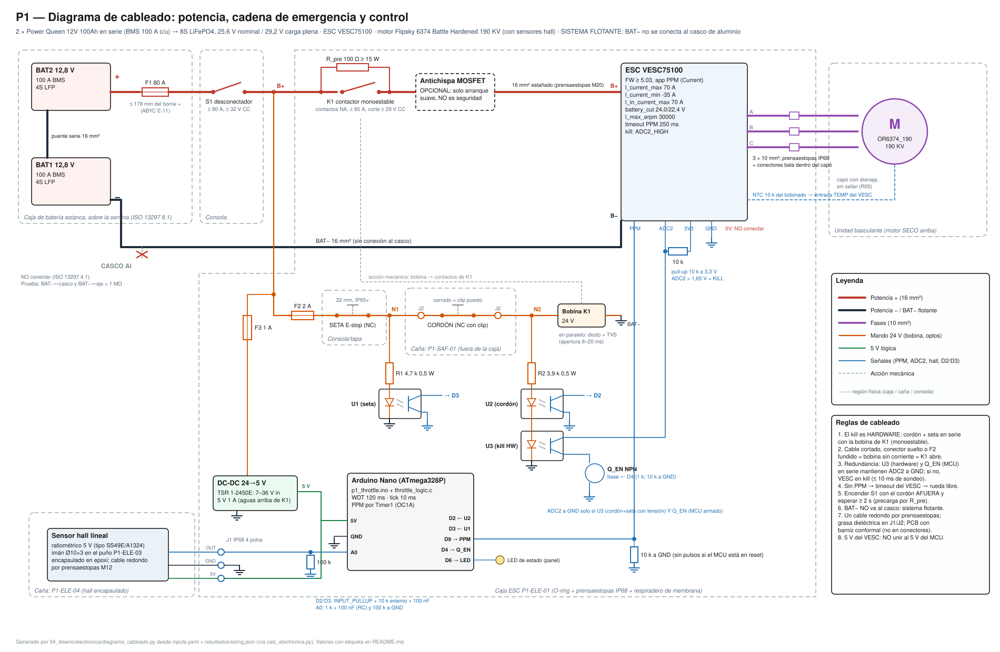

# 04_diseno/electronica — Electrónica, cadena de seguridad y control de P1

**Estado:** diseño + firmware + tests de lógica. **[NO EJECUTADO en hardware]**: nada de esto se probó todavía con componentes reales. Lo verificado en esta sesión: la lógica compila en C99 estricto (gcc 13.3 y avr-gcc 7.3 para ATmega328P), el sketch compila con arduino-cli 1.5.2 + core arduino:avr 1.8.8 (11 270 B de flash = 36 %, 436 B de RAM = 21 %), y `pytest -q tests/test_firmware.py` pasa (§5.8). Los parámetros del VESC se leyeron en el código fuente del firmware (`vedderb/bldc`, rama master, 2026-10-01).

Etiquetas: **[VERIFICADO: fuente]** · **[CALCULADO]** · **[ESTIMADO: base]** · **[SUPUESTO]**. Las tablas entre marcas `ELEC:` las genera `calc_electronica.py` desde `inputs.yaml` y `resultados/sizing.json`: no editarlas a mano.

| Archivo | Qué es |
|---|---|
| [`diagrama_cableado.svg`](diagrama_cableado.svg) | Diagrama de cableado: potencia, cadena de emergencia, control, sistema flotante |
| `diagrama_cableado.py` | Lo genera (svgwrite); rótulos leídos de `calc_electronica.compute()` |
| `calc_electronica.py` | Configuración del VESC, precarga, bobina, optos, presupuesto de corte, tabla de verdad; escribe `electronica.json`, `tabla_verdad.csv` y los bloques `ELEC:` de este README (`--check` solo verifica) |
| `firmware/throttle_logic.h`, `.c` | Lógica pura C99 (armado, rampa, zona muerta, expo, reversa limitada, dwell de inversión, fallas de sensor, watchdog lógico) |
| `firmware/p1_throttle/p1_throttle.ino` | Sketch Arduino Nano: E/S, PPM por Timer1, interrupciones del cordón/seta, WDT de hardware, LED, calibración |
| `firmware/p1_throttle/src/` | Copia idéntica de la lógica (el IDE de Arduino solo compila dentro de la carpeta del sketch). Un test exige que sea idéntica |
| `../../tests/test_firmware.py` | 40 tests (gcc + ctypes, coherencia y vigencia de lo generado) + 1 de compilación AVR opcional |

Regenerar: `python 04_diseno/electronica/calc_electronica.py && python 04_diseno/electronica/diagrama_cableado.py` (no están en `run_all.py`: ver §11).

---

## 1. Diagrama de cableado



[Abrir `diagrama_cableado.svg`](diagrama_cableado.svg)

Lectura rápida, de izquierda a derecha:

1. **Potencia (rojo/negro grueso):** BAT2(+) → **F1** a ≤ 178 mm del borne + [VERIFICADO: R06 §5.1, ABYC E-11 7 in; el texto de ABYC lo escribe "175 mm" → montar a ≤ 175 mm] → **S1** desconectador → **K1** contactor monoestable con **R_pre** en paralelo → (antichispa MOSFET opcional, solo arranque suave) → VESC → 3 fases → motor. BAT1(−) → VESC B−. Las dos baterías de 12,8 V van en serie con un puente de la misma sección que el cable DC.
2. **Mando 24 V (naranja):** nodo B+ (aguas abajo de S1) → **F2** → **SETA** (NC) → nodo **N1** → J2 → **CORDÓN** (cerrado con el clip puesto) → J2 → nodo **N2** → **bobina de K1** → BAT−. Cualquier apertura de esa serie (clip afuera, seta pulsada, cable cortado, conector suelto, F2 fundido, bobina abierta) deja la bobina sin corriente y K1 abre: es el corte **por hardware** que pide R06 §3.2 y §3.5.
3. **Sensado y redundancia (azul):** el opto **U1** ve N1 (seta) → D3 del Nano; **U2** ve N2 (cordón + seta) → D2; **U3** también ve N2 y está **en serie** con el transistor **Q_EN** (comandado por D4 del Nano) entre la entrada **ADC2** del VESC y GND. ADC2 tiene pull-up de 10 kΩ a 3,3 V: si cualquiera de los dos deja de conducir, ADC2 > 1,65 V → **kill por software del VESC** [VERIFICADO: `timeout.c`, `KILL_SW_MODE_ADC2_HIGH`].
4. **Control:** DC-DC 24→5 V (alimentado **aguas arriba de K1**, después de S1 y F3) → Nano y sensor hall. PPM por D9 → VESC (pull-down de 10 kΩ en el lado del VESC: con el MCU en reset no hay pulsos). El 5 V del VESC **no** se une al 5 V del Nano.
5. **Sistema flotante:** BAT− **no** se conecta al casco de aluminio [VERIFICADO: R06 §5.1, ISO 13297 4.1 *"The hull of a metallic hull craft shall not be used as a circuit conductor"*; la excepción de 5.1 cubre sistemas de propulsión identificados como aislados]. Ver T0.1.

**Por qué el MCU va con su propio DC-DC y no con el BEC del VESC** (la BOM actual dice lo contrario, ver §11): con K1 abierto el VESC solo recibe energía por R_pre (≤ 2,1 W, §7), su BEC puede quedar en brown-out y el MCU se reiniciaría en ciclos; alimentado aguas arriba de K1, el MCU sigue vivo durante un kill, latchea el desarme, muestra el estado en el LED y vuelve a exigir 1 s en cero para re-armar.

## 2. Arquitectura de seguridad: cadena de habilitación

El motor solo puede producir torque si se cumplen **todas** a la vez:

> **Motor con torque ⇔ [F1 ∧ S1 ∧ K1 cerrado] ∧ [U3: F2 ∧ seta ∧ cordón] ∧ [Q_EN: MCU armado] ∧ [PPM válido] ∧ [comando ≠ 0]**

Barreras independientes cuando se tira del cordón (o se pulsa la seta):

| # | Barrera | Tipo | Depende de | Falla que la anula |
|---|---|---|---|---|
| 1 | K1 abre (bus sin potencia; por R_pre pasan ≤ 2,1 W [CALCULADO, §7]) | Hardware | bobina en serie con cordón/seta | K1 soldado |
| 2 | U3 deja de conducir → ADC2 alto → VESC en kill | Hardware + VESC | nodo N2, firmware VESC ≥ 5.03 | U3 en corto, pull-up de ADC2 suelto, kill mal configurado |
| 3 | MCU ve D2/D3 en alto → desarma: PPM 1500 µs **en el mismo tick** + Q_EN abre | Software (MCU) | U1/U2, firmware P1 | U2 en corto, MCU defectuoso |
| 4 | PPM ausente → timeout del VESC → corriente de freno 0 A (rueda libre) | VESC | cable PPM, MCU | — (solo actúa si el MCU deja de mandar pulsos) |

Tiempo de corte por camino (cada uno debe cumplir el requisito por sí solo):

<!-- ELEC:corte -->
| Camino de corte (cada uno por separado) | t [ms] [CALCULADO] | Base | < 1,0 s |
|---|---|---|---|
| MCU → PPM neutro → VESC (rampa negativa) | 131 | filtro RC + 1 tick + 1 trama PPM + ramp_time_neg | ✔ |
| MCU → Q_EN abre → kill por ADC2 del VESC | 21 | filtro RC + 1 tick + sondeo de 10 ms del VESC | ✔ |
| Hardware: opto U3 apaga → kill por ADC2 (sin MCU) | 11 | sondeo 10 ms + conmutación del opto | ✔ |
| Hardware: bobina sin corriente → contactor abre | 50 | peor caso SW80 con solo diodo (50 ms); 8–20 ms con diodo+resistencia | ✔ |
| MCU muerto: sin PPM → timeout del VESC | 250 | timeout_msec configurado | ✔ |
| MCU colgado: WDT de hardware → reset → Q_EN abre → kill ADC2 | 142 | WDTO_120MS del sketch × 1,1 [ESTIMADO: tolerancia del oscilador del WDT] + sondeo 10 ms | ✔ |

Requisito 1,0 s [VERIFICADO: inputs.yaml electrical.kill_switch_response_s_max]; peor camino individual **250 ms** [CALCULADO]. El corte real es el del camino más rápido que siga sano; el requisito se exige a cada camino por separado.
<!-- /ELEC:corte -->

## 3. Tabla de verdad del kill switch y de la cadena de habilitación

Variables: cordón (1 = clip puesto), seta (1 = liberada), desconectador S1 (1 = ON), fusibles F1/F2 (1 = sano), K1 (normal / soldado / bobina abierta), MCU armado (1 = el MCU habilita; 1 con cordón afuera modela un **MCU defectuoso**), timeout del VESC (1 = PPM perdida), falla de sensor hall. "Barreras activas" cuenta cuántas de las 4 barreras de §2 están deteniendo el motor (mín–máx sobre las combinaciones agrupadas). Modelo lógico: `calc_electronica.chain()`; lo verifica `test_truth_table_only_all_ok_runs`.

<!-- ELEC:verdad -->
| Caso | Cordón | Seta | Descon. | F1 | F2 | K1 | MCU armado | Timeout VESC | Falla sensor | Motor | Barreras activas (mín–máx) | Comb. |
|---|---|---|---|---|---|---|---|---|---|---|---|---|
| Todo OK, MCU armado | 1 | 1 | 1 | 1 | 1 | normal | 1 | 0 | 0 | **PUEDE GIRAR** | 0–0: — | 1 |
| Cordón tirado (MCU sano → desarma) | 0 | 1 | 1 | 1 | 1 | normal | 0 | – | – | **PARADO** | 3–4: MCU manda neutro; VESC en kill (ADC2); VESC en timeout PPM; bus sin potencia (K1/F1/S1) | 4 |
| Cordón tirado + MCU defectuoso que sigue armado | 0 | 1 | 1 | 1 | 1 | normal | 1 | – | – | **PARADO** | 2–4: MCU manda neutro; VESC en kill (ADC2); VESC en timeout PPM; bus sin potencia (K1/F1/S1) | 4 |
| Cordón tirado + K1 soldado (MCU sano) | 0 | 1 | 1 | 1 | 1 | soldado | 0 | – | – | **PARADO** | 2–3: MCU manda neutro; VESC en kill (ADC2); VESC en timeout PPM | 4 |
| Cordón tirado + K1 soldado + MCU defectuoso | 0 | 1 | 1 | 1 | 1 | soldado | 1 | – | – | **PARADO** | 1–3: MCU manda neutro; VESC en kill (ADC2); VESC en timeout PPM | 4 |
| Seta pulsada (cualquier cordón/MCU/K1) | – | 0 | 1 | 1 | 1 | – | – | – | – | **PARADO** | 1–4: MCU manda neutro; VESC en kill (ADC2); VESC en timeout PPM; bus sin potencia (K1/F1/S1) | 48 |
| Desconectador OFF (cualquier otro estado) | – | – | 0 | – | – | – | – | – | – | **PARADO** | 4–4: MCU manda neutro; VESC en kill (ADC2); VESC en timeout PPM; bus sin potencia (K1/F1/S1) | 384 |
| Fusible principal F1 fundido | – | – | – | 0 | – | – | – | – | – | **PARADO** | 4–4: MCU manda neutro; VESC en kill (ADC2); VESC en timeout PPM; bus sin potencia (K1/F1/S1) | 384 |
| Fusible de mando F2 fundido | – | – | 1 | 1 | 0 | – | – | – | – | **PARADO** | 1–4: MCU manda neutro; VESC en kill (ADC2); VESC en timeout PPM; bus sin potencia (K1/F1/S1) | 96 |
| K1 con bobina abierta (no cierra) | – | – | – | – | – | bobina_abierta | – | – | – | **PARADO** | 1–4: MCU manda neutro; VESC en kill (ADC2); VESC en timeout PPM; bus sin potencia (K1/F1/S1) | 256 |
| K1 soldado, todo lo demás OK | 1 | 1 | 1 | 1 | 1 | soldado | 1 | 0 | 0 | **PUEDE GIRAR** | 0–0: — | 1 |
| MCU desarmado (arranque, re-armado pendiente) | – | – | – | – | – | – | 0 | – | – | **PARADO** | 2–4: MCU manda neutro; VESC en kill (ADC2); VESC en timeout PPM; bus sin potencia (K1/F1/S1) | 384 |
| PPM perdida (timeout del VESC) | – | – | – | – | – | – | – | 1 | – | **PARADO** | 1–4: MCU manda neutro; VESC en kill (ADC2); VESC en timeout PPM; bus sin potencia (K1/F1/S1) | 384 |
| Falla de sensor hall | – | – | – | – | – | – | – | – | 1 | **PARADO** | 1–4: MCU manda neutro; VESC en kill (ADC2); VESC en timeout PPM; bus sin potencia (K1/F1/S1) | 384 |

Enumeración completa: **768 combinaciones** en [`tabla_verdad.csv`](tabla_verdad.csv) (1 = cerrado/sano/sí, 0 = abierto/fundido/no; "–" = cualquier valor). El motor puede girar en **2** de ellas: todas exigen cordón, seta, desconectador, F1, F2, MCU armado, PPM válido y sensor sano; la única variable libre es K1 (normal o soldado): un K1 soldado no se nota en marcha → se prueba antes de cada salida.
<!-- /ELEC:verdad -->

Lectura: (a) el cordón o la seta detienen el motor en **todas** las combinaciones, incluso con K1 soldado **y** un MCU defectuoso (queda U3 → kill del VESC); (b) con el MCU sano y K1 normal hay ≥ 3 barreras simultáneas; (c) la combinación peligrosa que la tabla **no** cubre es un **cortocircuito entre los dos conductores del cordón** (puentea el interruptor para K1 *y* para U2/U3): ver §8 y la prueba previa a cada salida.

## 4. Lista de componentes (especificación mínima)

<!-- ELEC:componentes -->
| Ref. | Componente | Especificación mínima | Elegido / referencia (BOM) | Etiqueta |
|---|---|---|---|---|
| BAT1, BAT2 | Batería LiFePO4 12,8 V en serie (8S) | BMS ≥ 100 A cont. c/u; el fabricante debe admitir conexión en serie; bornes cubiertos | 2 × Power Queen 12V 100Ah en serie (BMS 100 A c/u) (B-BAT) | [SUPUESTO: selección de sizing; apto serie: confirmar por escrito] |
| F1 | Fusible principal | 80 A (≥ 77,2 A), ≥ 32 V CC, a ≤ 178 mm del borne + | IMAXX midiOTO 58 V + portafusible HMD4-MG1-H (B-FUSE, B-FUSEH) | [CALCULADO: sizing.json fuse] · 178 mm [VERIFICADO: R06 §5.1 ABYC E-11] · 58 V [VERIFICADO: R08a §6]; poder de corte no publicado [ESTIMADO] |
| S1 | Desconectador manual | ≥ 80 A cont., ≥ 32 V CC, llave removible | Biltema Hovedafbryder AFD 275 A 12–48 V (B-SW) | [VERIFICADO: R08a §3] |
| K1 | Contactor MONOestable (nunca biestable) | NA, ≥ 80 A cont., corte bajo carga ≥ 29,2 V CC, bobina apta para 29,2 V CONTINUOS y que cierre con ≤ 24,0 V (24 V solo con confirmación escrita de 122 % Us continuo; si no, 36 V), supresor diodo+R/TVS | Albright SW80 24 V (B-CONT); NO relés sin corte CC publicado (p. ej. FRC3) | [VERIFICADO: R06 §3.3 SW80: 48 V con corte, 8–20 ms, cierre ≤ 66 % Us] · sobretensión de bobina [CALCULADO, §7] |
| R_pre | Resistencia de precarga ∥ K1 | 100 Ω, ≥ 15 W, carcasa de Al atornillada a la tapa-disipador | genérica (agregar a la BOM) | [CALCULADO] [SUPUESTO: research/R06_electrica.md §3.4 (100 Ω → 5τ ≤ 1 s)] |
| ASW | Antichispa MOSFET (OPCIONAL) | solo arranque suave aguas abajo de K1; falla en corto → NO es seguridad | Flipsky Antispark Pro V3.0 (B-ASW) | [VERIFICADO: R06 §3.1] |
| F2 | Fusible de mando (bobina) | 2 A, portafusible en línea estanco | genérico (agregar a la BOM) | [CALCULADO] |
| F3 | Fusible del DC-DC | 1 A, portafusible en línea | genérico (agregar a la BOM) | [SUPUESTO: protege el cable de 0,5 mm²; consumo de entrada ≈ 15 mA [ESTIMADO: 0,3 W / 25,6 V / 0,8]] |
| CORDÓN | Interruptor de hombre al agua | contacto CERRADO con clip (fail-safe), ≥ 1,3 A a 29,2 V CC | Watski Dødmands kontakt universal, polos M (B-KILL); alt. Sea Dog SD-420487-1 | ≥ [CALCULADO: 2 × I_bobina máx] · [VERIFICADO: research/R08a §3 — Watski 'Dødmands kontakt universal' 12 V – 15 A] — nominal 12 V < 29,2 V → ensayo T0.19 (200 aperturas) · Sea Dog 5 A [VERIFICADO: Sea Dog SD-420487-1, 5 A máx. (research/R06_electrica.md §3.2)] |
| SETA | Seta de emergencia | NC, enclavamiento (girar para rearmar), Ø22, IP65, ≥ 1 A | B-ESTOP | [ESTIMADO: especificación de BOM] |
| J1 | Conector IP68 del hall (caña) | 4 polos apantallado: 5 V, GND, OUT, malla | Lumberg 0332-04 + 0322-04 (B-SIGNAL) | [VERIFICADO: R08a §8] |
| J2 | Conector IP68 del cordón (caña) | 2 polos, ≥ 1 A | Cliffcon 68 FM686812 (B-KCONN) | [VERIFICADO: R08a §8] |
| ESC | VESC 75 V / 100 A | FW ≥ 5.03, filtro de fase OFF, entradas PPM y ADC2 accesibles, NTC de motor | Flipsky 75100 V2.0 (B-ESC) | [VERIFICADO: R08a §2; R06 §2.2] |
| M | Motor | con NTC 10 k en el bobinado (protección térmica del VESC) | Flipsky 6374 Battle Hardened 190 KV (con sensores hall) (B-MOT) | [VERIFICADO: R06 §1.2 soporte NTC] |
| DC-DC | Regulador 24→5 V | 5 V ≥ 0,5 A; entrada máx. > l_max_vin = 35 V; alimentado aguas ARRIBA de K1 | TRACO TSR 1-2450E 7–36 V (o RECOM R-78HB 9–72 V) | [VERIFICADO: research/R08a §9 — TRACO TSR 1-2450E, entrada 7–36 V → 5 V 1 A] |
| MCU | Arduino Nano (ATmega328P, 5 V, 16 MHz) | bootloader NUEVO (Optiboot): el viejo entra en bucle tras un reset por WDT | Arduino Nano V3 (B-MCU) | [VERIFICADO: R08a §9] · bootloader [ESTIMADO: problema conocido; se prueba en T0.18] |
| HALL | Sensor hall lineal ratiométrico 5 V + imán | salida analógica ratiométrica; imán NdFeB Ø10×3 diametral | Allegro A1324 (B-HALL) | [VERIFICADO: R08a §9 (sensor)]; imán [ESTIMADO] |
| U1–U3 | Optoacoplador de fototransistor (×3) | CTR ≥ 50 % a 5 mA, Vceo ≥ 30 V, aislación ≥ 2,5 kV | genérico 4 pines (agregar a la BOM) | [SUPUESTO: especificación mínima de compra CTR ≥ 50 %] |
| D_U1–D_U3 | Diodo antiparalelo de cada LED de opto | 1N4148 o similar (≥ 75 V, ≥ 100 mA), cátodo al ánodo del LED: limita la tensión inversa a ≈ 0,7 V (sin él: 29,9 V) | genérico (agregar a la BOM) | [CALCULADO, §7] |
| R1 / R2 | R serie de los LED de U1 / U2+U3 | 4,7 kΩ / 3,9 kΩ, 0,5 W | genéricas | [CALCULADO] |
| Q_EN | Transistor de habilitación (ADC2 del VESC) | NPN Vceo ≥ 30 V, Ic ≥ 50 mA; base 1 kΩ desde D4 y 10 kΩ a GND | genérico | [SUPUESTO] |
| Pasivos | Pull-ups y filtros | D2/D3: 10 kΩ a 5 V + 100 nF; ADC2: 10 kΩ a 3,3 V; A0: 1 kΩ + 100 nF + 100 kΩ a GND; PPM: 10 kΩ a GND | genéricos | [SUPUESTO: pull-up externo 10 kΩ (D2/D3 a 5 V; ADC2 a 3,3 V, R06 §2.5)] · [SUPUESTO: 10 kΩ × 100 nF en D2/D3 (inmunidad a ruido del motor)] |
| LED | LED de estado de panel | IP67, 5 V con resistencia | genérico | [SUPUESTO] |
| Cables | Potencia / mando / señal | DC 16 mm², fases 10 mm² (estañados); mando 0,75–1 mm² estañado; hall: 4 × 0,25 mm² apantallado redondo; cordón: 2 × 0,75 mm² redondo | Skyllermarks estañado (B-CAB-DC, B-CAB-PH) | [CALCULADO: sizing.json cables] · mando/señal [SUPUESTO] |
| Prensaestopas | Pasamuros IP68 | un cable REDONDO por prensaestopas; M20 6–12 mm (DC, fases), M16 4–8 mm (hall, cordón) | Biltema M20 / M16 (B-GLAND20, B-GLAND16) | [VERIFICADO: R08a §8] · regla de un cable [ESTIMADO: R05 §B8] |
| Respiradero | Membrana ePTFE M12 | IP68, en la cara inferior de la caja | B-VENT | [ESTIMADO; necesidad: R03/R05 bombeo térmico] |
<!-- /ELEC:componentes -->

## 5. Firmware

### 5.1 Estructura

- `throttle_logic.c/.h`: función de paso `tl_outputs_t tl_tick(tl_ctx_t *s, const tl_inputs_t *in, uint32_t dt_ms)`. Entradas: lectura ADC 10 bits del hall (ratiométrico, Vref = AVCC = alimentación del sensor), `kill_cord_ok`, `estop_ok`, `vesc_ok` (opcional), `dt_ms`. Salidas: `cmd` ∈ [−1, 1], `ppm_us` ∈ [1000, 2000] (1500 = neutro), `state`, `flags`, `enable`. Sin dependencias de Arduino; solo tipos de ancho fijo y `float` (en AVR `double` = `float`).
- `p1_throttle.ino`: lee entradas cada 10 ms [SUPUESTO], llama `tl_tick`, aplica salidas; las ISR de INT0/INT1 (D2/D3) ponen neutro y abren Q_EN **dentro de ~1 ms** del flanco a kill [ESTIMADO: 0,92 τ hasta V_IH = 0,6·Vcc con τ = 10 kΩ × 100 nF = 1 ms; algo menos con el pull-up interno en paralelo], antes del próximo tick. El neutro del PPM entra en la **próxima trama** (OCR1A tiene doble buffer: ≤ 20 ms); Q_EN abre en el acto.

### 5.2 Máquina de estados

| Estado | Salida | Entra cuando | Sale cuando |
|---|---|---|---|
| `DISARMED` | neutro, `enable` = 0 | power-on; cordón/seta abiertos; watchdog lógico | ≥ `arm_hold_ms` continuos con cordón+seta OK, sensor válido, calibración válida y acelerador en zona muerta → `ARMED` |
| `FAULT` | neutro, `enable` = 0 | ADC < `adc_fault_low` o > `adc_fault_high`; salto imposible; VESC en falla (si se usa); calibración inválida | igual que `DISARMED` (re-armado con 1 s en cero) |
| `ARMED` | 0, `enable` = 1 | armado y acelerador en zona muerta, sin dwell pendiente | comando ≠ 0 → `RUN_*` |
| `RUN_FWD` / `RUN_REV` | rampa hacia el objetivo | comando > 0 / < 0 | soltar → `DWELL_ZERO`; cualquier falla → `DISARMED`/`FAULT` en el **mismo tick** |
| `DWELL_ZERO` | 0 | la salida llegó a 0 tras marchar; o se pidió el sentido opuesto | `dwell_ms` cumplido → `ARMED`/sentido nuevo; mismo sentido → sigue sin esperar |

Reglas: (1) todo corte de seguridad es **inmediato** (sin rampa); (2) cualquier kill/fault/watchdog **latchea** el desarme: aunque el cordón vuelva, no arranca hasta 1 s continuo en cero; (3) un `dt_ms` > `watchdog_ms` no cuenta como tiempo en cero; (4) la marcha atrás **escala** el comando (tope atrás = −`reverse_limit`), no lo recorta; (5) la inversión exige que la **salida** permanezca en 0 durante ≥ `dwell_ms`, aunque el puño pase rápido por el centro.

Flags (`tl_outputs_t.flags`, bits en `throttle_logic.h`): `KILL_CORD`, `ESTOP`, `SENS_LOW`, `SENS_HIGH`, `SENS_JUMP`, `WATCHDOG`, `VESC` (latcheados hasta el próximo armado); `CAL`, `NOT_ZERO`, `RAMP`, `REV_LIM`, `DWELL`, `ARMING` (instantáneos).

### 5.3 Parámetros por defecto (leídos de `tl_default_config()`)

<!-- ELEC:firmware -->
| Parámetro (`tl_config_t`) | Valor por defecto | Etiqueta |
|---|---|---|
| `deadband` | 0,08 | [SUPUESTO: ±8 % de la semicarrera (pedido de diseño); ajustar en T0] |
| `expo` | 0,0 | [SUPUESTO: lineal; la rampa ya suaviza. 0,3 si el puño resulta "nervioso"] |
| `reverse_limit` | 0,5 | [SUPUESTO: = inputs.yaml motor.reverse_current_frac (0,5)] |
| `jump_travel_per_s` | 25,0 | [SUPUESTO: el puño no recorre tope a tope en < 40 ms; validar en T0.9] |
| `adc_rev` | 1,30 V → 266 cuentas | [ESTIMADO: provisorio tipo SS49E; lo reemplaza la calibración (T0.5); con cal_valid = 0 no arma] |
| `adc_center` | 2,50 V → 512 cuentas | [ESTIMADO: provisorio tipo SS49E; lo reemplaza la calibración (T0.5); con cal_valid = 0 no arma] |
| `adc_fwd` | 3,70 V → 757 cuentas | [ESTIMADO: provisorio tipo SS49E; lo reemplaza la calibración (T0.5); con cal_valid = 0 no arma] |
| `adc_fault_low` | 0,30 V → 61 cuentas | [SUPUESTO: ~0,3 V (pedido de diseño)] |
| `adc_fault_high` | 4,70 V → 962 cuentas | [SUPUESTO: ~4,7 V (pedido de diseño)] |
| `min_half_span` | 0,50 V → 102 cuentas | [SUPUESTO: semicarrera >= 0,5 V -> >= 102 cuentas de resolución] |
| `jump_noise_counts` | 12 | [ESTIMADO: ruido hall+ADC tras promediar 4 muestras ~±5 cuentas, ×2] |
| `arm_hold_ms` | 1000 | [SUPUESTO: >= 1 s en cero para armar (pedido de diseño)] |
| `ramp_up_ms` | 1000 | [SUPUESTO: 0->100 % en >= 1 s (pedido de diseño; R06 §2.6 sugiere ~1 s)] |
| `ramp_down_ms` | 250 | [SUPUESTO: bajada rápida 100->0 % en 0,25 s; los cortes de seguridad son inmediatos] |
| `dwell_ms` | 500 | [SUPUESTO: >= 0,5 s en cero antes de invertir (pedido de diseño; correa HTD)] |
| `watchdog_ms` | 100 | [SUPUESTO: tick nominal 10 ms; > 100 ms sin tick = lazo colgado] |
| `ppm_min_us` | 1000 | [VERIFICADO: VESC appconf_default.h APPCONF_PPM_PULSE_START 1,0 ms] |
| `ppm_center_us` | 1500 | [VERIFICADO: APPCONF_PPM_PULSE_CENTER 1,5 ms] |
| `ppm_max_us` | 2000 | [VERIFICADO: APPCONF_PPM_PULSE_END 2,0 ms] |
| `cal_valid` | 0 | — |
| `use_vesc_ok` | 0 | [SUPUESTO: sin telemetría UART en P1; hook para P2] |
<!-- /ELEC:firmware -->

Detección de "salto imposible": entre dos muestras se admite `jump_noise_counts + |adc_fwd − adc_rev| × jump_travel_per_s × dt` [CALCULADO: con los valores de arriba ≈ 135 cuentas en 10 ms = 27 % de la carrera total]. Un puño a mano (0→100 % en 150 ms) o el retorno por resortes en 30 ms no disparan; un salto centro→tope en un tick sí (tests).

### 5.4 Pines del Nano

| Pin | Función | Hardware | Falla → resultado |
|---|---|---|---|
| A0 | Hall (ADC, Vref AVCC 5 V) | 1 kΩ + 100 nF; 100 kΩ a GND | señal o 5 V cortados → ≈ 0 V → `SENS_LOW` |
| D2 (INT0) | Cordón (opto U2) | `INPUT_PULLUP` + 10 kΩ externo + 100 nF | ALTO = kill (abierto/cortado/suelto) |
| D3 (INT1) | Seta (opto U1) | ídem | ALTO = e-stop |
| D9 (OC1A) | PPM, Timer1 modo 14, prescaler 8, 50 Hz | 10 kΩ a GND en el VESC | reset del MCU → sin pulsos → timeout del VESC |
| D4 | Q_EN (habilita ADC2 a GND) | NPN, base 1 kΩ, 10 kΩ a GND | reset → transistor abierto → kill del VESC |
| D6 / D13 | LED de estado | panel IP67 | — |

Coherencia del cableado en serie: si D2 dice "cordón OK" pero D3 dice "seta abierta" (imposible con la serie seta→cordón), el sketch trata ambos como abiertos. WDT de hardware `WDTO_120MS`; `wdt_reset()` solo tras un tick completo; el registro de reset (MCUSR) se imprime al arrancar (bit 0x08 = reset por WDT; con Optiboot puede leer 0 [ESTIMADO]). `p1_early_init()` (en `.init3`: copia MCUSR y apaga el WDT antes de `setup()`) lleva `__attribute__((used))`: el core compila con `-flto` y **sin `used` el enlazador la descartaba** (revisión adversarial: el ELF no tenía ningún acceso a MCUSR; sin Optiboot, tras un reset por WDT el WDT seguía activo a 16 ms → bucle de reset). Lo verifica `test_avr_build_if_toolchain_available` con `avr-objdump`.

### 5.5 Compilación

```
arduino-cli core install arduino:avr
arduino-cli compile --fqbn arduino:avr:nano 04_diseno/electronica/firmware/p1_throttle
# para T0 (habilita el comando 'h' que cuelga el lazo para probar el WDT):
arduino-cli compile --fqbn arduino:avr:nano --build-property "compiler.cpp.extra_flags=-DP1_TEST_COMMANDS=1" 04_diseno/electronica/firmware/p1_throttle
arduino-cli upload  --fqbn arduino:avr:nano -p /dev/ttyUSB0 04_diseno/electronica/firmware/p1_throttle
```

Resultado en esta sesión [VERIFICADO: arduino-cli 1.5.2-rc.1, arduino:avr 1.8.8, avr-gcc 7.3.0]: compila sin advertencias en los archivos del proyecto; 11 270 B / 436 B (versión de agua) y 11 390 B (versión T0), con `used` en `p1_early_init` (antes 11 244 B: la función no estaba en el binario) y `serial_poll()` procesando un carácter por vuelta de `loop()` (una ráfaga por USB ya no puede bloquear el lazo hasta el WDT). Si se modifica la lógica: `cp firmware/throttle_logic.[ch] firmware/p1_throttle/src/` (el test lo exige). FQBN `arduino:avr:nano` = bootloader nuevo; con un clon de bootloader viejo, regrabar el bootloader o comprobar T0.18.

### 5.6 Calibración (una vez, y tras cambiar imán/sensor)

Monitor serie 115200. Con **el cordón afuera** (K1 abierto; el sketch se niega a calibrar con el cordón puesto): `c` → soltar el puño, `1` → tope avance, `2` → tope atrás, `3` → `s`. `tl_calibrate()` exige orden monótono, semicarrera ≥ 102 cuentas y los tres puntos dentro de la banda válida; se guarda en EEPROM con CRC-8. Sin calibración válida el estado es `FAULT` permanente (no arma). Se admite el imán invertido (avance con tensión decreciente).

### 5.7 LED y telemetría

LED: fijo = armado; 4 Hz = desarmado con acelerador fuera de cero; 2 Hz = contando 1 s en cero; destello cada 2 s = cordón/seta abiertos; 10 Hz = `FAULT`. Telemetría CSV cada 100 ms (`t` la activa/desactiva): `t_ms, estado, adc, cmd, ppm_us, flags, enable` — es el registro que usa T0.

### 5.8 Tests (`pytest -q tests/test_firmware.py`)

Compila `throttle_logic.c` con `gcc -std=c99 -Wall -Wextra -Wpedantic -Wconversion -Wshadow -Wdouble-promotion -Werror` a una librería compartida en un directorio temporal y la usa por ctypes (el tamaño de cada struct se verifica contra C). Movimientos del puño realistas (`goto` de 100 ms). Escenarios: estructuras; defaults vs requisitos e `inputs.yaml`; sin calibración no arma; **no arranca con acelerador fuera de cero al encender** (60 %, +100 %, −100 %); **arma tras 1 s continuo en cero** (y una interrupción reinicia el conteo); **rampa de subida** ≤ 1 %/10 ms y 0→100 % en ≥ 1 s; **bajada rápida**; **cordón y seta → neutro en el mismo tick, latch y re-armado solo tras 1 s en cero**; **encendido con el cordón afuera o la seta pulsada → no arma, y al reponerlos exige 1 s más**; glitch de un tick; **reversa ≤ 50 %** (PPM 1250 µs); **inversión con dwell ≥ 0,5 s** (ambos sentidos, barrido lento por el centro, re-aplicación en el mismo sentido sin espera); **sensor abierto/en corto** (6 valores) → neutro + `FAULT` + re-armado; bordes de la banda válidos; **salto imposible** vs mano real; **watchdog lógico** (100 ms pasa, 101 ms corta; un dt largo no cuenta como cero); **zona muerta**; expo; calibración (incl. imán invertido); entrada de falla del VESC; **tiempo total de corte < 1 s** por camino; fuzz de 20 000 ticks con invariantes (PPM en rango, neutro ante cualquier condición insegura, rampa, dwell entre signos opuestos, cada armado precedido por ≥ 1 s en cero con todo OK); tabla de verdad; copia del sketch idéntica, E/S requeridas y `used` en `p1_early_init`; config VESC coherente con sizing e `inputs.yaml` (polos, temperatura de motor); hallazgos del circuito reflejados en la lista de componentes; el diagrama se genera; **README/JSON/CSV/SVG vigentes** respecto de `inputs.yaml` + `sizing.json`. El tick de los tests se lee de `TICK_MS` del sketch. Resultado: **40 passed, 1 skipped** (la compilación AVR se salta si no hay `avr-gcc`/`arduino-cli`; con `P1_ARDUINO_CLI=<ruta>` y `avr-gcc` en el PATH también pasó, incluida la verificación con `avr-objdump` de que `p1_early_init` está en `.init3`).

## 6. Configuración obligatoria del VESC

Los valores por defecto del firmware **no sirven** para el bote [VERIFICADO: R06 §2.4]. Cargar en VESC Tool (Motor Config y App Config), escribir, reiniciar, **volver a leer** y comparar con esta tabla (T0.6). Guardar el XML exportado junto a este README. Columna "Default FW": [VERIFICADO: `motor/mcconf_default.h` y `applications/appconf_default.h` de vedderb/bldc, rama master, leídos el 2026-10-01]; entre paréntesis, el valor que pone el firmware del **target 75_100** (`hwconf/flipsky/hw_75_100.h`) cuando difiere [VERIFICADO: R06 §2.2, §2.4] — es lo que se verá en VESC Tool con un Flipsky 75100; los nombres de parámetro, [VERIFICADO: `datatypes.h`].

<!-- ELEC:vesc -->
| Grupo | Parámetro (VESC Tool) | Valor P1 | Unidad | Default FW | Etiqueta | Nota |
|---|---|---|---|---|---|---|
| Firmware | `versión de firmware` | ≥ 5.03 | — | — | [VERIFICADO: research/R06_electrica.md §2.2 — KILL_SW_MODE aparece en 5.03; no existe en 5.02] | — |
| Firmware | `foc_phase_filter_enable` | false | — | true (false en target 75_100, FW ≥ 6.00) | [VERIFICADO: research/R06_electrica.md §2.1 — Flipsky: con FW ≥ 5.3 apagar el filtro de fase o se daña el 75100]; default [VERIFICADO: mcconf_default.h MCCONF_FOC_PHASE_FILTER_ENABLE; hw_75_100.h false (research/R06_electrica.md §2.2)] | Solo Flipsky 75100/75200; un VESC con filtro de fase por hardware puede dejarlo |
| Motor | `si_motor_poles` | 14 | — | 14 | [inputs.yaml motor.options.OR6374_190.pole_pairs = 7 (allí con su etiqueta)] · default FW 14 [VERIFICADO: mcconf_default.h MCCONF_SI_MOTOR_POLES]; CONTAR imanes del motor real | — |
| Motor | `l_current_max` | 70 | A | 60 | [SUPUESTO: inputs.yaml motor.current_limit_a]; default 60 A [VERIFICADO: mcconf_default.h] | En PPM Current acelera con servo × l_current_max en AMBOS sentidos [VERIFICADO: app_ppm.c] |
| Motor | `l_current_min` | -35 | A | -60 | [CALCULADO: −reverse_current_frac × l_current_max] | Corriente de FRENADO (servo opuesto a las rpm) [VERIFICADO: app_ppm.c] |
| Motor | `límite de reversa (MCU)` | 0,5 × l_current_max = 35 | A | — | [CALCULADO: firmware escala el PPM negativo a −reverse_limit] | Coincide con bollard en reversa de sizing: I_m = 35 A |
| Batería | `l_in_current_max` | 65 | A | 99 (100 en target 75_100) | [CALCULADO: ⌈1,05 × I_bat pico 61,8 A⌉ a 5 A, ≤ 80 % × BMS 100 A] | No limita el pico de sizing (61,8 A) y deja 15 A de margen al 80 % del BMS |
| Batería | `l_in_current_min` | -10 | A | -60 (-100 en target 75_100) | [SUPUESTO: la hélice regenera poco; protege el BMS al frenar/invertir] · defaults [VERIFICADO: mcconf_default.h; hw_75_100.h (research/R06_electrica.md §2.4)] | — |
| Batería | `l_battery_cut_start` | 24 | V | 10 | [CALCULADO: 8 celdas × 3 V] · [ESTIMADO: research/R06_electrica.md §2.4, corte LFP 3,0 V/celda] | — |
| Batería | `l_battery_cut_end` | 22,4 | V | 8 | [CALCULADO: 8 × 2,8 V] · [ESTIMADO: research/R06_electrica.md §2.4, corte LFP 2,8 V/celda] | OJO: sizing usa V mín bajo carga = 22 V < cut_end → con batería baja el VESC recorta antes de lo que supone el cálculo de V máx |
| Batería | `l_max_vin` | 35 | V | 57 (90 en target 75_100) | [CALCULADO: 1,2 × 29,2 V] · [SUPUESTO: l_max_vin = 1,2 × V carga plena → protege el DC-DC ante un BMS abierto regenerando] | < entrada máx. del DC-DC TSR 1-2450E 36 V |
| Velocidad | `l_max_erpm` | 29100 | ERPM | 100000 | [CALCULADO: 1,15 × 3619 rpm (máx. con carga, sizing) × 7 pares de polos] | Sin carga (hélice fuera del agua) el motor iría a 5548 rpm = 38836 ERPM [CALCULADO: KV 190 × 29,2 V]; el límite lo baja a 4157 rpm |
| Velocidad | `l_min_erpm` | -18900 | ERPM | -100000 | [CALCULADO: −1,5 × 1796 rpm (bollard reversa, sizing) × 7] · [SUPUESTO: 50 % sobre las rpm del bollard en reversa (arrancada hacia atrás)] | — |
| Velocidad | `l_max_duty` | 0,95 | — | 0,95 | [VERIFICADO: mcconf_default.h MCCONF_L_MAX_DUTY 0,95; mantener] | — |
| Temperatura | `l_temp_fet_start / end` | 85 / 100 | °C | 85 / 100 | [VERIFICADO: mcconf_default.h; mantener] | — |
| Temperatura | `l_temp_motor_start / end` | 85 / 100 | °C | 85 / 100 | [CALCULADO: start = mín(85 default, t_winding_max_c 85 °C de inputs.yaml); end = start + 15 como el default] · default 85/100 [VERIFICADO: mcconf_default.h] | sizing toma t_winding_max_c como la temperatura donde el VESC EMPIEZA a limitar: no subir start sin rehacer el cálculo térmico. Requiere NTC 10 k en el bobinado (TEMP_SENSOR_NTC_10K_25C, R06 §1.2) |
| App | `app_to_use` | PPM | — | UART | [VERIFICADO: appconf_default.h APPCONF_APP_TO_USE = APP_UART → cambiar] | — |
| App PPM | `ctrl_type` | PPM_CTRL_TYPE_CURRENT | — | NONE | [VERIFICADO: https://raw.githubusercontent.com/vedderb/bldc/master/applications/app_ppm.c — reversa directa con signo] | La lógica de dwell/inversión la hace el MCU; alternativa DUTY si la hélice ventila (R06 §2.6) |
| App PPM | `pulse_start / center / end` | 1,0 / 1,5 / 2,0 | ms | 1,0 / 1,5 / 2,0 | [VERIFICADO: appconf_default.h] = salida del MCU (throttle_logic.c) | — |
| App PPM | `hyst (zona muerta VESC)` | 0,02 | — | 0,15 | [SUPUESTO: el MCU ya aplica la zona muerta; default 0,15 VERIFICADO se comería el 15 % inferior] | app_ppm.c aplica utils_deadband(servo, hyst) [VERIFICADO: app_ppm.c] |
| App PPM | `throttle_exp` | 0 | — | 0 | [VERIFICADO: default lineal; la expo la hace el MCU] | — |
| App PPM | `ramp_time_pos` | 1 | s | 0,4 | [SUPUESTO: redundante con la rampa del MCU (research/R06_electrica.md §2.6 ~1 s); default 0,4 s VERIFICADO] | — |
| App PPM | `ramp_time_neg` | 0,1 | s | 0,2 | [SUPUESTO: bajada rápida en el VESC; default 0,2 s VERIFICADO appconf_default.h] | — |
| App PPM | `safe_start` | true | — | true | [VERIFICADO: app_ppm.c MIN_PULSES_WITHOUT_POWER 50 → ≈ 1 s de neutro a 50 Hz [CALCULADO]] | — |
| General | `timeout_msec` | 250 | ms | 1000 | [SUPUESTO: 12 tramas PPM perdidas; default 1000 ms VERIFICADO appconf_default.h] | Sin PPM válido → corriente de freno de timeout [VERIFICADO: app_ppm.c] |
| General | `timeout_brake_current` | 0 | A | 0 | [VERIFICADO: appconf_default.h; 0 = rueda libre] | — |
| General | `kill_sw_mode` | KILL_SW_MODE_ADC2_HIGH | — | DISABLED | [VERIFICADO: https://raw.githubusercontent.com/vedderb/bldc/master/timeout.c — kill si V(ADC_EXT2) > 1,65 V, sondeo cada 10 ms] | Pull-up 10 kΩ a 3,3 V en ADC2; Q_EN + opto U3 lo llevan a GND solo con cordón+seta+MCU armado |
| General | `multi_esc` | false | — | true | [VERIFICADO: appconf_default.h APPCONF_PPM_MULTI_ESC true; un solo ESC] | — |
<!-- /ELEC:vesc -->

Notas: (1) `l_current_max` es el límite de corriente de motor de `inputs.yaml` y en modo PPM *Current* se usa para acelerar **en ambos sentidos**; el 50 % de marcha atrás lo garantiza el MCU (PPM ≥ 1250 µs) y `l_current_min` acota el **frenado** [VERIFICADO: `app_ppm.c`, rama `PPM_CTRL_TYPE_CURRENT`]. (2) `hyst` chico porque `app_ppm.c` aplica `utils_deadband(servo, hyst)` además de la zona muerta del MCU [VERIFICADO: app_ppm.c]. (3) `safe_start` del VESC exige 50 pulsos en neutro [VERIFICADO: `MIN_PULSES_WITHOUT_POWER 50`]: el MCU manda neutro desde el arranque y durante el segundo de armado, así que se cumplen solos. (4) `l_max_erpm` depende del número de polos: **contar los imanes** del motor real y corregir `si_motor_poles`. (5) Detección de motor (FOC) **sin correa**. (6) Con FW ≥ 5.3 en un Flipsky 75100, `foc_phase_filter_enable = false` o se daña el ESC [VERIFICADO: R06 §2.1].

## 7. Cálculos del circuito

<!-- ELEC:calc -->
| Magnitud | Valor | Etiqueta / base |
|---|---|---|
| Pack | 2 × Power Queen 12V 100Ah en serie (BMS 100 A c/u) → 8S LFP, 25,6 V nom., 29,2 V carga plena | [CALCULADO: inputs.yaml battery] · V/celda [ESTIMADO: research/R06_electrica.md §4.3, LFP 3,65 V/celda máx.] |
| R de precarga (en paralelo con K1) | 100 Ω, ≥ 15 W (carcasa de Al sobre la tapa-disipador) | [SUPUESTO: research/R06_electrica.md §3.4 (100 Ω → 5τ ≤ 1 s)]; potencia [CALCULADO: 1,5 × V²/R en corto del bus] |
| τ = R·C_bus / 5τ | 0,20 s / 1,00 s | [CALCULADO] con C_bus 2 mF [ESTIMADO: research/R06_electrica.md §3.4, C de bus del VESC 1–2 mF no publicado; se toma el mayor] |
| Pico de corriente / energía en R | 0,29 A / 0,85 J | [CALCULADO: V_máx/R; ½·C·V²] |
| Potencia máx. que pasa por R con K1 abierto | 2,1 W = 0,23 % del crucero (910 W, sizing) | [CALCULADO: V²/4R] → sin empuje con K1 abierto |
| Espera con cordón AFUERA tras encender S1 | ≥ 2 s | [CALCULADO: ≥ 2 × 5τ, redondeado] |
| Bobina K1 | 24 V, R = 44,3–82,3 Ω, I máx 0,66 A a 29,2 V | [CALCULADO] desde [VERIFICADO: Albright SW80, bobina continua 7–13 W (research/R06_electrica.md §3.3)]; rango de bobina requerido 22,0–29,2 V |
| Bobina a carga plena (sobretensión) | Us 24 V: 122 % Us → 10,4–19,2 W, cierra con ≤ 15,8 V (✔ vs 24,0 V en reposo al corte, margen 8,2 V); Us 36 V: 81 % Us → 4,6–8,6 W, cierra con ≤ 23,8 V (✔ vs 24,0 V en reposo al corte, margen 0,2 V) | [CALCULADO: V_máx²/R_bobina] · [VERIFICADO: Albright SW80, bobina prolongada 13–15 W (research/R06_electrica.md §3.3)] · [VERIFICADO: Albright SW80, cierre máx. 66 % Us, tipo continuo (research/R06_electrica.md §3.3)] · [SUPUESTO: tensión de bobina alternativa a evaluar con Albright (6–240 V CC disponibles, R06 §3.3)] → con 24 V la bobina queda a 122 % Us sin tolerancia publicada (R06 §3.3 d): pedir confirmación escrita o usar 36 V |
| Consumo de bobina en 2 h | 15,9–29,6 Wh = 0,7–1,3 % de la energía usable (sizing) | [CALCULADO: V_nom²/R × t] |
| Fusible de mando F2 | 2,0 A | [CALCULADO: primer valor normalizado ≥ 3 × I_bobina máx] · factor [SUPUESTO: fusible de mando ≥ 3 × I_bobina máx.] |
| Margen del interruptor de cordón | 5,0 A / 0,66 A = 7,6× (peor caso: Sea Dog 5 A; Watski 15 A) | [VERIFICADO: Sea Dog SD-420487-1, 5 A máx. (research/R06_electrica.md §3.2)] · [VERIFICADO: research/R08a §3 — Watski 'Dødmands kontakt universal' 12 V – 15 A] |
| R serie de U2+U3 (nodo bobina) | 3900 Ω, 5,0–6,9 mA, P 0,18 W → 0,5 W | [CALCULADO: E12 ≤ (V_nom − 2·Vf)/I] [ESTIMADO: LED IR de optoacoplador típico 1,1–1,4 V] |
| R serie de U1 (nodo seta) | 4700 Ω, 4,4–6,0 mA, P 0,17 W → 0,5 W | [CALCULADO] |
| Tensión inversa en los LED de U1–U3 al abrir la bobina | N2 → -29,9 V (supresor diodo + R 44 Ω) vs V_R máx. 5 V → **diodo 1N4148 en antiparalelo con cada LED** (conduce 7,3 mA de pico por R2) | [CALCULADO: −(V_d + I_bobina·R_sup)] · [SUPUESTO: R del supresor diodo+R ≈ R de bobina (pico ≈ 2·V); el valor real lo fija T0.4] · [ESTIMADO: V_R máx. del LED de optoacopladores de fototransistor típicos 5–6 V; verificar en la hoja del elegido] |
| Precarga con el consumo en reposo del VESC | I_q ≤ 25,6 mA para llegar al 90 % con K1 abierto; al 80 % la energía del cierre de K1 es 26 mJ | [CALCULADO: 0,1·V_nom/R; ½·C·(0,2·V_nom)²] · [SUPUESTO: el consumo en reposo del VESC 75100 no está publicado; se mide en T0.3] |
| Corriente de colector mínima (CTR 50 %) vs pull-up | 2,51 mA ≫ 0,50 mA (5 V) / 0,33 mA (3,3 V) | [CALCULADO] [SUPUESTO: especificación mínima de compra CTR ≥ 50 %] |
| Fusible principal F1 / cable DC / fases | 80 A (mín. 77,2) / 16 mm² / 10 mm² | [CALCULADO: resultados/sizing.json fuse, cables] |
<!-- /ELEC:calc -->

Procedimiento de encendido que se deriva: **S1 ON con el cordón AFUERA** → esperar el tiempo de la tabla (la R_pre carga el bus) → colocar el cordón (K1 cierra sobre un bus ya cargado) → soltar el acelerador 1 s → armado. Si se enciende con el cordón puesto, K1 cierra sobre el bus descargado: el pico lo limita solo la ESR [VERIFICADO: R06 §3.4, "thousands of Amps… weld contacts"]; el antichispa opcional aguas abajo evita ese caso.

## 8. Modos de falla del propio circuito

| Falla | Efecto | Detección | Resultado / mitigación | ¿Seguro? |
|---|---|---|---|---|
| **K1 soldado** | El cordón ya no corta la potencia | Sin "clic" al poner/sacar el cordón; con cordón afuera y S1 ON, tensión sobre los bornes de K1 ≈ 0 V en vez de la caída del VESC por R_pre [ESTIMADO: > 1 V con el VESC encendido] | Quedan U3→ADC2, MCU neutro y Q_EN (§3). T0.15 prueba esa situación. Probar el clic **antes de cada salida** | Sí (2 barreras) |
| K1 con bobina abierta / no cierra | Sin propulsión | No arranca | Remos; revisar bobina/F2 | Sí |
| Bobina de K1 en sobretensión (24 V nominal a 29,2 V de carga plena = 122 % Us) | Hasta 1,48 × la potencia nominal (§7) dentro de la caja de PETG: recalentamiento de bobina y de la caja | T0.4 (1 h a carga plena) | Bobina apta para 29,2 V continuos por escrito, o bobina de 36 V (§7: cierra con ≤ 23,8 V) | Sí si se cumple §4 (si no: degradación térmica lenta) |
| LED de U1–U3 en inversa al abrir la bobina (supresor diodo + R lleva N1/N2 a ≈ −30 V, §7) | Sin el diodo antiparalelo: ruptura inversa repetida del LED en cada kill → LED abierto/degradado | T0.4 (V(N2)), T0.12 (10 kills) | 1N4148 antiparalelo en cada LED (§4) | Sí (un LED muerto deja su opto apagado = kill: fail-safe, pero sin propulsión) |
| **MOSFET del antichispa en corto** | Se pierde el arranque suave | Bus cargado sin presionar el botón | K1 sigue aguas arriba [VERIFICADO: R06 §3.1, falla en corto] | Sí |
| R_pre en corto o puenteada | Equivale a K1 soldado | Mismo método que K1 soldado | ídem | Sí (2 barreras) |
| R_pre abierta | Sin precarga → K1 cierra sobre bus descargado → desgaste/soldadura de K1 | T0.3: el bus no sube con el cordón afuera | Reemplazar; inspeccionar K1 | Sí (pierde vida K1) |
| **Cable del cordón cortado / J2 suelto / F2 fundido** | Bobina sin corriente → K1 abre; U2/U3 apagan | LED destello 2 s | Fail-safe por diseño (NC-con-clip en serie) | Sí |
| **Corto entre los dos conductores del cordón** (cable aplastado en la caña, agua salada en J2) | Puentea el cordón para K1 **y** U2/U3: **tirar del cordón no corta** | Solo con la prueba de cordón **antes de cada salida** (latente) | Seta sigue funcionando; cable redondo protegido dentro del tubo de la caña con alivio de tensión; grasa dieléctrica en J2; en P2 evaluar interruptor de 2 contactos (2 canales) | **No** (falla latente: única combinación peligrosa) |
| Cable de la seta cortado | K1 abre | LED destello | Fail-safe | Sí |
| U2 en corto (C–E) | El MCU no ve el cordón | Con el cordón afuera el LED NO destella | K1 y U3 cortan igual; T0.12 detecta | Sí (2 barreras) |
| U3 en corto | Se pierde el kill por hardware del VESC | T0.14 b: con Q_EN puenteado y el cordón afuera, V(ADC2) queda baja | K1, Q_EN y PPM neutro siguen | Sí |
| Q_EN en corto | El MCU no puede poner al VESC en kill | T0.14 c: cordón puesto y MCU desarmado, V(ADC2) queda baja | U3 y K1 siguen; PPM neutro | Sí |
| Pull-up de ADC2 suelto | ADC2 flotante: kill por software indeterminado | T0.14 b/c: V(ADC2) no llega a 3,3 V | K1 + PPM | Sí |
| **MCU colgado** | — | WDT de hardware 120 ms → reset → pines en alta impedancia | Q_EN abre (kill del VESC) y no hay PPM (pull-down → timeout); arranca `DISARMED`; T0.18 | Sí |
| MCU sin alimentación (DC-DC o F3) | Sin PPM, Q_EN abierto | LED apagado | Kill del VESC + timeout | Sí |
| MCU en bucle de reset (bootloader viejo + WDT) | Sin propulsión | LED/serie | Regrabar bootloader (Optiboot) | Sí |
| **Pérdida de señal PPM** (cable cortado/suelto, en corto a 5 V o GND) | Sin flancos válidos | VESC Tool: timeout | Timeout del VESC → freno 0 A (rueda libre) + safe start [VERIFICADO: `app_ppm.c`] en ≤ `timeout_msec` (§6) | Sí |
| Hall: señal o 5 V cortados | ADC ≈ 0 V (pull-down 100 kΩ) | `SENS_LOW`, LED 10 Hz | Neutro + `FAULT` en el mismo tick | Sí |
| Hall: GND cortado | Salida hacia 5 V o valor intermedio [ESTIMADO: no documentado para el A1324] | `SENS_HIGH` o `SENS_JUMP` | T0.16 prueba los 3 hilos por separado; si GND abierto da un valor "válido", bajar el pull-down a 10 kΩ | A verificar en T0.16 |
| Imán despegado / sensor saturado | Lectura fija ≈ centro o en un extremo | No acelera / no arma | Neutro (centro) o `NOT_ZERO`/`FAULT` (extremo) | Sí |
| Ruido del motor en A0 | Falso `SENS_JUMP` | `FAULT` espurio | Promedio de 4 muestras + RC + cable apantallado (J1 con malla) | Sí (disponibilidad) |
| Configuración del VESC por defecto (kill deshabilitado, `hyst` 0,15, `battery_cut` 10/8 V, timeout 1 s) | Barreras 2 y 4 degradadas | T0.6: leer y comparar | Tabla §6 | Sí con T0.6 |
| BMS abre bajo carga | Pérdida de propulsión; pico de tensión al regenerar | — | `l_max_vin` < entrada máx. del DC-DC (§6); `l_in_current_min` limita la regeneración | Sí (remos) |
| BAT− a casco (aislación perdida) | Corrientes parásitas/galvánicas | T0.1 (> 1 MΩ) antes de cada temporada | Buscar el contacto | Sí (no inmediato) |
| Agua dentro de la caja ESC | Puentes en ADC2/optos; VESC en falla | T1, papel tisú | IP68 + O-ring + respiradero (§9); K1 aguas arriba sigue | Sí (pérdida de propulsión) |

## 9. Estanqueidad: conectores, prensaestopas, recubrimientos

- **Caja ESC (P1-ELE-01):** sello axial con O-ring de NBR 70 y grasa de **silicona** (compatible con NBR/EPDM/FKM; nunca grasa mineral con EPDM ni grasa de silicona con O-rings de silicona) [VERIFICADO: R05 §B, tabla de compatibilidad S24]; cara de apoyo refrentada o con epoxi + lijado [ESTIMADO: R05 §B4]. Limpiar el PETG con IPA:agua 50:50; **nunca MEK** (disuelve el PETG) [VERIFICADO: R05 S34]; evitar también la acetona por precaución [ESTIMADO: R05 aclara que S34 no la menciona y que su efecto sobre el PETG no está verificado].
- **Prensaestopas:** **un cable redondo por prensaestopas** (dos cables o un cable plano no sellan) [ESTIMADO: R05 §B8]; rosca en PETG **pasante con contratuerca** y junta sobre cara plana [R05 §B8]; M20 6–12 mm para los 2 cables DC y las 3 fases, M16 4–8 mm para el cable del hall y el del cordón (**dos** cables de señal → dos prensaestopas) [VERIFICADO: R08a §8 / BOM B-GLAND20, B-GLAND16]. Referencia de calidad: LAPP SKINTOP ST-M M20, IP68 5 bar/30 min, junta CR anti-UV, cable 6–13 mm [VERIFICADO: R05 S40]. Verificar el diámetro exterior real de cada cable contra el rango del prensaestopas antes de perforar [SUPUESTO: el OD del 16 mm² y del 10 mm² estañados no está medido].
- **Extremos de cable:** termocontraíble **con adhesivo** en cada punta y terminal: el agua viaja por dentro de un cable multifilar mojado [ESTIMADO: R05 §B8]. Lazo de goteo antes de cada prensaestopas; prensaestopas en caras laterales o inferiores, nunca arriba [SUPUESTO].
- **Conectores de la caña:** J1 Lumberg 0332-04/0322-04 (4 polos apantallado) y J2 Cliffcon 68 (2 polos), ambos IP68 [VERIFICADO: R08a §8]. Alternativa de mayor robustez: Bulgin 900 Buccaneer, IP68 10 m/2 semanas, niebla salina EN 60068-2-52 [VERIFICADO: R05 S41]. **Grasa dieléctrica de silicona** en juntas y contactos al armar; tapas puestas cuando están desconectados; enjuagar con agua dulce después de cada salida [ESTIMADO: práctica habitual].
- **PCB (Nano, placa de optos/Q_EN, DC-DC):** barniz conformal (acrílico o silicona) en las dos caras, **enmascarando** conectores, USB y bornes [ESTIMADO: práctica habitual]; aplicarlo y curarlo **antes** de montar en la caja de PETG (sus solventes pueden atacar el PETG [ESTIMADO: R05 S34, solventes]).
- **Respiradero de membrana ePTFE M12** en una cara lateral baja de la caja: iguala presión y evita que la caja "aspire" agua por los sellos al enfriarse (bombeo térmico) [ESTIMADO; necesidad: R03/R05, BOM B-VENT].
- **Sensor hall:** encapsulado en epoxi dentro de P1-ELE-04 (la West 105/205 tiene HDT 48 °C [VERIFICADO: R05 S21]: suficiente en la caña, lejos del motor); salida por prensaestopas M12 con cable redondo.
- **Motor y fases:** el motor es SECO y está fuera del agua: conectores bala dentro del capó con drenaje, sin conector IP68 [VERIFICADO: R05 §B8, "Un conector IP68 solo hace falta si se pasa a un pod"].
- **Batería:** caja estanca sobre el nivel de sentina [VERIFICADO: R06 §5.1, ISO 13297 8.1]; cubrebornes; batería que estuvo sumergida en agua salada = no cargar, aislar al aire libre y descartar [VERIFICADO: R06 §4.2].

## 10. T0 — banco en seco (pasa / no-pasa)

Montaje: unidad en el banco o el bote en tierra; **motor SIN correa** (o sin hélice) [SUPUESTO: seguridad]; multímetro; PC con VESC Tool y monitor serie (115200, telemetría CSV); celular grabando a ≥ 120 fps para medir tiempos [SUPUESTO]; extintor ABC a mano. No avanzar a T1/T2 si algo no pasa.

| # | Prueba | Cómo | Pasa si |
|---|---|---|---|
| T0.1 | Aislación (sistema flotante) | S1 OFF, multímetro en Ω: BAT− ↔ casco, BAT− ↔ eje/tubo de cola, B+ ↔ casco | > 1 MΩ en los tres [ESTIMADO: R06 §6.4] |
| T0.2 | Tensiones | Pack y cada batería en reposo | Pack 25,6–29,2 V [CALCULADO: 8 × 3,2–3,65 V]; diferencia entre baterías ≤ 0,2 V [SUPUESTO] |
| T0.3 | Precarga | Cordón AFUERA, S1 ON; medir V entre B+ y B− del VESC y la caída sobre R_pre | ≥ 90 % de V_pack en ≤ 2 s (§7); K1 sin clic. El consumo en reposo del VESC no está publicado: el 90 % exige I_q ≤ la de §7 [CALCULADO]; si queda entre 80 y 90 %, anotar I_q = V(R_pre)/R y consultar antes de seguir (al 80 % el cierre de K1 disipa la energía de §7) |
| T0.4 | Contactor y bobina | Poner el cordón; medir I de bobina y V sobre los bornes de K1; con el pack a carga plena dejar la bobina 1 h energizada en la caja cerrada y medir la temperatura de la carcasa de la bobina y de la pared de PETG más cercana; con un osciloscopio (o multímetro con captura de mínimo) medir V(N2) al sacar el cordón | Clic; I ≤ I_bobina máx. de §7; V sobre K1 ≤ 0,05 V [ESTIMADO: 40 mV/polo a 100 A, R06 §3.3]; pared de PETG ≤ 60 °C [ESTIMADO: R05 propone 60 °C para tapas de PETG sin carga (50 °C con carga)]; V(N2) mínima ≈ la de §7 y los LED de U1–U3 con su diodo antiparalelo |
| T0.5 | Calibración | §5.6 | `CAL: guardada`; en telemetría: centro → `cmd` 0, topes → ±1 (atrás −0,5) |
| T0.6 | Configuración del VESC | Leer y comparar con §6; exportar XML | 100 % de coincidencia (incluido `kill_sw_mode` y `timeout_msec`) |
| T0.7 | Arranque con acelerador abierto | Puño a fondo, S1 ON + cordón, esperar 10 s; luego soltar | Motor quieto 10 s, LED 4 Hz, PPM 1500; al soltar arma en 1,0–1,1 s (telemetría) |
| T0.8 | Rampa y zona muerta | Puño a fondo de golpe; luego ±5 % alrededor del centro | `cmd` 0→1 en ≥ 1,0 s; dentro de ±8 % `cmd` = 0 y PPM 1500 |
| T0.9 | Retorno por resortes | Llevar a tope y soltar, 10 veces | Nunca `SENS_JUMP`; si aparece, subir `jump_travel_per_s` (§5.3) |
| T0.10 | Marcha atrás | Puño a fondo atrás | PPM 1250 ± 2 µs, `cmd` −0,50, estado `RUN_REV` |
| T0.11 | Inversión | De 100 % avance a fondo atrás en < 0,2 s, 10 veces | En la telemetría, ≥ 500 ms con PPM 1500 antes de < 1500; 10/10 |
| T0.12 | Kill por cordón | Motor al 30 %, tirar del cordón; 10 veces | Motor sin torque en < 1 s (video), clic de K1, LED destello 2 s; al volver a poner el cordón con el puño abierto NO arranca; 10/10 |
| T0.13 | Seta | Ídem con la seta | 10/10 |
| T0.14 | Barrera hardware sola + optos | a) Puentear D2 y D3 a GND en el Nano (MCU "ciego") **y** ADC2 a GND (kill por software anulado); motor al 30 %; tirar del cordón. b) Sin motor: puentear C–E de Q_EN y medir V(ADC2) con el cordón afuera / puesto. c) Cordón puesto, acelerador fuera de cero (MCU desarmado): medir V(ADC2) | a) para por K1 en < 1 s, 5/5; b) > 3,0 V afuera y < 0,5 V puesto; c) > 3,0 V [ESTIMADO: pull-up a 3,3 V; umbral del VESC 1,65 V VERIFICADO]. Retirar los puentes |
| T0.15 | Barrera software sola | Cordón AFUERA, S1 ON y esperar la precarga (§7); **recién entonces** puentear los bornes de K1 con cable de la sección DC (K1 "soldado"; bus ya cargado → sin chispa de cierre; si se pone el puente con S1 OFF, S1 cierra sobre el bus descargado y el pico solo lo limita la ESR); poner el cordón, armar, motor al 30 %; tirar del cordón | Para por U3/ADC2 + MCU en < 1 s; VESC Tool muestra kill; 5/5. S1 OFF y retirar el puente |
| T0.16 | Falla de sensor | Motor al 30 %: desconectar J1; luego cortar por separado OUT, 5 V y GND (cable de prueba con interruptores) | Neutro inmediato y LED 10 Hz en los 4 casos; al reconectar no arranca hasta 1 s en cero |
| T0.17 | Pérdida de PPM | Motor al 30 %, desconectar el cable PPM | Para en ≤ `timeout_msec` (§6); al reconectar exige neutro |
| T0.18 | Watchdog | Firmware T0 (`P1_TEST_COMMANDS=1`), motor al 30 %, enviar `h` | Motor para; la serie muestra de nuevo el encabezado de arranque (reinicio por WDT en ~120 ms [VERIFICADO: `WDTO_120MS` del sketch]) y el estado `DISARMED`; `MCUSR` puede leer 0 porque Optiboot borra el registro [ESTIMADO]; si el Nano no vuelve a arrancar → bootloader viejo: regrabar. Luego cargar el firmware de agua |
| T0.19 | Vida del interruptor de cordón | 200 aperturas con la bobina real y su supresor | Clic de K1 200/200; resistencia de contacto del interruptor < 0,1 Ω antes y después [SUPUESTO] (nominal 12 V < 29,2 V: BOM B-KILL) |

**Prueba previa a cada salida** (en el muelle, 1 min): S1 ON con el cordón afuera → LED destella cada 2 s; poner el cordón → clic; acelerador fuera de cero → no arranca; soltar → arma; acelerar al mínimo y **tirar del cordón** → para + clic; repetir con la seta. Si algo falla: no salir (remos a bordo siempre).

## 11. Hallazgos que afectan a otros archivos (no modificados por esta tarea)

1. **BOM B-MCU / R08a "no hace falta DC-DC"**: este diseño requiere el DC-DC 24→5 V aguas arriba de K1 (§1). Agregar TRACO TSR 1-2450E (7–36 V) [VERIFICADO: R08a §9]; `l_max_vin` queda por debajo de su entrada máxima (§6).
2. **BOM**: faltan R_pre, F2 y F3 con portafusibles en línea, 3 optoacopladores + Q_EN + pasivos (placa perforada), LED de panel y el pull-down del PPM.
3. **P1-ELE-01 (CAD)**: tiene 3 + 2 agujeros M16 y 1 M12; la BOM compra M20 para DC/fases y M16 para señal, y hacen falta **dos** pasos de señal (hall + cordón). Ajustar los agujeros (M20 Ø20,4; 2 × M16) y prever lugar para la seta (Ø22) si va en la tapa/consola, y para el respiradero M12.
4. **`sizing.py`**: usa V mín. bajo carga = 22,0 V (inputs.yaml), por debajo de `l_battery_cut_end` (§6): la V máx. "con batería baja" calculada es optimista; el VESC ya estará recortando.
5. **`run_all.py`**: agregar `04_diseno/electronica/calc_electronica.py` y `diagrama_cableado.py` después de `sizing.py` para que estas tablas y el SVG se regeneren solos.
6. **Interruptor de cordón** (B-KILL, 12 V nominal) a 29,2 V: T0.19 lo valida; si falla, cambiar a uno con tensión nominal ≥ 30 V CC.
7. Corto entre conductores del cordón = única falla latente peligrosa (§8): en P2 evaluar interruptor de doble contacto (dos canales independientes, uno a la bobina y otro directo a D2).
8. **BOM B-CONT (SW80 24 V)**: a 29,2 V la bobina de 24 V trabaja a 122 % Us sin tolerancia publicada (R06 §3.3 d; §7): pedir a Albright la tensión continua admisible o comprar bobina de 36 V. Agregar 3 × 1N4148 (antiparalelo de los LED de U1–U3) a la lista de la placa de optos.
9. **Revisión adversarial**: las tablas de este README estaban desactualizadas respecto de `resultados/sizing.json` (p. ej. `l_in_current_max` 70 → 65 A, `l_max_erpm` 30000 → 29100); `test_generated_files_are_current` lo detecta ahora. Cada vez que cambie `sizing.json` correr `calc_electronica.py` y `diagrama_cableado.py` (o agregarlos a `run_all.py`, punto 5).
