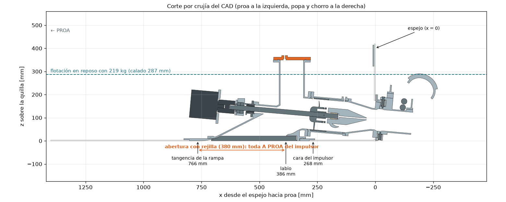

# P1-J — Waterjet eléctrico inboard para el jet boat de Jorge (2,30 m)

> Paquete de ingeniería del prototipo: cálculo, CAD paramétrico verificado, planos, BOM, firmware y
> pruebas. Todo se regenera desde [`inputs.yaml`](inputs.yaml) con `python run_all.py`. Los números de
> este README se actualizan solos desde `resultados/*.json` (marcadores `<!--V:…-->`).
> **Visor 3D para Jorge** (ensamblado, explotado, pieza por pieza y demo): `04_diseno/visor/` — publicado
> como página web (link en la descripción del PR).

## Resumen ejecutivo

1. **Qué es:** el waterjet que pidió Jorge, rediseñado para que funcione: toma enrasada **entera a proa del impulsor** (su comentario: la rejilla del plano estaba detrás), rampa de 27°, impulsor inox Ø<!--V:sizing.selection.D_imp_mm:.0f-->132<!--/V--> de 5 álabes directo a un motor refrigerado por agua, estator con buje de agua, tobera Ø<!--V:sizing.selection.D_noz_mm:.0f-->87<!--/V-->, boquilla ±25° y bucket de reversa obligatorio. 12S / 38,4 V (< 50 V CC).
2. **Prestaciones (modelo, sin validar en agua):** margen en la joroba <!--V:sizing.performance.hump_margin_min:.0%-->3%<!--/V--> con la banda alta de resistencia (se piden ≥ 10 %: **no cumple**; <!--V:sizing.vmax_band.nominal.hump_margin:.0%-->15%<!--/V--> con la nominal; 02 §3.2), 0 a planeo en <!--V:sizing.performance.t_to_plane_s:.0f-->14<!--/V--> s; **V máx. sostenida <!--V:sizing.performance.vmax_cont_kmh:.1f-->25.0<!--/V--> km/h** sin base validada hasta T4 (banda <!--V:sizing.vmax_band.high.vmax_cont_kmh:.0f-->18<!--/V-->–<!--V:sizing.vmax_band.low.vmax_cont_kmh:.0f-->29<!--/V--> km/h; objetivo 30; ~<!--V:sizing.performance.vmax_peak_kmh:.0f-->29<!--/V--> km/h por ratos); <!--V:sizing.energy.t_top_min:.0f-->37<!--/V--> min a fondo o <!--V:sizing.energy.t_legal_h:.1f-->2.5<!--/V--> h a 5 kn; empuje a punto fijo <!--V:sizing.performance.bollard_N:.0f-->765<!--/V--> N.
3. **Recomendación:** pedir cotización de la **AWT JT132** (la bomba de la foto de Jorge) con este mismo tren eléctrico: gana la matriz de arquitectura en el <!--V:arch.mc_win_frac.B:.0%-->89%<!--/V--> del Monte Carlo, da <!--V:cmp.B_vmax_kmh:.1f-->27.4<!--/V--> km/h y baja el costo a ~<!--V:cmp.B_total_eur_min:.0f-->7002<!--/V-->–<!--V:cmp.B_total_eur_max:.0f-->7565<!--/V--> € contra <!--V:bom.total_eur:.0f-->10865<!--/V--> € de construir la bomba propia (<!--V:bom.verified_frac_of_subtotal:.0%-->35%<!--/V--> del subtotal con precio verificado; el resto son servicios de taller a cotizar).
4. **Riesgo n.º 1 — el casco, no la propulsión:** con 0,80 m de manga y el piloto sentado alto, GM ≈ <!--V:sizing.hydrostatics.GM_m:.3f-->0.008<!--/V--> m y capacidad (33 CFR 183.33) de <!--V:sizing.capacity.persons_gear_kg:.0f-->46<!--/V--> kg: **puede volcar**. Ensayo de escora antes de motorizar; probablemente haya que ensanchar el casco o bajar el asiento.
5. **Legal (Dinamarca):** ≤ 5 kn a < 300 m de la costa (perfil "costa" por defecto en el firmware), 4 kn en Als Sund; no es speedbåd (< 19 kW) y probablemente no es "vandscooter" (piloto dentro del casco): confirmar por escrito (research/R13 §8).
6. **Honestidad:** todo está verificado *en software* (CAD de <!--V:manifest.totals.n_parts:d-->65<!--/V--> piezas sin interferencias en <!--V:verify.n_pair_checks:d-->10566<!--/V--> pares×estados, FS ≥ 2 metal / ≥ 3 PETG, tests). **Nada está probado físicamente**; los primeros pasos están en [PENDIENTES_GASPAR.md](PENDIENTES_GASPAR.md).



## Comprar vs construir

| Opción | Costo total del sistema | V máx. sostenida | Unidad de jet | Comentario |
|---|---|---|---|---|
| **A — bomba propia (este paquete)** | <!--V:bom.total_eur:.0f-->10865<!--/V--> € ≈ <!--V:bom.total_dkk:.0f-->81219<!--/V--> DKK [CALCULADO: bom.py] | <!--V:cmp.A_vmax_kmh:.1f-->25.1<!--/V--> km/h | <!--V:cmp.A_jet_mass_kg:.1f-->20.1<!--/V--> kg | Impulsor y estator CNC 5 ejes + soldaduras: el 42 % del costo es taller sin cotizar |
| **B — AWT JT132 + este tren** | <!--V:cmp.B_total_eur_min:.0f-->7002<!--/V-->–<!--V:cmp.B_total_eur_max:.0f-->7565<!--/V--> € [CALCULADO; precio de la JT132 ESTIMADO] | <!--V:cmp.B_vmax_kmh:.1f-->27.4<!--/V--> km/h | 12 kg [VERIFICADO: R11 §4] | Trae toma, dirección y reversa; pedir brida, altura del eje y curva de la bomba |
| Lampuga Air (jet boat eléctrico comercial de 2,30 m) | no verificado | ≤ 50 km/h [VERIFICADO: R12] | — | Referencia: 10 kW, 3,6 kWh |

Detalle y matriz ponderada: [03_arquitectura.md](03_arquitectura.md).

## Estado (verificado / no verificado)

| Ítem | Estado |
|---|---|
| Pipeline `run_all.py` (sizing → CAD → FS → planos → verify → BOM → arquitectura → comparación → electrónica → visor → docs) | Ejecuta con exit 0 (bitácora en PROGRESS.md) |
| Dimensionamiento: masas, estabilidad, Savitsky + joroba, waterjet con curva de bomba, cavitación, energía, térmico, eje, pasador | [CALCULADO] `sizing.py`; [02_calculos.md](02_calculos.md) — **calibrar con pruebas T2–T4** |
| CAD: <!--V:manifest.totals.n_parts:d-->65<!--/V--> piezas, STEP + STL, sólidos válidos, impresas ≤ 210×210×260 | [VERIFICADO en software] `verify_parts.py` |
| Interferencias: boquilla −25/0/+25° × bucket arriba/abajo, contra bomba, toma, tren y casco de referencia | [VERIFICADO en software] |
| FS ≥ 3 (impresas) / ≥ 2 (metal) por caso de carga | [CALCULADO] `structural.py` (02 §9); FEA de las piezas críticas en `04_diseno/fea/` |
| Firmware del acelerador (bucket, perfiles costa/abierto, limpieza de rejilla, kill switch) | [VERIFICADO en software] 69 tests; **sin compilar para AVR** (sin toolchain aquí) |
| Precios | <!--V:bom.verified_frac_of_subtotal:.0%-->35%<!--/V--> del subtotal verificado (research/R11, R08a/b); servicios de taller [ESTIMADO] |
| Casco de Jorge | **Leído de un plano sin escala única: medir todo** (PENDIENTES P0) |
| Estabilidad, estanqueidad, pruebas en agua | **[NO EJECUTADO] — pendiente físico** |

## Cómo correr

```bash
pip install -r requirements.txt          # núcleo (build123d, numpy, trimesh, openplaning, …)
python run_all.py                        # todo (~5 min); --fast = mallas gruesas; --skip-render
pytest -q                                # tests (P1_SKIP_SLOW=1 salta la regeneración completa)
```
Cambiar cualquier dato en `inputs.yaml` (p. ej. `boat.bottom_thickness_mm`, `waterjet.axis_height_m`,
una batería o un motor nuevo) y volver a correr regenera cálculos, selección, geometría, planos, BOM,
visor y documentos (probado: `tests/test_regeneration*.py`, ver [auditoria.md](auditoria.md) §Regeneración).

## Mapa del repositorio

| Archivo | Contenido |
|---|---|
| [01_investigacion.md](01_investigacion.md) + `research/` | Plano de Jorge auditado, toma, métodos de bomba y planeo, componentes y precios, normativa DK |
| [02_calculos.md](02_calculos.md) + `sizing.py`, `p1calc/` | Memoria de cálculo completa |
| [03_arquitectura.md](03_arquitectura.md) | Requisitos, matriz ponderada, comprar vs construir, qué se imprime/mecaniza/compra, riesgos |
| [04_diseno/](04_diseno/README.md) | `params*.py`, `piezas/`, `build_all.py`, `verify_parts.py`, `structural*.py`, planos, electrónica, visor |
| [05_fabricacion.md](05_fabricacion.md) + `prusaslicer/` | Impresión, mecanizado, soldadura, CNC, anodizado, probetas |
| [06_ensamblaje_y_pruebas.md](06_ensamblaje_y_pruebas.md) + [checklist_salida.md](checklist_salida.md) | Montaje, cambios de casco, pruebas T0–T4, FMEA, mantenimiento |
| [07_roadmap_P2.md](07_roadmap_P2.md) | Próxima iteración con disparadores medibles |
| [decisiones.md](decisiones.md) · [auditoria.md](auditoria.md) · [PENDIENTES_GASPAR.md](PENDIENTES_GASPAR.md) | Decisiones, auditoría adversarial, acciones físicas |
| `bom.csv` | Lista de materiales con links, fechas y etiqueta de verificación |

## Próximos pasos físicos (los 5 primeros)

1. **Medir el casco de Jorge** (fondo de 0,25 a 0,85 m del espejo, espejo, astilla muerta, calado en popa con piloto y baterías) → `inputs.yaml` → `python run_all.py`.
2. **Ensayo de escora / estabilidad** con carga desplazada, antes de motorizar.
3. **Pedir cotizaciones**: AWT JT132 (brida de toma, altura del eje, curva), Maytech (potencia continua del motor), taller CNC (impulsor y estator con los STEP).
4. **Consulta legal por escrito** a Søfartsstyrelsen (clasificación y potencia; preguntas en danés en research/R13 §8).
5. **Banco en seco T0** con el controlador, el firmware y el kill switch (acople desconectado: el sello no gira en seco).

## Historia

La versión anterior del proyecto (cola larga eléctrica para un jon boat de 2 personas a 6 km/h) quedó en
el historial de git, commit `5dfada0`. Este paquete la reemplaza a pedido del usuario: el motor que necesita
Jorge es un waterjet inboard.
